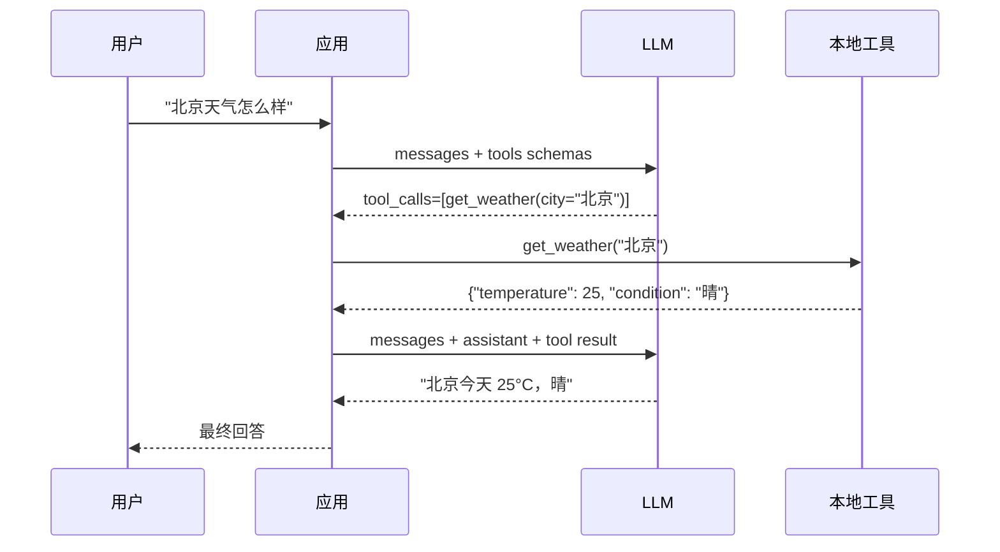

# 01 · LLM Function Call Demo

Function Call 三语言对照演示。LLM 不执行函数，只决定调哪个工具+用什么参数；应用层执行后把结果回灌给 LLM 总结。

## 两轮交互



LLM 一次可能并行调多个工具 —— 应用要遍历所有 `tool_calls`，不能只取 `[0]`。

## 目录结构

```
.
├── .env             # API_BASE_URL / API_KEY / MODEL_ID
├── python/          # Python 实现（client.py + tools.py + main.py + test.py）
├── go/              # Go 实现（client.go + tools.go + main.go）
├── rust/            # Rust 实现（client.rs + tools.rs + main.rs）
└── docs/            # TUTORIAL / USAGE_GUIDE / LOCAL_MODELS_GUIDE
```

每个语言目录里：
- `client.*` —— 两轮 function-call 往返，**整文件可 cp 出去用**
- `tools.*` —— 工具注册表（schema 和实现绑在一起，加新工具只改这里）
- `main.*` —— demo 入口（默认跑 3 个场景；带 `verify` / `test` 子命令则验证 LLM 调对了工具）

## 配置 `.env`

```bash
API_BASE_URL=http://localhost:8000/v1
API_KEY=...           # 本地 MLX 可填占位串
MODEL_ID=Qwen3.5-27B-Claude-4.6-Opus-Distilled-MLX-4bit
```

## 跑起来

### Python

```bash
cd python
pip install -r requirements.txt
python main.py        # demo
python test.py        # 验证调对工具
```

### Go

```bash
cd go
go mod tidy
go run .              # demo
go run . verify       # 验证（注意是 `.` 不是 `main.go`）
```

### Rust

```bash
cd rust
cargo run             # demo
cargo run -- verify   # 验证
```

## 三语言行数对比

| 语言 | tools | client | main | 总计 |
|---|---|---|---|---|
| Python | 98 | 35 | 38 + test 43 | **214** |
| Go | 164 | 54 | 94 | **312** |
| Rust | 136 | 65 | 75 | **276** |

## 三个示例工具

| 工具 | 用途 | 关键设计 |
|---|---|---|
| `get_weather` | 取城市天气 | `city` 必填，`unit` 默认 celsius |
| `calculate` | 四则运算 | `op` 枚举 add/sub/mul/div，`div` 时显式拦 b=0 |
| `search_products` | 产品搜索 | 暴露 `min_price`/`max_price` —— 让 LLM 自己把"500 元以上"翻译成 `min_price=500`，**不要在代码里 NLP** |

## 常见坑（三语言通用）

- ❌ **只取 `tool_calls[0]`** —— 现代模型并行调多工具会丢调用，必须 for-loop 全跑完
- ❌ **assistant message 不回灌** —— 第二轮 LLM 看不到自己刚才决定调啥工具
- ❌ **schema 和函数实现分两份名单** —— 加工具忘改一边是这类代码最常见的 bug，本 demo 用装饰器 / init / 结构体绑死
- ⚠️ **macOS 系统代理 / `HTTP_PROXY` 把 localhost 走代理** —— Python 版用 `httpx.Client(trust_env=False)`，Go 版用 `Transport.Proxy = nil` 显式绕过

详见每个语言子目录的 README。
