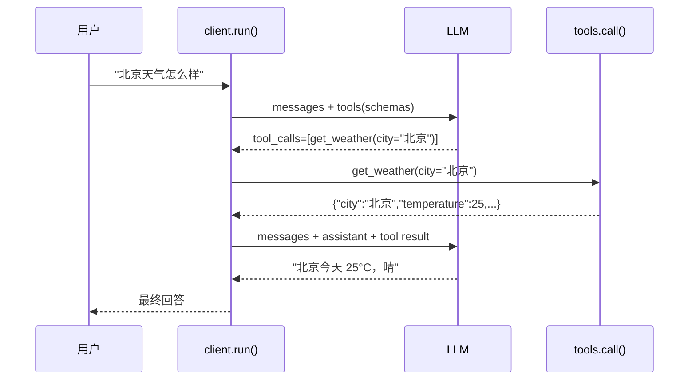

# 01 · LLM Function Call — `openai` SDK + 两轮往返

**Function Call 的本质就一件事：LLM 不执行函数，只决定调哪个工具+用什么参数；应用层负责真正执行并回灌结果。整个 demo 拆 4 个文件，你要套出去的只有 `client.py` 那 30 行 + `tools.py` 里你自己的工具。**

## 本目录文件

| 文件 | 角色 | 干啥 |
|---|---|---|
| `client.py` | 🟢 套出去用 | `run()` 一次完成两轮交互 |
| `tools.py` | 🟢 套出去用（自己改） | `@tool(schema)` 注册函数；schema 和实现写一起，没有第二份名单 |
| `main.py` | demo only | 三个场景的入口 |
| `test.py` | demo only | 验证三类问题调对了工具 |

## 两轮交互



## 为什么这么写

- **`openai` SDK 而不是手撸 `requests`** —— OpenAI-compatible 是事实标准，本地 MLX / vLLM / Ollama 都能用同一个 base_url。手撸的 `payload = {...}; requests.post(...)` 没拿到任何好处
- **schema 和函数实现配在一起** —— 原版有一份 `FUNCTION_DEFINITIONS` 列表 + 一份 `available_functions` dict，加工具要改两处且容易忘。`@tool({...})` 装饰器把这俩绑死
- **`search_products` 接 `min_price/max_price`，不在 Python 里 NLP** —— 原版 `_parse_price_query` 用正则猜"以上/以下/价格 XXX"是 50 行的 hack。让 LLM 自己拆"500 元以上" → `min_price=500` 才是 function call 的价值所在
- **不打装饰性分隔符** —— `"="*60` / `# ============ 实现 ============` / `→ 发送请求...` 这种行删掉后信息一字不少，跑 demo 看输出就够了

## 关键设计点

| 决策 | 原因 |
|---|---|
| `messages.append(msg.model_dump(exclude_none=True))` | 把 assistant 的 tool_calls 决策原样回灌，否则第二轮 LLM 看不到自己说了啥 |
| `for tc in msg.tool_calls` 全跑完再发 | LLM 一次可能调多个工具（并行 tool_calls），不能只取 `tool_calls[0]` |
| 工具异常 → 返回 `{"error": ...}` JSON | LLM 能看到错误并自我恢复，比 raise 抛断整个流程更鲁棒 |
| `httpx.Client(trust_env=False)` | 见下方常见坑 |

## 怎么跑

```bash
cd python_slim
pip install -r requirements.txt
# .env 在父目录，python-dotenv 会自动往上找
python main.py
python test.py
```

期待输出（test.py）：

```
✓ '北京天气怎么样？'              expected=get_weather       got=get_weather
✓ '156 除以 12'                expected=calculate         got=calculate
✓ '搜索笔记本相关的产品'           expected=search_products   got=search_products

3/3 passed
```

## 行数对比（原版 vs slim）

| 文件 | 原版 | slim |
|---|---|---|
| 工具定义 | `function_definitions.py` 219 | `tools.py` 98 |
| 主入口 | `demo.py` 108 | `main.py` 36 + `client.py` 35 |
| 测试 | `test.py` 77 | `test.py` 36 |
| **总计** | **404** | **205** |

砍掉的主要是：装饰性 print、`demo.py` 和 `test.py` 各自重复的 HTTP 客户端、`_parse_price_query` 正则、`FUNCTION_DEFINITIONS` 和 `available_functions` 双份名单。

## 套到生产

```python
from openai import OpenAI
from client import run
import tools  # 在 tools.py 里加你自己的 @tool

client = OpenAI(base_url=..., api_key=...)
answer = run(client, "your-model", "用户问题")
```

加新工具就在 `tools.py` 写一个：

```python
@tool({
    "name": "send_email",
    "description": "发邮件",
    "parameters": {
        "type": "object",
        "properties": {
            "to": {"type": "string"},
            "subject": {"type": "string"},
            "body": {"type": "string"},
        },
        "required": ["to", "subject", "body"],
    },
})
def send_email(to: str, subject: str, body: str) -> dict:
    ...
    return {"sent": True, "to": to}
```

`main.py` / `client.py` 一行都不改。

## 常见坑

- ⚠️ **macOS 系统代理把 localhost 也走进去了** —— 我们撞到过：本机开着 ClashX/V2Ray，httpx 默认 `trust_env=True` 会读 macOS SystemConfiguration 代理（即使 `HTTP_PROXY` 没设），把请求送进 127.0.0.1:1082；尽管系统设置里 localhost 在 bypass 列表，httpx 不读 bypass，直接撞死。表现是 `httpx.RemoteProtocolError: Server disconnected without sending a response`。修法是创建客户端时显式 `httpx.Client(trust_env=False)` 传给 `OpenAI(http_client=...)`，本 demo 已经这么写了
- ❌ **只处理 `tool_calls[0]`** —— 现代模型会一次发多个 tool_calls 并行执行，原版只取第一个会丢调用
- ❌ **assistant message 不回灌** —— 第二轮调 chat.completions 时 messages 里没有 assistant 的 tool_calls 决策，LLM 看不到自己刚才要调啥，会重复决策或答非所问
- ❌ **工具抛异常没 catch** —— LLM 看不到错误就没法自我修正。统一返回 `{"error": ...}` JSON
- ❌ **schema 和实现两份名单** —— 加工具忘改一边是这类代码最常见的 bug，用装饰器绑死
