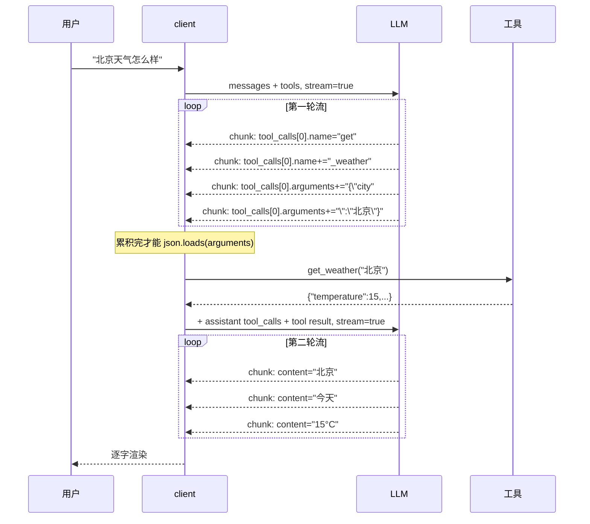

# 02 · Streaming Demo

三语言流式输出对照。两个场景：纯文本流式、流式 + function call。

## 为什么单独做这个 demo

非流式 vs 流式总耗时是一样的，区别在**首字延迟**：5-10s → 0.5-1s。用户感知差异巨大，所有面向用户的 LLM 应用都该上流式。

但流式真正难的是**function call 场景**：`tool_calls[i].function.arguments` 是分块到达的字符串片段，得按 `index` 分槽位累积，等流读完再 `json.loads`。这是这个 demo 的核心。

## 工作流（流式 + function call）



## 目录

```
.
├── .env             # API_BASE_URL / API_KEY / MODEL_ID
├── python/          # OpenAI SDK + yield iterator
├── go/              # sashabaranov/go-openai stream.Recv()
└── rust/            # ureq sync + 手撸 SSE 拆帧
```

每个语言子目录里：
- `client.*` —— 套出去用：`stream_text` + `stream_with_tools`
- `tools.*` —— 工具注册表（同 01 写法）
- `main.*` —— demo 入口

## 跑起来

```bash
# Python
cd python && pip install -r requirements.txt && python main.py

# Go
cd go && go mod tidy && go run .

# Rust
cd rust && cargo run
```

## 三语言关键差异

| 维度 | Python | Go | Rust |
|---|---|---|---|
| 流式 API | `for chunk in stream` | `stream.Recv()` 直到 EOF | 手撸 SSE 拆帧 |
| ToolCall index | `tc.index` (int) | `*tc.Index` (`*int`，需判 nil) | `tc["index"].as_u64()` |
| arguments 累积 | `acc[i]["args"] += d` | `acc[i].Args += d` | `entry.2.push_str(d)` |
| 事件回吐 | `yield` 字典 | 双回调 `onTool`/`onDelta` | `Event` enum + 单回调 |

## 共通的坑

- ❌ **`arguments` 边收边 `json.loads`** —— 永远报 unexpected end of JSON
- ❌ **只看 `tool_calls[0]`** —— 模型可能并行调多个工具，按 index 全收
- ❌ **`delta.content` 没判空** —— tool-call chunk 里 content 是 None/空，直接拼接会出 None 字符串
- ⚠️ **流式不会让总耗时变短** —— 只是把感知延迟从"等总时间"降到"等首字"
