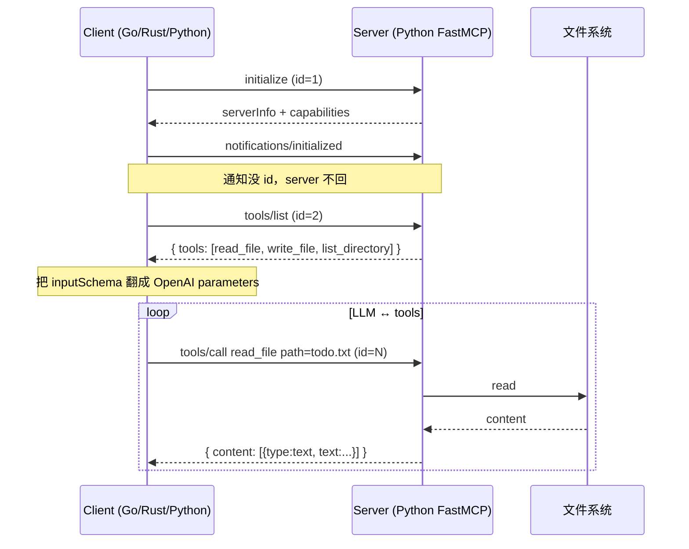

# 04 · MCP Demo

跨语言 MCP（Model Context Protocol）演示。**Python 写一个 FastMCP server，Go 和 Rust 客户端拉同一个 server 跑** —— MCP 的卖点就是工具实现在哪个语言不重要，client 只看 JSON-RPC 协议。

## 协议（够用版）



每条消息一行 JSON（NDJSON），stdout 是协议通道 —— server 千万别 print 调试信息到 stdout。

## 目录

```
.
├── .env                # API_BASE_URL / API_KEY / MODEL_ID
├── python/
│   ├── server.py       # 🟢 FastMCP server（被 Go/Rust 也拉起）
│   ├── client.py       # 🟢 MCPBridge：MCP ↔ OpenAI
│   ├── main.py / test.py
│   └── requirements.txt
├── go/
│   ├── mcp.go          # 🟢 手撸 MCP-stdio 客户端
│   ├── client.go       # 🟢 Bridge
│   └── main.go         # 拉 ../python/server.py
└── rust/
    └── src/mcp.rs · client.rs · main.rs   # 同 Go 的结构
```

## 跑起来

先装 Python MCP server 的依赖：

```bash
cd python
pip install -r requirements.txt
```

然后：

```bash
# Python：自己当 client 也用 server
cd python && python test.py && python main.py

# Go：拉 ../python/server.py 跑
cd go && go mod tidy && go run .

# Rust：拉 ../python/server.py 跑
cd rust && cargo run
```

## 三语言关键差异

| 维度 | Python | Go | Rust |
|---|---|---|---|
| MCP 客户端 | 官方 SDK (`mcp.ClientSession`) | 自己写 ~100 行 | 自己写 ~130 行 |
| 异步模型 | asyncio | goroutine + channel | 同步阻塞 |
| 子进程管理 | `stdio_client` ctx | `exec.Cmd` + `Wait()` | `Command::spawn` + Drop |
| 协议路由 | SDK 帮你做 | pending map by id | 循环 recv 跳过非匹配 id |

## 共通的坑

- ❌ **server 往 stdout print 调试信息** —— 破坏 JSON-RPC 帧，一行就崩
- ❌ **没设沙箱** —— `read_file/write_file` 暴露给 LLM 必须限定根目录，否则 `../../etc/passwd` 就出去了
- ❌ **没发 `notifications/initialized`** —— MCP server 会拒绝后续请求
- ❌ **不收尸子进程** —— 跑几次就一堆 zombie，Go 用 `cmd.Wait()`，Rust 用 `Drop` 里 `wait()`
- ⚠️ **协议版本** —— 这里用 `2024-11-05`；MCP 协议在演进，要看 server SDK 兼容什么
