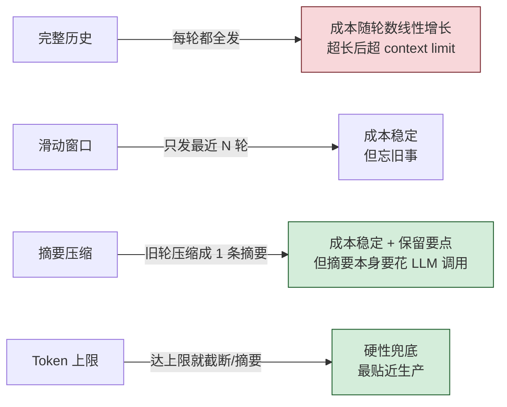

# 对话记忆管理演示

展示如何管理 LLM 对话历史，包括不同的记忆策略、持久化方案和成本控制。

**核心价值：所有对话系统的基础、直接影响用户体验和成本**

**三语言实现：Python ✅、Go（待实现）、Rust（待实现）**

## 四种策略的取舍



四种各有适用场景：

- **完整历史**：原型阶段、对话短、不在乎成本
- **滑动窗口**：客服话术（旧轮上下文真的不重要）
- **摘要**：长会话、要"记住"关键事实
- **Token 上限**：上面三种的组合策略，生产环境主力

---

## 什么是对话记忆管理

### 核心真相

**LLM 本身没有记忆！每次调用都是全新的、独立的。**

```python
# 每次调用都是独立的
response1 = call_llm("你好")  # "你好！"
response2 = call_llm("我刚才说了什么？")  # "我不知道" ❌
```

**所谓的"记忆"，只是我们把历史对话记录发给 LLM，让它提炼和理解。**

```python
# 我们把历史发给 LLM（使用 OpenAI 标准格式）
messages = [
    {"role": "user", "content": "你好"},
    {"role": "assistant", "content": "你好！"},
    {"role": "user", "content": "我刚才说了什么？"}  # LLM 看到历史
]
response = call_llm(messages)  # "你刚才说了'你好'" ✅

# LLM 只是在当前请求中"看到"了历史，并不是真的"记住"了
```

**本质：**
- ❌ LLM 没有记忆能力
- ✅ 我们每次都把历史发给它
- ✅ LLM 从历史中提炼信息
- ✅ 记忆管理 = 管理发送给 LLM 的历史内容

---

### OpenAI 标准消息格式

OpenAI 定义了标准的消息格式，现在已经成为**行业标准**（所有主流 LLM 都支持）：

```python
messages = [
    {
        "role": "system",      # 系统指令（可选）
        "content": "你是一个友好的助手"
    },
    {
        "role": "user",        # 用户消息
        "content": "你好，我叫张三"
    },
    {
        "role": "assistant",   # 助手回复
        "content": "你好张三！"
    },
    {
        "role": "user",        # 新的用户消息
        "content": "我刚才说我叫什么？"
    }
]
```

**三种角色（role）：**

1. **`system`** - 系统指令
   - 设置 AI 的行为、语气、输出格式
   - 通常放在最前面
   - 可选，但推荐使用

2. **`user`** - 用户消息
   - 用户的输入、问题、请求
   - 这是 LLM 需要回应的内容

3. **`assistant`** - 助手回复
   - LLM 之前的回复
   - 包含这些可以让 LLM "看到" 对话历史

**扩展角色（Function Call / Tool Use）：**

4. **`tool`** / **`function`** - 工具调用结果
   - 用于 Function Call 场景
   - 返回工具执行的结果

**为什么这是标准？**
- ✅ OpenAI 最先定义（2023年）
- ✅ 所有主流模型都支持（Claude、Gemini、本地模型）
- ✅ 简单、清晰、易于理解
- ✅ 支持多轮对话、系统指令、工具调用

**示例：完整对话**

```python
messages = [
    {"role": "system", "content": "你是一个友好的助手。用简短的1-2句话回答。"},
    {"role": "user", "content": "你好，我叫张三"},
    {"role": "assistant", "content": "你好张三！很高兴认识你。"},
    {"role": "user", "content": "我今年25岁"},
    {"role": "assistant", "content": "25岁正是充满活力的年纪！"},
    {"role": "user", "content": "我喜欢编程"},
    {"role": "assistant", "content": "编程是一项很棒的技能！"},
    {"role": "user", "content": "我刚才说我叫什么名字？"}
]

# LLM 会看到所有历史，从中提炼出 "张三"
response = call_llm(messages)  # "你叫张三"
```

### 核心挑战

1. **Token 限制**：上下文窗口有限（如 4K、8K、128K tokens）
2. **成本问题**：历史越长，成本越高
3. **性能问题**：历史越长，响应越慢
4. **记忆选择**：保留什么，丢弃什么？

---

## 快速开始

### Python 版本

```bash
cd python
pip install -r requirements.txt

# 1. 快速理解核心概念
python quick_demo.py

# 2. 记忆策略对比（看看不同策略如何管理历史）
python memory_strategies.py

# 3. 持久化演示（保存和加载对话）
python persistent_memory.py

# 4. Token 和成本管理
python token_management.py
```

**输出示例：**
```
============================================================
策略 1: 完整记忆（Full Memory）
============================================================

[轮次 1] 用户: 你好，我叫张三
助手: 你好张三！很高兴认识你...

[完整记忆] 记忆状态
  消息数量: 2
  估算 Token: 45
  成本估算: ~$0.000450

# 💡 这里我们把所有历史都发给了 LLM
```

### Go 版本

```bash
cd go
go mod tidy
go run memory_strategies.go
```

### Rust 版本

```bash
cd rust
cargo run --release
```

---

## 四种记忆策略

### 1. 完整记忆（Full Memory）

**原理：** 保存所有对话历史

```python
class FullMemoryChat:
    def __init__(self):
        self.messages = []
    
    def chat(self, user_input):
        self.messages.append({"role": "user", "content": user_input})
        response = call_llm(self.messages)  # 发送完整历史
        self.messages.append({"role": "assistant", "content": response})
        return response
```

**优点：**
- ✅ 记住所有信息
- ✅ 上下文完整
- ✅ 实现简单

**缺点：**
- ❌ Token 消耗大
- ❌ 成本高
- ❌ 可能超出上下文限制

**适用场景：**
- 短对话（<10 轮）
- 重要对话（需要完整记录）
- 成本不敏感

---

### 2. 滑动窗口（Sliding Window）

**原理：** 只保留最近 N 条消息

```python
class SlidingWindowChat:
    def __init__(self, window_size=6):
        self.messages = []
        self.window_size = window_size
    
    def chat(self, user_input):
        self.messages.append({"role": "user", "content": user_input})
        
        # 只保留最近的消息
        if len(self.messages) > self.window_size:
            self.messages = self.messages[-self.window_size:]
        
        response = call_llm(self.messages)
        self.messages.append({"role": "assistant", "content": response})
        
        if len(self.messages) > self.window_size:
            self.messages = self.messages[-self.window_size:]
        
        return response
```

**优点：**
- ✅ Token 可控
- ✅ 实现简单
- ✅ 成本可预测

**缺点：**
- ❌ 会忘记早期信息
- ❌ 可能丢失重要上下文

**适用场景：**
- 一般对话（10-50 轮）
- 成本敏感
- 不需要长期记忆

---

### 3. 摘要记忆（Summary Memory）

**原理：** 定期总结历史对话，保留摘要

**关键理解：** 我们让 LLM 总结历史，然后把摘要（而不是完整历史）发给 LLM

```python
class SummaryMemoryChat:
    def __init__(self, summary_threshold=6):
        self.messages = []
        self.summary = ""
        self.summary_threshold = summary_threshold
    
    def chat(self, user_input):
        self.messages.append({"role": "user", "content": user_input})
        
        # 当历史太长时，让 LLM 生成摘要
        if len(self.messages) >= self.summary_threshold:
            self.summary = self._generate_summary()  # 调用 LLM 总结
            self.messages = []  # 清空详细历史
        
        # 构建消息（摘要 + 最近的消息）
        request_messages = []
        if self.summary:
            request_messages.append({
                "role": "system",
                "content": f"之前的对话摘要：{self.summary}"  # 发送摘要而不是完整历史
            })
        request_messages.extend(self.messages)
        
        response = call_llm(request_messages)
        self.messages.append({"role": "assistant", "content": response})
        return response
    
    def _generate_summary(self):
        # 让 LLM 总结历史
        summary_prompt = f"总结以下对话的关键信息：{self.messages}"
        return call_llm([{"role": "user", "content": summary_prompt}])
```

**优点：**
- ✅ 保留关键信息
- ✅ Token 可控
- ✅ 适合长对话

**缺点：**
- ❌ 摘要可能丢失细节（LLM 提炼时可能遗漏）
- ❌ 需要额外 LLM 调用（生成摘要）
- ❌ 实现复杂

**适用场景：**
- 长对话（>50 轮）
- 需要保留关键信息
- 可以接受额外成本

---

### 4. Token 限制（Token-Limited）

**原理：** 根据 Token 数量动态调整历史

```python
class TokenLimitedChat:
    def __init__(self, max_tokens=500):
        self.messages = []
        self.max_tokens = max_tokens
    
    def chat(self, user_input):
        self.messages.append({"role": "user", "content": user_input})
        
        # 根据 Token 限制裁剪
        self._trim_by_tokens()
        
        response = call_llm(self.messages)
        self.messages.append({"role": "assistant", "content": response})
        
        self._trim_by_tokens()
        return response
    
    def _trim_by_tokens(self):
        while len(self.messages) > 2:
            total_tokens = count_tokens(self.messages)
            if total_tokens <= self.max_tokens:
                break
            self.messages.pop(0)  # 删除最早的消息
```

**优点：**
- ✅ 精确控制成本
- ✅ 不会超出限制

**缺点：**
- ❌ 可能在对话中途突然"失忆"
- ❌ 需要准确的 Token 计数

**适用场景：**
- 严格成本控制
- 已知 Token 限制
- 可以接受突然失忆

---

## 策略对比

| 策略 | Token 消耗 | 成本 | 记忆完整性 | 实现复杂度 | 适用场景 |
|------|-----------|------|-----------|-----------|---------|
| 完整记忆 | ⭐⭐⭐⭐⭐ 高 | ⭐⭐⭐⭐⭐ 高 | ⭐⭐⭐⭐⭐ 完整 | ⭐ 简单 | 短对话 |
| 滑动窗口 | ⭐⭐⭐ 中 | ⭐⭐⭐ 中 | ⭐⭐ 部分 | ⭐ 简单 | 一般对话 |
| 摘要记忆 | ⭐⭐ 低 | ⭐⭐⭐ 中 | ⭐⭐⭐⭐ 较好 | ⭐⭐⭐⭐ 复杂 | 长对话 |
| Token 限制 | ⭐ 可控 | ⭐ 可控 | ⭐⭐ 部分 | ⭐⭐ 中等 | 成本敏感 |

---

## 对话持久化

### 为什么需要持久化？

1. **用户体验**：用户可以随时中断和恢复对话
2. **数据分析**：分析历史对话，改进系统
3. **审计合规**：保留对话记录，用于审计
4. **多设备同步**：在多个设备间同步对话

### 持久化方案

#### 1. JSON 文件（开发/测试）

```python
# 保存
with open(f"{session_id}.json", 'w') as f:
    json.dump({"messages": messages}, f)

# 加载
with open(f"{session_id}.json", 'r') as f:
    data = json.load(f)
    messages = data["messages"]
```

**优点：** 简单、直观  
**缺点：** 不适合大规模、并发访问

#### 2. SQLite（小型应用）

```sql
CREATE TABLE conversations (
    id INTEGER PRIMARY KEY,
    session_id TEXT,
    role TEXT,
    content TEXT,
    timestamp DATETIME
);
```

**优点：** 结构化、支持查询  
**缺点：** 单文件、并发有限

#### 3. Redis（缓存）

```python
# 保存（带过期时间）
redis.setex(f"session:{session_id}", 3600, json.dumps(messages))

# 加载
messages = json.loads(redis.get(f"session:{session_id}"))
```

**优点：** 快速、支持过期  
**缺点：** 内存存储、成本高

#### 4. PostgreSQL/MySQL（生产环境）

```sql
CREATE TABLE conversations (
    id SERIAL PRIMARY KEY,
    session_id UUID,
    user_id INTEGER,
    role VARCHAR(20),
    content TEXT,
    tokens INTEGER,
    created_at TIMESTAMP
);

CREATE INDEX idx_session ON conversations(session_id);
CREATE INDEX idx_user ON conversations(user_id);
```

**优点：** 可靠、可扩展、支持复杂查询  
**缺点：** 需要维护

#### 5. 向量数据库（语义检索）

```python
# 保存（带向量）
vector_db.add(
    id=message_id,
    text=content,
    vector=embedding,
    metadata={"session_id": session_id}
)

# 检索相关历史
relevant_messages = vector_db.search(query, top_k=5)
```

**优点：** 支持语义检索  
**缺点：** 复杂、成本高

---

## Token 计数和成本管理

### Token 是什么？

**Token 是 LLM 处理文本的基本单位。**

- 不是字符（character）
- 不是单词（word）
- 是一种**编码单位**

**示例：**
```python
"Hello, world!"  # 约 4 tokens
"你好，世界！"    # 约 4 tokens
"编程"           # 约 2 tokens
"programming"    # 约 1 token
```

**为什么重要？**
- ✅ API 按 token 计费（不是按字符）
- ✅ 模型有 token 限制（如 4K、8K、128K）
- ✅ Token 越多，成本越高，响应越慢

---

### Token 计数方法

#### 1. 简单估算（快速但不准确）

```python
def estimate_tokens_simple(text: str) -> int:
    """简单估算：中文约 1.5 字符/token，英文约 4 字符/token"""
    chinese_chars = sum(1 for c in text if '\u4e00' <= c <= '\u9fff')
    other_chars = len(text) - chinese_chars
    return int(chinese_chars / 1.5 + other_chars / 4)
```

**准确度：** ±20%  
**优点：** 快速，无需额外库  
**缺点：** 不准确，只是粗略估算  
**适用：** 开发阶段快速估算

**示例：**
```python
estimate_tokens_simple("Hello, world!")  # 约 3 tokens（实际 4）
estimate_tokens_simple("你好，世界！")    # 约 4 tokens（实际 4）
estimate_tokens_simple("编程")           # 约 1 token（实际 2）
```

---

#### 2. 准确计数（使用 tiktoken）

```python
import tiktoken

def estimate_tokens_accurate(text: str) -> int:
    """准确计数：使用 OpenAI 的 tiktoken 库"""
    encoding = tiktoken.get_encoding("cl100k_base")  # GPT-4/3.5 使用
    return len(encoding.encode(text))
```

**准确度：** 99%+  
**优点：** 非常准确，与 API 计费一致  
**缺点：** 需要安装 tiktoken 库  
**适用：** 生产环境、成本控制

**安装：**
```bash
pip install tiktoken
```

**示例：**
```python
import tiktoken

encoding = tiktoken.get_encoding("cl100k_base")

# 英文
text = "Hello, world!"
tokens = encoding.encode(text)
print(f"Text: {text}")
print(f"Tokens: {tokens}")  # [9906, 11, 1917, 0]
print(f"Count: {len(tokens)}")  # 4

# 中文
text = "你好，世界！"
tokens = encoding.encode(text)
print(f"Text: {text}")
print(f"Tokens: {tokens}")  # [57668, 53901, 3922, 99489, 6313]
print(f"Count: {len(tokens)}")  # 5（注意：中文通常 1-2 字符 = 1 token）
```

---

#### 3. API 返回的准确计数

**最准确的方法：使用 API 返回的 usage 信息**

```python
response = requests.post(
    f"{API_BASE_URL}/chat/completions",
    json={
        "model": "gpt-4",
        "messages": messages
    }
)

result = response.json()

# API 返回准确的 token 计数
usage = result["usage"]
print(f"输入 tokens: {usage['prompt_tokens']}")      # 实际输入的 tokens
print(f"输出 tokens: {usage['completion_tokens']}")  # 实际输出的 tokens
print(f"总计 tokens: {usage['total_tokens']}")       # 总计
```

**优点：**
- ✅ 100% 准确（这是实际计费的数字）
- ✅ 包含输入和输出的分别计数
- ✅ 无需额外计算

**缺点：**
- ❌ 需要实际调用 API
- ❌ 无法提前估算

---

### 不同编码方式

不同模型使用不同的编码方式：

| 模型 | 编码方式 | tiktoken 名称 |
|------|---------|--------------|
| GPT-4 | cl100k_base | `cl100k_base` |
| GPT-3.5-turbo | cl100k_base | `cl100k_base` |
| GPT-3 (davinci) | p50k_base | `p50k_base` |
| Codex | p50k_base | `p50k_base` |

**示例：**
```python
import tiktoken

# GPT-4 / GPT-3.5-turbo
encoding_gpt4 = tiktoken.get_encoding("cl100k_base")

# GPT-3
encoding_gpt3 = tiktoken.get_encoding("p50k_base")

text = "Hello, world!"
print(f"GPT-4 tokens: {len(encoding_gpt4.encode(text))}")  # 4
print(f"GPT-3 tokens: {len(encoding_gpt3.encode(text))}")  # 4
```

---

### 成本计算

**公式：**
```
总成本 = (输入 tokens / 1000) × 输入单价 + (输出 tokens / 1000) × 输出单价
```

**示例定价（假设）：**

| 模型 | 输入（$/1K tokens） | 输出（$/1K tokens） |
|------|-------------------|-------------------|
| GPT-4 | $0.03 | $0.06 |
| GPT-3.5-turbo | $0.001 | $0.002 |
| Claude-3-Opus | $0.015 | $0.075 |
| Claude-3-Sonnet | $0.003 | $0.015 |
| 本地模型 | $0.00 | $0.00 |

**计算示例：**

```python
# 场景：1000 次对话
# 每次：500 input tokens + 200 output tokens

input_tokens = 1000 * 500  # 500,000
output_tokens = 1000 * 200  # 200,000

# GPT-4
input_cost = (500000 / 1000) * 0.03   # $15.00
output_cost = (200000 / 1000) * 0.06  # $12.00
total_cost = input_cost + output_cost  # $27.00

# GPT-3.5-turbo
input_cost = (500000 / 1000) * 0.001  # $0.50
output_cost = (200000 / 1000) * 0.002 # $0.40
total_cost = input_cost + output_cost  # $0.90
```

**成本对比（1000 次对话）：**

| 模型 | 输入成本 | 输出成本 | 总成本 | 相对成本 |
|------|---------|---------|--------|---------|
| GPT-4 | $15.00 | $12.00 | **$27.00** | 30x |
| GPT-3.5-turbo | $0.50 | $0.40 | **$0.90** | 1x |
| Claude-3-Opus | $7.50 | $15.00 | **$22.50** | 25x |
| Claude-3-Sonnet | $1.50 | $3.00 | **$4.50** | 5x |
| 本地模型 | $0.00 | $0.00 | **$0.00** | 0x* |

\* 本地模型不包括硬件和维护成本

---

### Token 管理策略

#### 1. 监控 Token 使用

```python
class TokenAwareChat:
    def __init__(self):
        self.total_input_tokens = 0
        self.total_output_tokens = 0
        self.total_cost = 0.0
        self.pricing = {
            "input": 0.001 / 1000,   # $0.001 per 1K
            "output": 0.002 / 1000   # $0.002 per 1K
        }
    
    def chat(self, user_input):
        # ... 调用 LLM ...
        
        # 记录 token 使用
        self.total_input_tokens += usage["prompt_tokens"]
        self.total_output_tokens += usage["completion_tokens"]
        
        # 计算成本
        cost = (
            usage["prompt_tokens"] * self.pricing["input"] +
            usage["completion_tokens"] * self.pricing["output"]
        )
        self.total_cost += cost
        
        print(f"本次: {usage['total_tokens']} tokens, ${cost:.6f}")
        print(f"累计: {self.total_input_tokens + self.total_output_tokens} tokens, ${self.total_cost:.6f}")
```

#### 2. 设置 Token 限制

```python
def chat_with_limit(messages, max_tokens=2000):
    # 估算当前 token
    current_tokens = estimate_tokens_accurate(
        " ".join(m["content"] for m in messages)
    )
    
    # 超出限制，自动裁剪
    if current_tokens > max_tokens:
        while current_tokens > max_tokens and len(messages) > 2:
            messages.pop(0)  # 删除最早的消息
            current_tokens = estimate_tokens_accurate(
                " ".join(m["content"] for m in messages)
            )
    
    return call_llm(messages)
```

#### 3. 成本报警

```python
class CostMonitor:
    def __init__(self, budget=10.0):
        self.budget = budget
        self.spent = 0.0
    
    def check(self, cost):
        self.spent += cost
        
        if self.spent > self.budget:
            raise Exception(f"预算超支！已花费 ${self.spent:.2f}，预算 ${self.budget:.2f}")
        
        if self.spent > self.budget * 0.8:
            print(f"⚠️  警告：已使用 {self.spent/self.budget*100:.1f}% 预算")
```

---

### 优化 Token 使用

#### 1. 简化 System Prompt

```python
# ❌ 冗长（100+ tokens）
system_prompt = """
你是一个非常友好、乐于助人、知识渊博的AI助手。
你总是尽力回答用户的问题，并提供详细的解释。
你会用清晰、简洁的语言与用户交流...
"""

# ✅ 简洁（10 tokens）
system_prompt = "你是一个友好的助手。"
```

#### 2. 压缩历史对话

```python
# ❌ 保存完整对话（Token 多）
messages = [
    {"role": "user", "content": "你好，我叫张三，我今年25岁，我喜欢编程..."},
    {"role": "assistant", "content": "你好张三！很高兴认识你..."},
    # ... 更多历史 ...
]

# ✅ 使用摘要（Token 少）
messages = [
    {"role": "system", "content": "用户信息：张三，25岁，喜欢编程"},
    {"role": "user", "content": "我刚才说我叫什么？"}
]
```

#### 3. 使用更便宜的模型

```python
def smart_routing(task):
    # 简单任务 → 便宜模型
    if is_simple(task):
        return call_llm(task, model="gpt-3.5-turbo")  # $0.001/1K
    
    # 复杂任务 → 强大模型
    else:
        return call_llm(task, model="gpt-4")  # $0.03/1K
```

---

### Token 计数方法

#### 1. 简单估算（快速但不准确）

```python
def estimate_tokens_simple(text):
    chinese_chars = sum(1 for c in text if '\u4e00' <= c <= '\u9fff')
    other_chars = len(text) - chinese_chars
    return int(chinese_chars / 1.5 + other_chars / 4)
```

**准确度：** ±20%  
**适用：** 快速估算

#### 2. 准确计数（使用 tiktoken）

```python
import tiktoken

def estimate_tokens_accurate(text):
    encoding = tiktoken.get_encoding("cl100k_base")  # GPT-4/3.5
    return len(encoding.encode(text))
```

**准确度：** 99%+  
**适用：** 生产环境

### 成本估算

```python
# 假设定价（每 1K tokens）
pricing = {
    "input": 0.01,   # $0.01 per 1K input tokens
    "output": 0.03   # $0.03 per 1K output tokens
}

# 计算成本
input_cost = (input_tokens / 1000) * pricing["input"]
output_cost = (output_tokens / 1000) * pricing["output"]
total_cost = input_cost + output_cost
```

### 不同模型定价对比（假设）

| 模型 | 输入（$/1K tokens） | 输出（$/1K tokens） | 1000次对话成本* |
|------|-------------------|-------------------|----------------|
| GPT-4 | $0.03 | $0.06 | $27.00 |
| GPT-3.5-turbo | $0.001 | $0.002 | $0.90 |
| Claude-3-Opus | $0.015 | $0.075 | $22.50 |
| Claude-3-Sonnet | $0.003 | $0.015 | $4.50 |
| 本地模型 | $0.00 | $0.00 | $0.00** |

\* 假设每次 500 input + 200 output tokens  
\** 不包括硬件和维护成本

---

## 最佳实践

### 1. 选择合适的策略

```python
# 根据对话长度选择
if conversation_length < 10:
    strategy = FullMemoryChat()  # 完整记忆
elif conversation_length < 50:
    strategy = SlidingWindowChat(window_size=10)  # 滑动窗口
else:
    strategy = SummaryMemoryChat()  # 摘要记忆
```

### 2. 监控和报警

```python
class MonitoredChat:
    def __init__(self, max_cost_per_session=1.0):
        self.total_cost = 0.0
        self.max_cost = max_cost_per_session
    
    def chat(self, user_input):
        response = self._call_llm(user_input)
        self.total_cost += self._calculate_cost()
        
        if self.total_cost > self.max_cost:
            self._send_alert(f"成本超限: ${self.total_cost}")
        
        return response
```

### 3. 优化 Token 使用

```python
# ❌ 冗长的 System Prompt
system_prompt = """
你是一个非常友好、乐于助人、知识渊博的AI助手。
你总是尽力回答用户的问题，并提供详细的解释。
你会用清晰、简洁的语言与用户交流...
"""  # 100+ tokens

# ✅ 简洁的 System Prompt
system_prompt = "你是一个友好的助手。"  # 10 tokens
```

### 4. 分层存储

```python
# 热数据（最近 1 小时）：Redis
# 温数据（最近 24 小时）：PostgreSQL
# 冷数据（>24 小时）：S3/对象存储

class TieredStorage:
    def get_conversation(self, session_id):
        # 先查 Redis
        if data := redis.get(session_id):
            return data
        
        # 再查 PostgreSQL
        if data := db.query(session_id):
            redis.set(session_id, data, ex=3600)  # 缓存 1 小时
            return data
        
        # 最后查 S3
        return s3.get(session_id)
```

---

## 常见问题

### Q: 应该使用哪种记忆策略？

A: 
- **短对话（<10 轮）**：完整记忆
- **一般对话（10-50 轮）**：滑动窗口
- **长对话（>50 轮）**：摘要记忆
- **成本敏感**：Token 限制

### Q: 如何准确计算 Token？

A: 
- **开发阶段**：简单估算即可
- **生产环境**：使用 tiktoken 库
- **不同模型**：使用对应的编码方式

### Q: 对话历史应该保存多久？

A: 
- **法律要求**：根据行业规定（如金融、医疗）
- **用户体验**：至少 30 天
- **成本考虑**：冷数据可以归档到便宜的存储

### Q: 如何处理敏感信息？

A: 
- **加密存储**：敏感字段加密
- **脱敏处理**：保存前脱敏（如手机号、身份证）
- **定期清理**：自动删除过期数据
- **访问控制**：严格的权限管理

### Q: 本地模型真的免费吗？

A: 
- **直接成本**：免费（不需要 API 费用）
- **硬件成本**：GPU/CPU、电费
- **维护成本**：部署、监控、更新
- **机会成本**：开发时间

**结论：** 小规模使用本地模型划算，大规模使用云端模型更划算

---

## 实战建议

### 1. 从简单开始

```python
# 第一步：完整记忆
chat = FullMemoryChat()

# 第二步：加入 Token 限制
chat = TokenLimitedChat(max_tokens=2000)

# 第三步：使用滑动窗口
chat = SlidingWindowChat(window_size=10)

# 第四步：根据需要使用摘要
chat = SummaryMemoryChat()
```

### 2. 监控关键指标

- **Token 使用量**：每次对话、每天、每月
- **成本**：实时成本、预算对比
- **响应时间**：历史长度 vs 响应时间
- **用户满意度**：记忆策略 vs 用户反馈

### 3. A/B 测试

```python
# 测试不同策略的效果
group_a = SlidingWindowChat(window_size=6)  # 对照组
group_b = SummaryMemoryChat()  # 实验组

# 对比指标
# - 用户满意度
# - 对话完成率
# - 平均成本
# - 响应时间
```

### 4. 渐进式优化

1. **第一周**：使用完整记忆，收集数据
2. **第二周**：分析 Token 使用模式
3. **第三周**：实施滑动窗口，对比效果
4. **第四周**：根据数据调整窗口大小

---

## 总结

### 核心要点

1. **LLM 没有记忆**：所有"记忆"都是代码层面管理的，每次都把历史发给 LLM
2. **LLM 只是提炼**：LLM 从我们发送的历史中提炼信息，不是真的"记住"
3. **选择合适策略**：根据对话长度和成本要求选择策略
4. **监控和优化**：持续监控 Token 使用和成本
5. **用户体验优先**：在成本和体验之间找平衡

### 价值评估

**价值：⭐⭐⭐⭐⭐**
- 所有对话系统必需
- 直接影响用户体验
- 直接影响成本
- 长期价值不会下降

### 学习建议

1. **理解原理**：LLM 无状态，每次都是我们把历史发给它，它从历史中提炼信息
2. **实践策略**：尝试不同的记忆策略，看看它们如何管理历史
3. **监控成本**：学会计算和控制成本
4. **持续优化**：根据数据调整策略

---

**记住：LLM 没有记忆，所谓的"记忆"只是我们把历史发给它，让它提炼。好的记忆管理是用户体验和成本控制的关键。**
