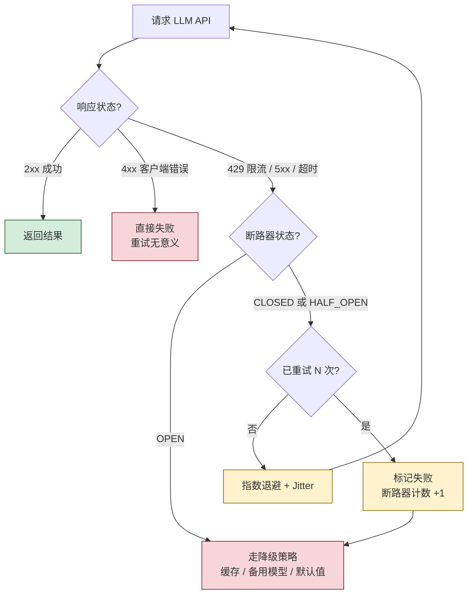

# 错误处理和重试机制演示

展示生产环境必需的错误处理策略：重试、断路器、降级。

**核心价值：所有生产系统的基础、直接影响系统稳定性**

**三语言实现：Python ✅、Go（待实现）、Rust（待实现）**

## 决策流程



三层防御逐级兜底：

- **重试**：处理临时性故障（限流、瞬时网络抖动）
- **断路器**：防止持续失败时雪崩——连续失败 N 次后**暂停发起请求一段时间**
- **降级**：所有手段都失败时返回备用结果（缓存、规则回答、占位提示）

---

## 什么是错误处理

### 核心真相

**LLM API 调用会失败！**

常见错误：
- **429 Rate Limit**：请求过快，被限流
- **500/502/503/504**：服务器错误
- **Timeout**：请求超时
- **Connection Error**：网络连接失败

**不处理错误 = 系统不稳定 = 用户体验差**

---

## 快速开始

### Python 版本

```bash
cd python
pip install -r requirements.txt

# 1. 基础重试
python basic_retry.py

# 2. 指数退避
python exponential_backoff.py

# 3. 断路器
python circuit_breaker.py

# 4. 降级策略
python fallback_strategies.py

# 5. 生产级示例（整合所有策略）
python production_example.py
```

---

## 五种核心策略

### 1. 基础重试（Basic Retry）

**原理：** 失败后重新尝试

```python
def call_with_retry(func, max_retries=3):
    for attempt in range(max_retries):
        try:
            return func()
        except Exception as e:
            if attempt == max_retries - 1:
                raise
            time.sleep(2)  # 固定等待 2 秒
```

**优点：**
- ✅ 简单易懂
- ✅ 容易实现

**缺点：**
- ❌ 固定间隔不够智能
- ❌ 可能导致雷鸣群效应

**适用场景：**
- 简单应用
- 低并发场景

---

### 2. 指数退避（Exponential Backoff）

**原理：** 每次重试的等待时间呈指数增长

```python
def call_with_exponential_backoff(func, max_retries=5):
    for attempt in range(max_retries):
        try:
            return func()
        except Exception as e:
            if attempt == max_retries - 1:
                raise
            
            # 指数退避
            delay = min(1.0 * (2 ** attempt), 60.0)
            
            # 添加抖动（随机化）
            delay = delay * (0.5 + random.random())
            
            time.sleep(delay)
```

**延迟序列示例：**
```
尝试 1: 1.0 秒
尝试 2: 2.0 秒
尝试 3: 4.0 秒
尝试 4: 8.0 秒
尝试 5: 16.0 秒
```

**优点：**
- ✅ 快速失败（前几次很快）
- ✅ 避免过载（后续间隔更长）
- ✅ 自适应

**缺点：**
- ❌ 实现稍复杂

**适用场景：**
- 生产环境（推荐）
- 高并发场景

**抖动（Jitter）：**
```python
# 无抖动：所有客户端同时重试（雷鸣群效应）
delay = 4.0  # 所有客户端都等待 4 秒

# 有抖动：随机化延迟
delay = 4.0 * (0.5 + random.random())  # 2.0-6.0 秒之间随机
```

---

### 3. 断路器（Circuit Breaker）

**原理：** 防止级联失败，快速失败

**三种状态：**

1. **CLOSED（关闭）**：正常工作
   - 允许所有请求
   - 记录失败次数

2. **OPEN（打开）**：停止请求
   - 拒绝所有请求
   - 快速失败
   - 等待超时

3. **HALF_OPEN（半开）**：尝试恢复
   - 允许少量请求测试
   - 成功 → CLOSED
   - 失败 → OPEN

**状态转换：**
```
CLOSED → OPEN: 失败次数超过阈值
OPEN → HALF_OPEN: 超时后尝试恢复
HALF_OPEN → CLOSED: 成功次数达到阈值
HALF_OPEN → OPEN: 再次失败
```

**实现：**
```python
class CircuitBreaker:
    def __init__(self, failure_threshold=5, timeout=60, success_threshold=2):
        self.state = CircuitState.CLOSED
        self.failure_count = 0
        self.success_count = 0
        self.last_failure_time = None
        self.failure_threshold = failure_threshold
        self.timeout = timeout
        self.success_threshold = success_threshold
    
    def call(self, func):
        # 检查状态
        if self.state == CircuitState.OPEN:
            if self._should_attempt_reset():
                self.state = CircuitState.HALF_OPEN
            else:
                raise Exception("Circuit breaker open")
        
        # 尝试调用
        try:
            result = func()
            self._on_success()
            return result
        except Exception as e:
            self._on_failure()
            raise
```

**优点：**
- ✅ 防止级联失败
- ✅ 快速失败
- ✅ 自动恢复
- ✅ 保护系统

**缺点：**
- ❌ 实现复杂
- ❌ 需要调优参数

**适用场景：**
- 调用外部 API
- 微服务调用
- 数据库连接

---

### 4. 降级策略（Fallback）

**原理：** 主服务失败时使用备用方案

**五种降级方案：**

#### 4.1 模型降级
```python
# GPT-4 失败 → GPT-3.5-turbo
try:
    return call_gpt4(prompt)
except:
    return call_gpt35(prompt)  # 更便宜的模型
```

**优点：** 质量下降，但仍可用  
**缺点：** 需要多个模型

#### 4.2 缓存降级
```python
# API 失败 → 使用缓存
try:
    result = call_api(prompt)
    cache[prompt] = result
    return result
except:
    return cache.get(prompt)  # 历史缓存
```

**优点：** 快速响应  
**缺点：** 数据可能过时

#### 4.3 功能降级
```python
# 完整功能失败 → 基础功能
try:
    return advanced_feature(prompt)
except:
    return basic_feature(prompt[:50])  # 简化功能
```

**优点：** 核心功能可用  
**缺点：** 功能受限

#### 4.4 默认响应
```python
# 所有方法失败 → 默认响应
try:
    return call_api(prompt)
except:
    return "抱歉，服务暂时不可用，请稍后再试。"
```

**优点：** 总是有响应  
**缺点：** 用户体验差

#### 4.5 多级降级
```python
# 逐级尝试多个方案
try:
    return call_primary_model(prompt)  # 级别 1
except:
    try:
        return call_fallback_model(prompt)  # 级别 2
    except:
        cached = get_from_cache(prompt)  # 级别 3
        if cached:
            return cached
        return get_default_response()  # 级别 4
```

**优点：** 最大化可用性  
**缺点：** 实现复杂

---

### 5. 生产级实现（整合所有策略）

**完整流程：**

```python
class ProductionLLMClient:
    def chat(self, prompt):
        # 1. 检查断路器
        if circuit_breaker.is_open():
            return fallback_response(prompt)
        
        # 2. 尝试从缓存获取
        if cached := get_from_cache(prompt):
            return cached
        
        # 3. 带重试的 API 调用（指数退避）
        for attempt in range(max_retries):
            try:
                result = call_api(prompt)
                cache_response(prompt, result)
                circuit_breaker.on_success()
                return result
            except Exception as e:
                if attempt == max_retries - 1:
                    circuit_breaker.on_failure()
                    return fallback_response(prompt)
                
                delay = calculate_exponential_backoff(attempt)
                time.sleep(delay)
```

**特性：**
- ✅ 指数退避重试
- ✅ 断路器保护
- ✅ 多级降级
- ✅ 缓存支持
- ✅ 监控统计
- ✅ 日志记录

---

## 错误类型和处理策略

### 应该重试的错误

| 错误类型 | HTTP 状态码 | 重试策略 | 原因 |
|---------|-----------|---------|------|
| Rate Limit | 429 | ✅ 重试 | 临时限流，等待后可恢复 |
| Server Error | 500/502/503/504 | ✅ 重试 | 服务器临时故障 |
| Timeout | - | ✅ 重试 | 网络或服务器慢 |
| Connection Error | - | ✅ 重试 | 网络临时故障 |

### 不应该重试的错误

| 错误类型 | HTTP 状态码 | 重试策略 | 原因 |
|---------|-----------|---------|------|
| Bad Request | 400 | ❌ 不重试 | 请求格式错误，重试无意义 |
| Unauthorized | 401 | ❌ 不重试 | 认证失败，需要修复凭证 |
| Forbidden | 403 | ❌ 不重试 | 权限不足，重试无意义 |
| Not Found | 404 | ❌ 不重试 | 资源不存在 |

---

## 配置建议

### 开发环境
```python
config = {
    "max_retries": 3,
    "base_delay": 0.5,
    "failure_threshold": 10,
    "circuit_timeout": 30,
    "enable_cache": False
}
```

### 生产环境
```python
config = {
    "max_retries": 5,
    "base_delay": 1.0,
    "max_delay": 60.0,
    "exponential_base": 2.0,
    "failure_threshold": 5,
    "circuit_timeout": 60,
    "success_threshold": 2,
    "enable_cache": True,
    "enable_fallback": True
}
```

---

## 监控指标

### 关键指标

1. **成功率**
   ```python
   success_rate = successful_requests / total_requests * 100
   ```
   - 目标：>99%
   - 报警：<95%

2. **重试率**
   ```python
   retry_rate = retries / total_requests
   ```
   - 正常：<0.5
   - 报警：>1.0

3. **断路器打开次数**
   ```python
   circuit_breaks_per_hour
   ```
   - 正常：0
   - 报警：>1

4. **降级使用率**
   ```python
   fallback_rate = fallback_uses / total_requests * 100
   ```
   - 正常：<5%
   - 报警：>10%

5. **平均响应时间**
   ```python
   avg_response_time = total_time / successful_requests
   ```
   - 目标：<2秒
   - 报警：>5秒

---

## 最佳实践

### 1. 重试策略

**推荐：指数退避 + 抖动**
```python
delay = min(base_delay * (2 ** attempt), max_delay)
delay = delay * (0.5 + random.random())  # 抖动
```

**参数建议：**
- base_delay: 1 秒
- exponential_base: 2
- max_delay: 60 秒
- max_retries: 5 次

### 2. 断路器配置

**参数建议：**
- failure_threshold: 5-10 次
- timeout: 30-60 秒
- success_threshold: 2-3 次

**监控：**
- 记录状态转换
- 报警断路器打开
- 分析失败原因

### 3. 降级策略

**优先级：**
1. 缓存（最快）
2. 降级模型（质量下降）
3. 简化功能（功能受限）
4. 默认响应（最后手段）

**注意：**
- 向用户说明服务状态
- 记录降级使用情况
- 定期测试降级方案

### 4. 日志记录

**必须记录：**
- 所有错误和异常
- 重试次数和延迟
- 断路器状态变化
- 降级使用情况

**日志格式：**
```python
{
    "timestamp": "2024-01-01T12:00:00Z",
    "level": "ERROR",
    "event": "api_call_failed",
    "attempt": 3,
    "error": "Timeout",
    "prompt": "...",
    "circuit_state": "CLOSED"
}
```

### 5. 测试

**单元测试：**
- 测试各个组件
- 模拟各种错误
- 验证重试逻辑

**集成测试：**
- 测试完整流程
- 验证降级方案
- 测试断路器

**混沌测试：**
- 故意注入失败
- 测试系统韧性
- 验证恢复能力

---

## 常见问题

### Q: 应该重试多少次？

A: 
- **一般场景**：3-5 次
- **关键业务**：5-7 次
- **非关键业务**：1-3 次

**原则：** 平衡用户等待时间和成功率

### Q: 重试间隔应该多长？

A: 
- **固定间隔**：不推荐（可能导致雷鸣群效应）
- **指数退避**：推荐（1s, 2s, 4s, 8s, 16s）
- **加抖动**：强烈推荐（避免同时重试）

### Q: 什么时候使用断路器？

A: 
- ✅ 调用外部 API
- ✅ 微服务调用
- ✅ 数据库连接
- ✅ 任何可能失败的远程调用

### Q: 如何选择降级策略？

A: 
- **高价值业务**：多级降级
- **一般业务**：缓存 + 默认响应
- **低价值业务**：直接返回错误

### Q: 如何监控错误处理？

A: 
- **Prometheus**：监控指标
- **Grafana**：可视化
- **Sentry**：错误追踪
- **ELK**：日志分析

---

## 推荐工具

### Python

1. **tenacity** - 重试库
   ```bash
   pip install tenacity
   ```
   ```python
   from tenacity import retry, stop_after_attempt, wait_exponential
   
   @retry(stop=stop_after_attempt(5), wait=wait_exponential(multiplier=1, min=1, max=60))
   def call_api():
       ...
   ```

2. **pybreaker** - 断路器库
   ```bash
   pip install pybreaker
   ```
   ```python
   from pybreaker import CircuitBreaker
   
   breaker = CircuitBreaker(fail_max=5, timeout_duration=60)
   
   @breaker
   def call_api():
       ...
   ```

3. **prometheus_client** - 监控
   ```bash
   pip install prometheus-client
   ```

4. **sentry-sdk** - 错误追踪
   ```bash
   pip install sentry-sdk
   ```

---

## 总结

### 核心要点

1. **错误会发生**：API 调用必然会失败
2. **重试要智能**：使用指数退避 + 抖动
3. **保护系统**：使用断路器防止级联失败
4. **优雅降级**：提供备用方案
5. **监控关键**：持续监控，及时发现问题

### 价值评估

**价值：⭐⭐⭐⭐⭐**
- 所有生产系统必需
- 直接影响系统稳定性
- 直接影响用户体验
- 长期价值不会下降

### 学习建议

1. **理解原理**：为什么需要错误处理
2. **实践策略**：尝试不同的策略
3. **监控优化**：根据数据调整参数
4. **持续改进**：定期review和优化

---

**记住：好的错误处理是系统稳定性的基础。**
