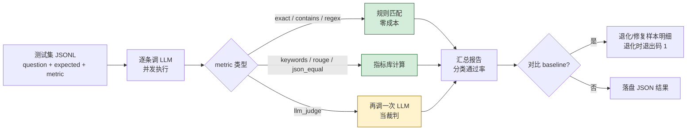

# 评测演示（Evaluation Demo）

LLM 应用的"回归测试"。改了 Prompt、换了模型、升级了版本——怎么知道是变好还是变差？

**核心价值：所有 LLM 应用都需要、价值不会下降**

**当前实现：Python ✅**

## 评测流程



设计要点：

- **能用规则就别用 LLM 裁判**——规则零成本、稳定；裁判慢、贵、不稳
- **baseline 对比是核心**——单次跑通无意义，要看"改完之后退化了什么"
- **CI 接入**：退化返回非零退出码，可以直接挡发布

---

## 为什么需要评测

LLM 输出是不确定的。你以为在"优化"，实际可能在"退化"，但凭直觉发现不了。

真实场景：
- 改了一个 system prompt，A 类问题修好了，B 类问题悄悄坏了
- 升级了模型版本，平均分上去了，但某个关键场景跌了 30%
- 调了 temperature，主观感觉"更自然"，实际事实错误率翻倍

**没有评测 = 凭运气和直觉迭代**

评测的目标不是追求高分，而是**快速、客观地发现退化**。

---

## 五个文件，渐进式

| 文件 | 用途 | 是否需要 LLM |
|------|------|--------------|
| [`quick_demo.py`](python/quick_demo.py) | 入门：3 种最常用方法 | ✅ |
| [`basic_metrics.py`](python/basic_metrics.py) | 指标库：exact / contains / regex / keywords / json_equal / rouge_l / levenshtein | ❌（离线即可跑） |
| [`llm_judge.py`](python/llm_judge.py) | LLM-as-Judge：二元 / 评分 / 成对比较（含位置去偏） | ✅ |
| [`dataset_eval.py`](python/dataset_eval.py) | 批量评测：JSONL 数据集 → 并发跑 → 分类报告 → 保存 JSON | ✅ |
| [`regression_test.py`](python/regression_test.py) | 回归测试：保存 baseline，下次升级时对比退化 / 修复 | ✅ |
| [`production_example.py`](python/production_example.py) | 综合：用评测做 Prompt A/B 测试 | ✅ |

---

## 快速开始

```bash
cd 08-evaluation-demo/python
pip install -r requirements.txt

# 1. 离线先看指标库（不调用 LLM）
python basic_metrics.py

# 2. 调 LLM 看三种最常用的评测方法
python quick_demo.py

# 3. 跑一遍内置数据集（10 个样本），出报告
python dataset_eval.py

# 4. 把当前结果存为基准
python regression_test.py save --tag v1

# 5. 改了 prompt 后再跑一遍，对比退化 / 修复
python regression_test.py compare --baseline v1

# 6. 完整 A/B 测试示例（对比两个 prompt 的实际效果）
python production_example.py
```

---

## 七种指标怎么选

```
能用规则就别用 LLM 裁判
能用精确匹配就别用模糊匹配
```

| 任务类型 | 推荐指标 | 例子 |
|----------|---------|------|
| 数学、ID、枚举 | `exact` | "1+1=?" → "2" |
| 事实问答（答案在长句里） | `contains` | "首都是？" → 答案含"北京" |
| 固定格式（邮编、日期、电话） | `regex` | `^\d{6}$` |
| 开放式但要点明确 | `keywords` | 解释递归必须含"函数"+"自身" |
| 结构化输出 | `json_equal` | 忽略 key 顺序、空格 |
| 摘要、翻译 | `rouge_l` | 与参考答案的 LCS 相似度 |
| 主观、综合判断 | `llm_judge` | "这段客服话术够专业吗？" |

数据集格式（[`datasets/qa_testset.jsonl`](python/datasets/qa_testset.jsonl)）：

```jsonl
{"id":"q1","category":"math","question":"1+1=?","expected":"2","metric":"exact"}
{"id":"q5","category":"format","question":"邮编（6位）","metric":"regex:^\\d{6}$"}
{"id":"q8","category":"open","question":"解释递归","expected_keywords":["函数","自身|自己"],"metric":"keywords"}
{"id":"q10","category":"judge","question":"...","rubric":"答案需提到 2 点 ...","metric":"llm_judge"}
```

---

## LLM-as-Judge 的诚实警告

LLM 裁判很方便，但：

1. **不稳定** —— 同一题多次跑可能给不同结论。建议判 3 次取多数，或用成对比较
2. **位置偏好** —— 倾向选第一个或最后一个。用 `judge_pairwise_balanced`（交换顺序再问一次）
3. **偏爱啰嗦** —— 长答案 ≠ 好答案，但裁判常这么觉得。评分维度里加"是否简洁"
4. **同模型偏见** —— GPT-4 评 GPT-4 输出，分数会偏高。换更强的模型或换厂商
5. **慢且贵** —— 每个样本多一次 LLM 调用。先用规则筛掉一批，剩下的再让 LLM 判

**LLM 裁判是最后手段，不是默认手段。**

---

## 回归测试：把它接进 CI

```bash
# 第一次（满意当前效果时）
python regression_test.py save --tag prod_v1

# 改了 prompt / 换了模型 / 升级了 SDK 后
python regression_test.py compare --baseline prod_v1

# 退化 → 退出码 1，可以直接接 CI 拦截发布
echo $?  # 0 = 无退化，1 = 有退化
```

输出会同时告诉你：
- 总通过率从 X% → Y%（涨/跌）
- 哪些样本**从通过变失败**（regressions，要修）
- 哪些样本**从失败变通过**（improvements，可能是误打误撞）
- 哪些**两版都失败**（已知短板）

---

## 设计原则

1. **零依赖核心库** —— `basic_metrics.py` 不引入 nltk / rouge / jieba。代码即文档，方便你抄走
2. **JSONL 数据集** —— 一行一个样本，用任何编辑器都能改、git diff 友好
3. **并发执行** —— `ThreadPoolExecutor`，10 条样本 4 并发约 30 秒（取决于模型延迟）
4. **结果保存** —— 每次跑都写 `results/eval_<model>_<ts>.json`，便于事后查看和复盘
5. **退出码语义** —— 回归测试用退出码区分"有退化 / 无退化"，直接接 CI

---

## 局限和不会做的

- **不实现 BLEU / METEOR** —— 中文场景不准、复杂度不必要。需要时你自己装 `sacrebleu`
- **不做 perplexity 评估** —— 闭源 API 不返回 logprob，且与"业务效果"相关性弱
- **不做"自动生成测试集"** —— 用 LLM 自动出题再用 LLM 判分 = 自欺欺人。测试集必须人工把关
- **样本量小**（10 条）—— 仅用于演示。真实业务建议 100+ 样本，按场景分层抽样

---

## 与项目其他 Demo 的关系

- 改完 `13-prompt-engineering-demo` 的 prompt？跑这里看效果
- 改完 `01-llm-function-call-demo` 的工具描述？跑这里看是否还能正确调用
- 改完 `09-simple-agent-demo` 的逻辑？跑这里看 Agent 输出质量
- 升级了 `02-streaming-demo` 用的模型？跑这里确认没退化

**评测是其它所有 demo 的"安全带"。**

---

## 核心理念

> 凭直觉迭代 LLM 应用 = 在黑暗里赛跑

- 改之前：跑 baseline，记下当前通过率
- 改之后：跑同一个数据集，对比
- 退化了：不许发布
- 改进了：把新版本设为 baseline

**这是 LLM 工程化最便宜、最有效的实践。**
