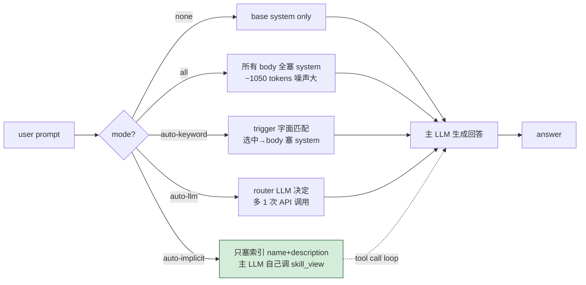
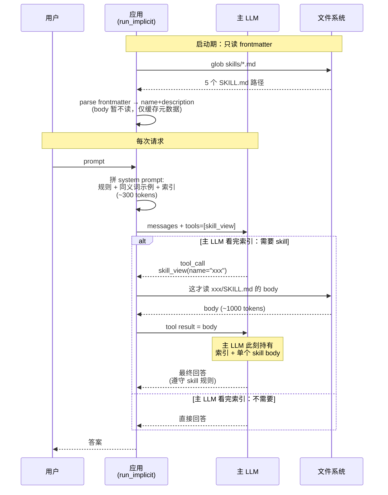

# 14-skill-loader-demo

Skill 概念的本地实现。把"指令 + 触发条件 + 使用说明"打包成 `SKILL.md`，按用户请求自动选最相关的几个加进 system prompt。

跑在本地 MLX，**不**依赖 Claude API。

## 工作流程

### 五种模式总览



### auto-implicit 详细时序



看图时盯紧三件事：

1. **元数据和 body 分两步读** —— 启动只解析 frontmatter，body 只在 `skill_view` 工具调用时才读，这是 progressive disclosure 的本质
2. **system prompt 永远只有索引** —— 内容稳定，可被 prompt cache（多次请求只付一次完整价格）
3. **tool call 可能多轮** —— `run_implicit` 有 `max_iters=3`，主 LLM 可以连续调多个 `skill_view` 把多个 skill 拉进来

### 和 Function Call / MCP 的差别

| | 加载的是 | 谁决定调用 |
|---|---|---|
| Function Call | 函数（代码） | LLM 看 tools 列表 |
| MCP | 函数（远程） | LLM 看 Server 暴露的 tools |
| Skill | **指令 / 提示词 / 工作流文档** | 看模式：keyword 字面、router LLM、或主 LLM 自己 |

## SKILL.md 格式

```markdown
---
name: sql-query-builder
description: Help write, review, or optimize SQL queries.
triggers: [sql, query, postgres, 查询]
---

When the user asks about SQL:
- Default to ANSI SQL; switch dialect if requested
- Always list column names, never SELECT *
- ...
```

`description` 是给路由器看的（语义匹配）；`triggers` 是给关键词路由用的（字面匹配）；`body` 才是真正塞进 LLM system prompt 的内容。

## 四种加载策略

| 模式 | 谁决定 | 成本 | 风险 |
|------|--------|------|------|
| `none` | 不加载 | 零 | LLM 没有专门指令 |
| `all` | 全加载 | system token 巨大 | 噪声多，无关 skill 会干扰 |
| `auto-keyword` | trigger 字面匹配 | 零 | 漏命中（同义词不识别） |
| `auto-llm` | 独立 router LLM 选 | 多一次调用 | 偶尔过于保守 |
| `auto-implicit` | 主 LLM 自己决定要不要 `skill_view(name)` | 多 0-1 轮对话 | 主 LLM 比 router 更"克制"，漏同义词 |

实测对比（11 个测试 query，详见 `quick_demo.py`）：

| 模式 | 命中数 | 特点 |
|------|--------|------|
| `auto-keyword` | 6/11 | 字面命中正确，但同义词全 miss |
| `auto-llm` | 10/11 | 同义词识别强，但易 over-match（case 8 同时选 sql + security） |
| `auto-implicit` | 9/11 | over-match 问题缓解（case 8 精准），但更保守（synonyms 略弱） |

### `auto-implicit` 是怎么工作的

这是和 **Hermes / Anthropic 官方 Skills 最接近**的实现：

1. 把所有 skill 的 `(name, description)` 列在 system prompt 里
2. 暴露 `skill_view(name)` 作为 LLM 的工具
3. **主 LLM 自己读索引、自己决定要不要加载 body**
4. 工具调用返回 body 后，LLM 在下一轮回答里使用

好处：
- **Progressive disclosure** —— body 只在真需要时才加载，省 token
- **不需要独立 router** —— 减少一个失败点
- **不会 over-match** —— 主 LLM 看着索引能做整体判断，case 8 实测精准选了 code-review-security，没把 sql-query-builder 也拉进来

## 文件

| 文件 | 用途 |
|------|------|
| `skills/*.md` | 5 个示例 skill（会议纪要、代码审查、SQL、客服、翻译） |
| `skill_loader.py` | 解析 frontmatter、路由、组合 system prompt |
| `quick_demo.py` | 5 个测试 prompt × 多种模式对比 |

## 运行

```bash
pip install -r requirements.txt

# 只看路由决策，不调真实 LLM（最快）
python quick_demo.py --mode route-only

# 完整对比：none / all / auto-keyword / auto-implicit 各跑一遍
python quick_demo.py --mode compare

# 单一模式
python quick_demo.py --mode auto-implicit   # Hermes / Anthropic Skills 风格
python quick_demo.py --mode auto-llm        # 独立 router LLM
```

## 加自己的 skill

1. 在 `skills/` 新建 `<name>.md`
2. 写 frontmatter：name / description / triggers
3. 写 body：你想让 LLM 遵守的工作流 / 规则 / 格式
4. 不用注册，`skill_loader` 启动时自动扫描

## 生产环境主流方案

本 demo 实现的是教学版（keyword + LLM 路由）。真实生产用 **embedding 召回 + 阈值过滤**，必要时叠加 LLM rerank。

### 关键组件

| 组件 | 主流选型 |
|------|---------|
| Embedding 模型 | OpenAI `text-embedding-3-small`、Cohere `embed-multilingual-v3`、BGE-M3（中文）、`paraphrase-multilingual-MiniLM-L12-v2`（本地） |
| 向量存储 | < 1k skill：内存 numpy 数组；> 1k：Qdrant / Chroma / pgvector |
| 相似度 | cosine（≥ 0.5 才考虑，≥ 0.7 高置信） |
| Rerank（可选）| Cohere Rerank、BGE Reranker、或一次 LLM 调用从 top-5 选 top-2 |

### 流程

1. **构建期**（一次性）：把每个 skill 的 `description`（或 `description + body` 截断）做 embedding，缓存到磁盘 / 向量库
2. **运行期**（每次请求）：
   - embed 用户 prompt（10-50ms）
   - 跟所有 skill 向量算 cosine（< 1k 个 skill 不到 1ms）
   - 取 top-k 且 score ≥ 阈值
   - 可选 rerank

### 为什么这是主流

- **同义词原生解决**：embedding 空间里"对话录音"和"meeting transcript"距离很近，不需要维护 trigger 列表
- **跨语言**：multilingual embedding 让中文 prompt 能命中英文 skill description
- **延迟可控**：和 keyword 一样快（一次 embedding + 向量乘法），不像 LLM 路由要等一次完整生成
- **可解释**：相似度分数能直接展示给运维，便于调阈值

### 为什么本 demo 不实现

- 需要额外 100-500MB 依赖（sentence-transformers + torch），违背"轻量教学"原则
- 你本地 MLX 服务 `/v1/embeddings` 没开启，没法演示 API 调用版本
- 教学目的是讲**路由是什么**，不是讲**怎么调 embedding 库**

要把本 demo 升级到生产版：在 `skill_loader.py` 加一个 `route_embedding(prompt, skills)` 函数，把 `route_keyword` / `route_llm` 的位置替换掉即可——接口已经预留好。

## 和 Anthropic 官方 Skill 的差距

本 demo **没**实现的部分：

- **Progressive disclosure**：官方 Skill 可以分级加载（先看 description → 决定要不要加载 body → 决定要不要加载附件）。本 demo 一次加载完整 body
- **嵌套 skill**：skill 内部引用其他 skill。复杂场景需要
- **运行时工具调用**：Skill 内部可以触发 code execution / file ops。本 demo 是纯 prompt 注入
- **TTL / 版本管理**：官方有 `version` 字段、能跨设备同步

这些都是工程细节，**核心思路本 demo 已经覆盖**：按请求动态加载相关指令，避免长 system prompt。

## 局限

- 关键词路由对**同义词、错别字、新词汇**毫无办法
- LLM 路由偶尔过度保守，返回空数组（本 demo 用更严的 system prompt + 鲁棒 JSON 解析缓解）
- skill 越多，路由出错概率越高——5 个还行，50 个就要分组或两层路由

## 相关 demo

- `01-llm-function-call-demo`：工具层（执行代码）
- `04-mcp-demo`：工具层 + 标准协议
- `13-prompt-engineering-demo`：写好的 system prompt 怎么来——本 demo 解决"该用哪条"的问题
