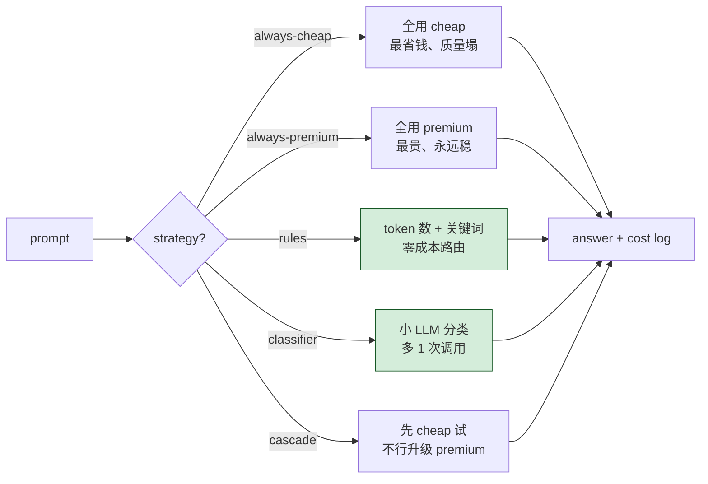
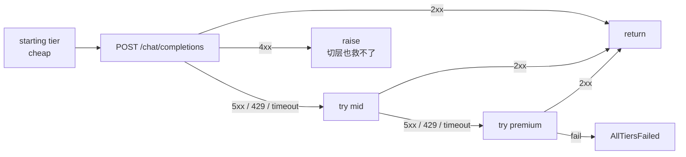

# 16-model-router-demo

按请求难度把任务分发到不同模型——简单题给小模型（便宜快），复杂题给大模型（贵但准）。降本的另一条主路径，和 `07-caching-demo` 不同维度但可叠加。

## 五种策略对比



## 三档模型

`models.py` 注册三档，价格直接对齐 Anthropic Haiku 3.5 / Sonnet 4 / Opus 4（输入比例约 1 : 4 : 19）：

| tier | 对标 Anthropic | $/1k in | $/1k out | quality |
|------|------|---------|----------|---------|
| cheap   | Haiku 3.5 | $0.0008 | $0.004  | 5 |
| mid     | Sonnet 4  | $0.0030 | $0.015  | 7 |
| premium | Opus 4    | $0.0150 | $0.075  | 9 |

本地示例每档配的具体 model ID 在 `.env` 里（`MODEL_CHEAP` / `MODEL_MID` / `MODEL_PREMIUM`），默认值是本机 MLX 的三个模型。要换 OpenAI / DeepSeek / 自家定价直接改 `models.py:REGISTRY`。

## 文件

| 文件 | 用途 |
|------|------|
| `models.py` | 模型注册表 + cost 估算 |
| `router.py` | 5 种路由策略 |
| `quick_demo.py` | 真实调 LLM，7 query × 5 策略 side-by-side |
| `production_example.py` | 100 query 模拟，纯算术不调 LLM（秒级出结果）|

## 运行

```bash
pip install -r requirements.txt

# 不调 LLM 的成本模拟（秒级）
python production_example.py

# 真调 LLM，所有策略全跑（本地 MLX 实测 25-40 分钟）
python quick_demo.py

# 只跑一个策略
python quick_demo.py --strategy cascade

# 限制 query 数量做快测
python quick_demo.py --strategy classifier --limit 3
```

## 模拟数据（100 query，70% easy / 25% medium / 5% hard）

```
strategy                total cost   vs oracle  vs premium
oracle (理论下限)        $0.8119      +0.0%      +52.6%
always-cheap            $0.0914      -88.7%     +94.7%  ← 便宜但质量差
always-mid              $0.3428      -57.8%     +80.0%
always-premium          $1.7139     +111.1%      +0.0%  ← 基线
rules (token buckets)   $0.7139      -12.1%     +58.3%
classifier (15% err)    $0.8860       +9.1%     +48.3%
classifier (5% err)     $0.8240       +1.5%     +51.9%
cascade                 $1.1845      +45.9%     +30.9%
```

**结论**：
- always-cheap 数字最低但 hard query 几乎全挂，实际质量不可用
- rules 极简（几行 if），已经比 premium 省 58%——大多数项目止步于此就够
- classifier 准确度好（5% err 时只比 oracle 多 1.5%），但 15% err 就掉到 +9.1%——分类器质量直接决定上限
- cascade 在 "cheap 通过率 easy 95% / medium 40% / hard 10%" 假设下反而输给 rules，因为升级时 cheap 那次的钱白花

## 何时用哪个

| 你的情况 | 推荐 |
|---------|------|
| 项目早期、流量小 | always-premium（别想太多） |
| 流量起来了、想降本 | **rules**（5 行代码、零额外成本） |
| 业务对质量很挑、负载稳定 | classifier（多 1 次小调用值） |
| 输出可以"先粗后细"渐进 | cascade（搜索 / 写作类适用） |
| 全做对了 | **三种叠加**：缓存 + 路由 + 服务端前缀缓存 |

## Failover（自动故障切换）

每个 strategy 选的是 **starting tier**，真正的调用走 `_post_with_failover`：



哪些算"该 failover"：

| 错误 | 切层? | 原因 |
|------|------|------|
| 5xx | ✅ | tier-specific 故障 |
| 429 限流 | ✅ | 当前 tier 配额满了，别的可能有 |
| Timeout / ConnectionError | ✅ | 网络问题或单点挂 |
| 401 / 403 / 404 | ❌ | 凭证/请求本身问题，切层一样错 |
| 400 bad request | ❌ | prompt / 参数有问题 |

Failover 是**事件驱动**（5xx 触发），cascade 是**质量驱动**（弱答案触发）—— 两者正交，cascade 模式同时享受 failover。

## 测试

```bash
python -m unittest test_failover.py -v
```

`test_failover.py` 用 `unittest.mock` 拦截 `requests.post`，覆盖 8 个用例：

| 用例 | 验证 |
|------|------|
| no failover when first succeeds | 不该切的时候不切 |
| cheap 500 → falls over to mid | 基本 failover 路径 |
| cheap 500 + mid 500 → premium | 链式 failover |
| 所有 tier 全挂 | 抛 `AllTiersFailed` |
| 401 → 不 failover | 客户端错误直接传递 |
| Timeout → failover | 网络层错误也算 |
| `route_rules` 走 failover | 不只 always 模式有 |
| cascade + failover 组合 | 两层 escalation 都记录在 result 里 |

跑出来 8/8 通过，且不需要真实 LLM。

## 几条工程经验

1. **先量化质量损失再换模型** —— 用 `08-evaluation-demo` 跑回归，不要拍脑袋
2. **路由器自己也要监控** —— 鬼知道 classifier 把 30% 的请求误分到 premium
3. **小心 cascade 反水** —— 如果 cheap 大部分请求都不行，cascade 比 always-premium 还贵
4. **rules 永远是 baseline** —— 任何更复杂的方案都得证明能打过 rules，否则不值
5. **Failover ≠ 重试** —— 本 demo 的 failover 是"切 tier"，故意不做同 tier 重试（那是 `06-error-handling-demo` 的范畴）。生产中两层可以叠加：同 tier 重试 2-3 次仍失败再切下一档

## 局限

- 假定 LLM API 同 endpoint 多 model（OpenAI / 本地 MLX / vLLM 都行；多 provider 要先包一层）
- 失败的 tier 没冷却期 —— 下一个请求又会试已知挂掉的 tier，生产应加 circuit breaker
- 没有 per-user 配额（防止某用户把 premium 用爆）
- `_looks_weak` 启发太粗，真实生产应该接 evaluation-demo 的指标

## 相关 demo

- `07-caching-demo` —— 缓存命中省的是"调 LLM"；路由省的是"调贵 LLM"，互补
- `08-evaluation-demo` —— 任何路由策略上线前都该跑回归
- `15-a2a-protocol-demo` —— A2A 路由到不同 agent；本 demo 路由到不同 model，两层正交
