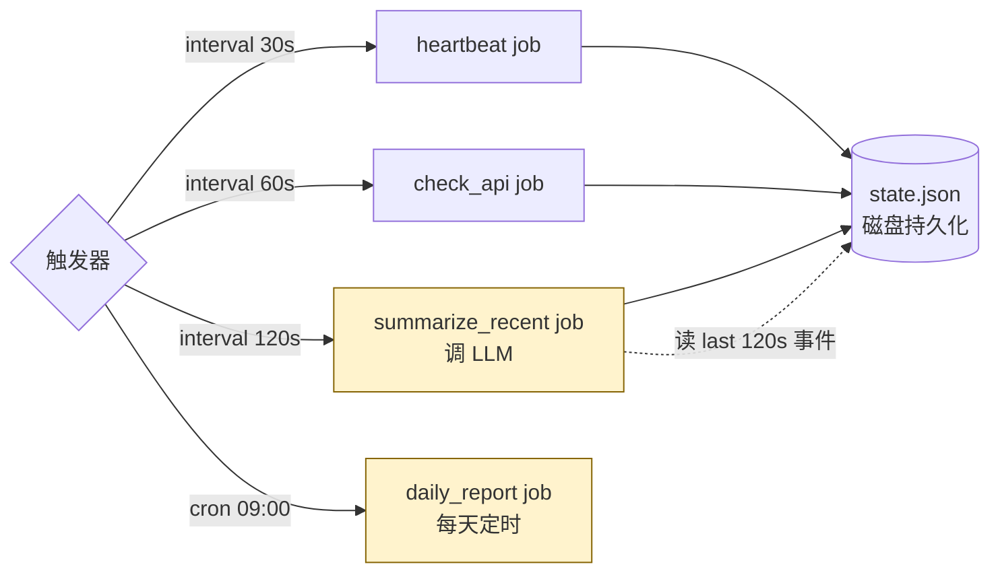

# 17-cron-agent-demo

定时触发的 Agent：按时间表跑、不靠用户输入。监控、汇报、清理、巡检——这些都不是"等用户问"，而是"主动按节奏跑"。

## 工作流程



## 和 simple-agent 的差别

| | `09-simple-agent` | **本 demo** |
|---|---|---|
| 触发方式 | 用户问 | 时间表（interval / cron） |
| 状态生命周期 | 一次对话 | 跨进程、跨重启 |
| 失败处理 | 抛错给用户 | 错过 → 补跑 / 合并 |
| 典型用途 | 交互问答 | 监控、汇报、定期清理 |

## 三个示例 job

| job | 触发 | 干啥 | 调 LLM? |
|-----|------|------|---------|
| `heartbeat` | 30s 间隔 | 写一条"活着"事件 | ❌ |
| `check_api` | 60s 间隔 | 探活 LLM API，记延迟 | ❌（只调 /models） |
| `summarize_recent` | 120s 间隔 | 把最近 2 分钟事件汇总成 1-2 句话 | ✅ |

实际项目里 cron agent 大多是这种模式：**便宜的常跑、昂贵的稀跑、状态写文件**。

## 文件

```
python/
├── state.py        基于 JSON 文件的简单持久化（线程安全，进程间不安全）
├── jobs.py         三个 job 的实现
├── scheduler.py    APScheduler 注册 + 主循环
└── data/state.json （自动生成）
```

## 运行

```bash
pip install -r requirements.txt
python scheduler.py --run-for 180     # 默认跑 180 秒，Ctrl-C 提前停
```

跑完看 `data/state.json`：所有事件 + 最后一次 summary 都在里面。重新启动 scheduler 会**接着上次状态继续**——这是 cron agent 区别于一次性脚本的关键。

## 几个工程要点

### 1. `max_instances=1`

防止 job 跑得比间隔慢时出现并发实例。比如 `summarize_recent` 调 LLM 可能 30 秒，但间隔是 120 秒——加上 `max_instances=1` 后即使本次跑了 150 秒，下一次也不会与之并行起飞。

### 2. `misfire_grace_time`

调度器卡住或系统休眠后，错过触发时间能不能补。设 10s = 错过 10 秒内还会跑一次；超时直接放弃。

### 3. `coalesce=True`

多次错过合并成一次。系统休眠 5 分钟、heartbeat 应该触发 10 次——开 coalesce 后只补跑 1 次，不刷屏。

### 4. 状态原子写

`state.py` 写 `state.tmp` 然后 rename。POSIX rename 是原子的——保证读到的 JSON 永远完整，不会出现写一半被读到的损坏文件。

### 5. 立即首次触发 + 优雅停机

- `add_job(..., next_run_time=now()+1s)` —— APScheduler 默认首次触发等满一个 interval；demo 里这样跑 `--run-for 2` 等不到任何 job 触发。改成启动后 1 秒立即跑一次，之后 interval 正常推进。
- `shutdown(wait=True)` —— 否则 in-flight 的慢 job（如 `summarize_recent` 调 LLM 要 20-30s）会在 "scheduler stopped" 之后才吐输出，看着像 zombie。代价是 Ctrl-C 后要等 in-flight job 结束才退出（连按两次 Ctrl-C 强杀）。

## 部署模式对比

| 模式 | 用途 | 何时选 |
|------|------|--------|
| **本 demo: 单进程长跑** | Daemon-style | 简单、最快上手；只在一台机器 |
| 系统 crontab + 脚本 | 一次性任务 | 不想自己写循环、容器化简单 |
| K8s CronJob | 容器化生产 | 已经在 K8s 集群里 |
| Celery Beat / Temporal | 分布式 | 多 worker、需要重试持久化 |

教学/原型用本 demo，生产规模建议 K8s CronJob 或 Temporal。

## 局限

- 单进程：进程挂了所有 job 都停
- 没有重试逻辑：job 抛错只会 log，不会重试
- 没有去重：如果跑多个进程会重复跑（生产用 Redis 分布式锁 / 数据库 unique key 解决）
- state.json 是本地文件，多节点要换 Redis / Postgres

## ⚠️ 一条踩过的坑：别拿 LLM 做监控摘要

`summarize_recent` 这个 job **本身就是反面案例**——cron + LLM 总结看起来 fancy，但在监控场景几乎一定会"编"。

实测踩到的：3 个事件给 LLM，它输出 "**Heartbeat checks are occurring approximately every 9 seconds**，consistent pattern" ——但 9 秒其实是上次 run 结束到这次 run 启动的间隙，根本不是 heartbeat 周期（30s）。LLM 看到 2 个时间戳就强行算 interval、还断言"consistent"，这是小样本归纳的经典翻车。

prompt 加严（"不准算 interval、不准 claim pattern、提醒数据可能跨重启"）能压住明显胡说，但本质问题在于：**LLM 不该用在"事实归纳"场景**。

**生产建议**：
- 监控摘要走纯统计（"过去 5min 内 N 次失败、平均延迟 Xms"），别让 LLM 介入
- LLM 摘要留给真正的"文本"场景：会议纪要、客服对话、文档分析
- 如果硬要用 LLM 看监控数据，至少：① 明确禁止它推算 interval/pattern；② 设最小数据点阈值（如 ≥ 20）；③ 输出只准"陈述事实"，禁"判断趋势"

## 相关 demo

- `06-error-handling-demo` —— job 内部应该用那里的重试 / 断路器
- `08-evaluation-demo` —— 定期跑回归测试就是典型 cron agent 用法
- `09-simple-agent-demo` —— 互动 agent；本 demo 是非互动 agent
