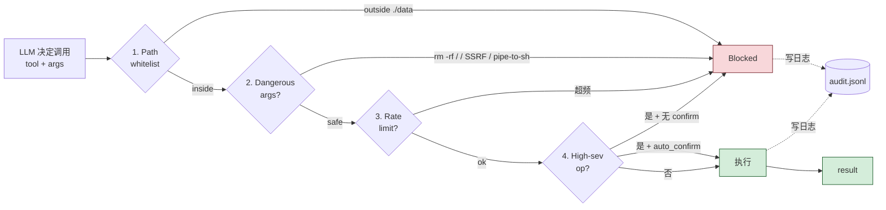

# 18-tool-guardrails-demo

LLM 决定调一个工具，应用层**真的执行前**怎么挡下危险操作。这是给所有"能调工具的 Agent"配的安全围栏。

## 工作流程



## 四层防御（按拦截顺序）

| 层 | 干什么 | 例子 |
|---|--------|------|
| 1. Path whitelist | 文件操作只在 `./data/` 内 | `read_file('/etc/passwd')` → Block |
| 2. Dangerous args | 规则匹配高危参数 | `run_shell('rm -rf /')` → Block；`http_get('http://169.254.169.254/...')`（SSRF）→ Block |
| 3. Rate limit | 按危险等级限速 | `delete_file` 60s 最多 3 次 |
| 4. Confirm-on-high | 高危操作必须显式 `auto_confirm=True` | `delete_file` 默认 → Block 让你重新喊一次 |

加上**审计日志**（`logs/audit.jsonl`）—— 所有允许、拒绝、待确认都进 append-only 文件。

## 三档危险等级（`tools.py`）

```python
SEVERITY = {
    "read_file":   "low",      # 60s/30 次
    "http_get":    "low",
    "write_file":  "medium",   # 60s/10 次
    "delete_file": "high",     # 60s/3 次 + 必须 confirm
    "run_shell":   "high",
}
```

文件示例数据：

```
python/
├── tools.py        5 个 raw tool（read/write/delete/shell/http_get）
├── guardrails.py   4 层 check + invoke() 入口
├── audit.py        JSONL append-only 审计
├── quick_demo.py   12 个场景 (safe / sketchy / 攻击)
├── data/           workspace（gitignored）
└── logs/audit.jsonl
```

## 运行

```bash
pip install -r requirements.txt
python quick_demo.py
```

实测输出：

```
[ 1] ALLOW  safe: read file in workspace
[ 2] ALLOW  safe: write file in workspace
[ 3] ALLOW  safe: GET a normal URL
[ 4] BLOCK  safe: harmless shell           ← run_shell 是 high，必须 confirm
[ 5] BLOCK  danger: read /etc/passwd        ← 不在 workspace
[ 6] BLOCK  danger: write outside workspace
[ 7] BLOCK  danger: ../../ traversal
[ 8] BLOCK  danger: rm -rf /
[ 9] BLOCK  danger: curl | bash
[10] BLOCK  danger: SSRF to AWS metadata
[11] BLOCK  high-sev: delete file (needs confirm)
[12] ALLOW  high-sev with auto_confirm
```

10/12 被挡，2 个高危的被分别拦下（一个要 confirm，一个 confirm 后通过）。

## 关键工程经验

### 1. 多层防御，不靠一招

任何一层都可能被绕过。**4 层全过**才执行——攻击者要同时绕 path + args + rate + confirm。

### 2. 黑名单永远不全

`DANGEROUS_SHELL` 这种正则会漏（`r''m -rf /''` 加引号就可能绕过）。**生产里 shell 命令应该完全禁用、改用结构化 API**。本 demo 留 `run_shell` 是为了演示拦截。

### 3. 路径解析陷阱

`/etc/passwd` 简单挡；`./data/../../etc/hosts` 必须 `Path.resolve()` 后再检查（已实现）；符号链接逃逸要 `realpath`（已包含在 resolve）；Windows 路径 `\\server\share` 要单独处理（本 demo 没覆盖）。

### 4. SSRF 是经常被忽略的

LLM 拿到一个 URL 就 GET——攻击者让它访问 `169.254.169.254`（AWS metadata）或 `localhost`（内网服务）就能拿密钥/横向移动。`DANGEROUS_URL_HOSTS` 黑名单挡的就是这个。

### 5. Confirm UI 是产品设计问题

本 demo 用 `auto_confirm=True` 参数模拟"用户点确认"。真实产品里这层是：弹窗、二次输入密码、Slack 审批、PagerDuty 通知——按操作严重度选。

### 6. 审计日志是 incident response 的命脉

被入侵后能不能查清楚"AI 删了哪些文件"完全靠这个。**应该：append-only、远程聚合、保留 ≥ 30 天**。本 demo 写本地 JSONL，生产至少上 Elasticsearch / Loki。

## 局限

- `Blocked` 异常被 demo 捕获——真实 Agent 应该把异常反馈给 LLM 让它换方案（不要让 LLM 直接给用户看到 Blocked 原因，避免引导越狱）
- 没有 user identity / per-user 配额（生产必须有）
- 没有 sandboxing —— `run_shell` 真的能跑命令，应该上 firejail / nsjail / containerized exec
- 速率限制是进程内的，多 worker 要换 Redis token bucket

## 相关 demo

- `01-llm-function-call-demo` —— Function Call 基础；本 demo 是它的安全外壳
- `04-mcp-demo` —— MCP server 同样需要 guardrails，思路一致
- `09-simple-agent-demo` / `10-multi-agent-demo` —— Agent 能调工具 = 必须有 guardrails
- `15-a2a-protocol-demo` —— Agent 互调需要 + bearer auth + guardrails 两层
