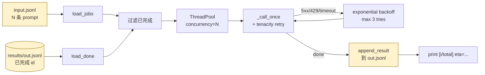

# 19-batch-runner-demo

跑 N 条 prompt 不是大事，**跑 1 万条**才有意思——并发、重试、断点续跑、进度可见、结果增量落盘。生产里所有的离线评测、数据生成、批量 inference 都长这个样子。

## 工作流程



## 文件

```
python/
├── runner.py            # 主程序：load → 并发 → retry → 增量落盘
├── data/sample.jsonl    # 20 条示例 prompt
└── results/out.jsonl    # 跑完输出（gitignored）
```

## 运行

```bash
pip install -r requirements.txt

# 默认：跑全部 20 条，concurrency=4
python runner.py

# 限制 8 条
python runner.py --limit 8

# 并发拉到 8
python runner.py --concurrency 8

# 强制重跑（删 results/out.jsonl）
python runner.py --no-resume

# 自己的输入输出
python runner.py --input my.jsonl --output my_out.jsonl
```

## 输入 / 输出格式

### 输入 (JSONL)

```json
{"id": "q1", "prompt": "用一句话解释 HTTP"}
{"id": "q2", "prompt": "1+1 等于几？"}
```

`id` 必须**全局唯一**——它是断点续跑的 key。

### 输出 (JSONL)

```json
{"id": "q1", "prompt": "...", "answer": "HTTP 是...", "error": null,
 "elapsed_ms": 28344, "attempts": 1, "tokens": 87}
{"id": "q2", "prompt": "...", "answer": null, "error": "...",
 "elapsed_ms": 60000, "attempts": 3, "tokens": 0}
```

每条独立 JSON，append-only —— 进程挂了已经写的不丢，重跑只会接着没做完的继续。

## 关键设计

### 1. 并发用 `ThreadPoolExecutor`

LLM API 是 I/O bound（等响应），thread pool 简单够用。CPU bound 才用 process pool。

为啥不用 `asyncio`？因为生态杂，本地 MLX、OpenAI SDK 各家姿势不同。线程池保守但通用，且性能足够。

### 2. 重试用 `tenacity` 库

```python
@retry(
    stop=stop_after_attempt(3),                       # 最多 3 次
    wait=wait_exponential(multiplier=1, min=1, max=8), # 1s, 2s, 4s 指数退避
    retry=retry_if_exception_type(TransientError),    # 只重试可恢复的
)
```

**关键**：只重试 5xx / 429 / 超时（封装成 `TransientError`）。4xx（参数错误、认证失败）直接挂——重试无意义。

### 3. 断点续跑（resume）

```python
def load_done(out_path) -> set[str]:
    """从已有 results JSONL 读出已成功的 id —— 失败的不算 done，下次重试"""
```

进程被 Ctrl-C / OOM / 网络挂 / 你回家睡觉了——下次起来 `python runner.py` 就接着跑。不用记 checkpoint 文件，结果文件本身就是 checkpoint。

### 4. 增量落盘

每条做完立刻 `append_result(out_path, r)`，不等全跑完。**5000 条跑到 4999 条进程挂了，只丢 1 条**，不是全丢。

### 5. ETA 估算

```python
eta = int(elapsed * (len(todo) - i) / max(i, 1))
```

简单线性外推——前 N 条平均速度推后面剩余时间。对均匀负载够用，长尾任务会高估。

## 实测（20 条简短问答，concurrency 4）

```
=== summary ===
total                 20
ran                   20
ok                    20
failed                0
elapsed_s             132
tokens                1894
avg_attempts          1.0
throughput_per_min    9.1
```

并发 4 vs 串行：串行约 540 秒，并发约 132 秒——**~4x 加速**，符合预期（受 LLM 端单实例 GPU 串行执行限制）。

## 几条工程经验

1. **设 concurrency 看 LLM 端能扛多少**——本地 MLX 通常 1-4 并发就饱和；商业 API 看你的 rate limit
2. **超时设短一点**（60-120s）——长尾任务等着只会卡批次，单条失败重试比卡死强
3. **不要把成本算在重试上**——成本应该按 `actual API calls`，包括失败的；本 demo `tokens` 字段只算最终成功的（生产可以分开算）
4. **大批量加分片**——10 万条不要一次扔，按 1000 条分批，每批一个独立 output 文件，方便并行多机
5. **错误必须可分析**——`error` 字段存全文，事后 `grep 'rate limit' out.jsonl | wc -l` 就能看出限流次数

## 局限

- 单进程：要分布式见下面"扩展"
- 没有 token-bucket 限速（生产应该按 provider rate limit 主动 throttle）
- 没有结果验证（评测是 `08-evaluation-demo` 的事）
- 进度只在 stdout，UI 弱（生产可换 `tqdm` 或推 metrics 到 Prometheus）

## 扩展到分布式

10 万条以上 / 多机：
1. **分片**：input 切成 N 份，每份给一个 worker
2. **去中心化 checkpoint**：每个 worker 写自己的 output JSONL，最后 merge
3. **限速**：用 Redis token bucket 共享配额（防止 N 个 worker 一起触发 rate limit）
4. **失败队列**：失败任务推到 dead-letter queue 让人工 review

但要做到这步前，先确认本 demo 这种简单形式扛不住。多数项目其实只需要 4 核 + 8 并发就够了。

## 相关 demo

- `06-error-handling-demo` —— 单次调用的重试逻辑，本 demo 把它批量化
- `08-evaluation-demo` —— 评测就是 batch run + metric；那个 demo 内置了简化版 batch runner
- `17-cron-agent-demo` —— 定时跑 batch 是常见 cron job 用途
