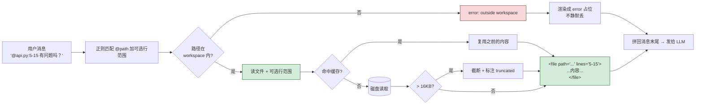

# 20-context-refs-demo

`@file.py` 这种引用语法的实现——用户消息里出现 `@路径`，应用自动读文件、附加到 prompt 里。Cursor / Continue / Claude Code 都靠这套维持"用户提供上下文"的流畅体验。

## 和 Function Call 的差别

| | Function Call | **@-ref** |
|---|---|---|
| 谁主动 | **LLM** 决定调什么工具拿数据 | **用户**显式指出要带哪些文件 |
| 时机 | 推理过程中 | 请求构造时（在 LLM 看到 prompt 前已注入）|
| 适合 | 探索性、不确定要读什么 | 用户清楚要给哪个文件 |
| 速度 | 慢（多轮）| 快（一次性塞进去）|

两套互补：日常 IDE 写代码用 @ref（用户在指挥），Agent 任务用 Function Call（LLM 在探索）。

## 工作流程



## 支持的语法

```
@file              整个文件
@file:42           只读第 42 行
@file:10-25        读 10 到 25 行
```

不支持：glob (`@src/*.py`)、跨目录递归——故意保持简单，让人能 1 分钟看懂。

## 文件

```
python/
├── refs.py         resolve_refs + render_for_llm
├── quick_demo.py   5 个场景，含安全测试
└── workspace/      被 @ 引用的样本文件
    ├── user.py
    ├── api.py
    └── notes.md
```

## 运行

```bash
pip install -r requirements.txt
python quick_demo.py
```

## 5 个示例场景

| # | 用户消息 | 行为 |
|---|---------|------|
| 1 | `我的代码 @user.py 里 find_user 有什么问题？` | 读整个 user.py，LLM 看代码后回答 |
| 2 | `@api.py:5-15 这几行有什么风险？` | 只读 5-15 行 |
| 3 | `结合 @notes.md 和 @api.py，列出 TODO` | 两个文件都附加，LLM 综合分析 |
| 4 | `@nonexistent.py 文件还在吗？` | 渲染成 `[error: file not found]` 占位，LLM 明确知道 |
| 5 | `解释一下闭包是什么` | 无 @ref，原消息直接发 |

## 关键设计

### 1. 路径安全

`@/etc/passwd` / `@../../foo` 一律拒绝——所有路径**必须 resolve 后落在 WORKSPACE 里**，否则返回 `error: path outside workspace`。这和 `18-tool-guardrails-demo` 是同一套思路。

### 2. 缓存：同文件引用一次

```python
if key in seen_keys:
    ordered.append(seen_keys[key])
    continue
```

`@user.py @user.py` 不会重复读盘、不会在 prompt 里出现两次（render 阶段也去重）。

### 3. 错误不静默

`@nonexistent.py` 不被丢掉，而是渲染成：

```
<file path="/.../nonexistent.py">
[error: file not found]
</file>
```

**为什么**：LLM 看到这个会告诉用户"你引用的文件不存在"，而不是装作没看见。静默丢失是最坏的 UX。

### 4. 大文件截断

> 16KB 自动截断 + 加 `... [truncated]` 标记。生产场景里这个上限应该按 context window 动态算。

### 5. 拼在消息尾部，不内嵌替换

```
原消息：'@user.py 有什么问题？'

发给 LLM：
'@user.py 有什么问题？

---
Attached files:
<file path="..."><内容></file>'
```

**为啥不直接把内容替换 `@user.py`**：
- 用户原意保留可读
- 多次 @同一文件不会重复内容
- LLM 看到一个清晰的"附加文件"区段，结构化

## 几个工程经验

1. **支持行范围比支持 glob 实用**——`@huge_file.py:200-220` 比 `@src/**/*.py` 更常用
2. **永远先做路径安全**——任何 IDE / 编辑器集成的第一漏洞都是这里
3. **截断要可见**——LLM 知道"这是部分内容"才不会编整文件
4. **错误要可见**——见上面"不静默"那条

## 局限

- 只识别 `@开头`；不识别 `\\@escape`（需要的话加个反斜杠转义机制）
- 没有 fuzzy 路径匹配（`@usr.py` 拼错不会自动找 `user.py`）
- 没有按 import 自动展开依赖（Claude Code 有，但要做 AST 分析，超 demo 范围）
- WORKSPACE 是硬编码相对路径，多项目要环境变量化

## 相关 demo

- `01-llm-function-call-demo` —— LLM 主动调工具拿数据；本 demo 是用户指定数据
- `18-tool-guardrails-demo` —— 路径白名单同思路
- `05-memory-management-demo` —— @ref 是给单条消息加上下文；那个 demo 是给整个对话加历史
