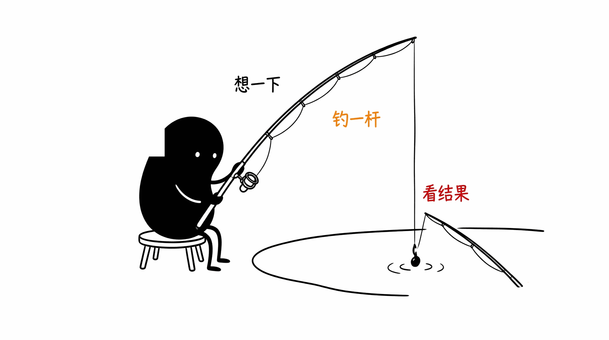
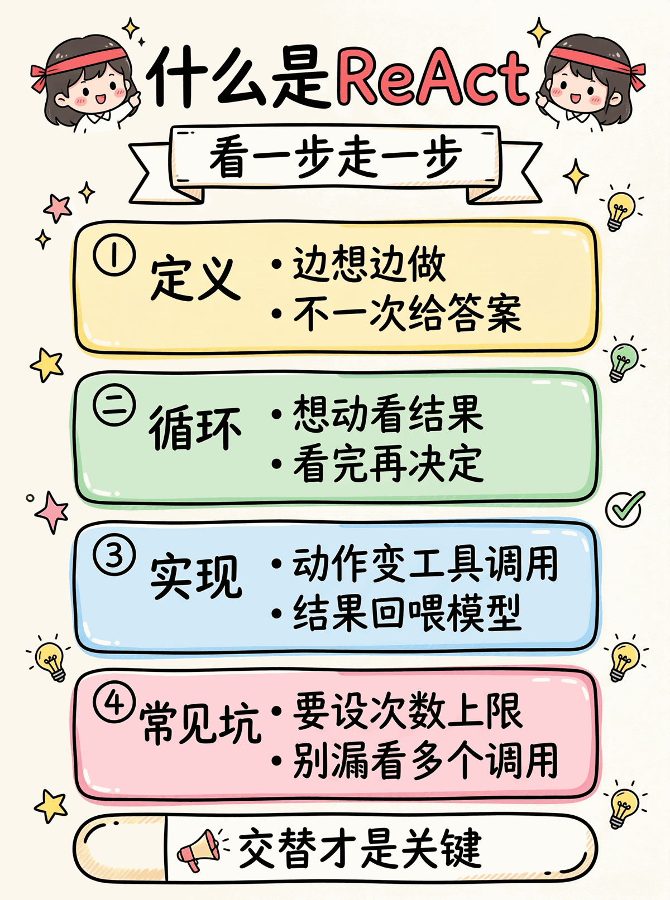

# 01 · Simple Agent Demo

把 01 的一次 function-call 往返包成多轮 while 循环 = ReAct 风格的最小 agent。



## 什么是 ReAct

**ReAct = Reasoning + Acting**, 出自 [Yao et al. 2022, *ReAct: Synergizing Reasoning and Acting in Language Models*](https://arxiv.org/abs/2210.03629). 当今所有 agent 框架 (LangChain / OpenAI Agents / AutoGPT / Claude Code) 的基础范式.

核心思想: LLM **交替**做两件事, 而不是一次给答案:

```
Thought (推理):  我要回答问题, 但缺天气信息
Action (行动):   call get_weather("北京")
Observation:     {temperature: 15, condition: "晴"}   ← 工具返回
Thought:         用户还问了上海, 再查
Action:          call get_weather("上海")
Observation:     {temperature: 20, condition: "多云"}
Thought:         信息够了
Answer:          北京 15 度晴, 上海 20 度多云
```

为什么"交替"是关键 —— 现实任务里**调工具前不知道工具会返回什么**, 必须看结果再决定下一步. 比如「找最便宜的手机」: 先 `search_products("手机")` → 看到价格列表 → 才能决定下一步. 一次性规划做不到.

跟其他范式的区别:

| 范式 | 思考 | 行动 | 不足 |
|------|------|------|------|
| 直接答 | ❌ | ❌ | 全靠模型内部记忆, 易幻觉 |
| Chain-of-Thought (CoT) | ✅ 一长串 | ❌ | 不能调外部工具 |
| 纯 tool use | ❌ | ✅ | 盲调, 不会"看结果再想" |
| **ReAct** | ✅ | ✅ | **交替**, 看一步走一步 |

### 经典 ReAct 格式 vs 现代 function calling

论文里的原版 prompt:
```
You will solve a task. Use this format:
Thought: <your reasoning>
Action: <tool_name>[<args>]
Observation: <tool result>
... (repeat)
Answer: <final answer>
```

现代 LLM (OpenAI/Anthropic function calling) 把它**结构化**了:
- `Thought` → LLM 内部消化, 不再显式输出
- `Action` → `assistant.tool_calls` JSON
- `Observation` → `role: "tool"` 消息

所以你在 messages 里看到的那一坨 (assistant + tool*) 配对, 就是 ReAct 的工程实现.

## ReAct 循环

```
while iter < max_iterations:
  LLM 决策 → 若给 content 且无 tool_calls：返回（任务完成）
            → 若给 tool_calls：执行，把结果回灌 messages，继续
到达 max 仍未给答案：返回最后一次 content
```

## 目录

```
.
├── python/
│   ├── agent.py    # 🟢 Agent + Step
│   ├── tools.py    # 🟢 工具注册表（同 01）
│   ├── main.py / test.py
│   └── requirements.txt
└── README.md
```

## 跑起来

```bash
cd python
pip install -r requirements.txt
python test.py    # 3/3 passed，用 mock 测循环逻辑
python main.py    # 4 个多步任务
```

## 常见坑

- ❌ 没 `max_iterations` 兜底 → LLM 死循环
- ❌ 只看 `tool_calls[0]` → 漏调用
- ❌ 工具异常直接 raise → LLM 看不到错误，没法自我修正
- ⚠️ `max_iterations` 太小 → 复杂任务跑不完

## 长跑下的局限

这个最小 ReAct 跑 5-10 轮没事, 跑到 20+ 轮会崩三次:
- **结构崩** —— history 被截后留下孤儿 `tool` 消息, API 直接 400
- **体积崩** —— 一次 `web_fetch` 返回 50KB, 几轮就把 context 撑爆
- **预算崩** —— 总 token 超 context window, LLM 拒绝

延伸读 [03-context-governance](../03-context-governance) —— 5 步治理组合拳, 让 ReAct 撑到 50+ 轮.

<p align="center"></p>
