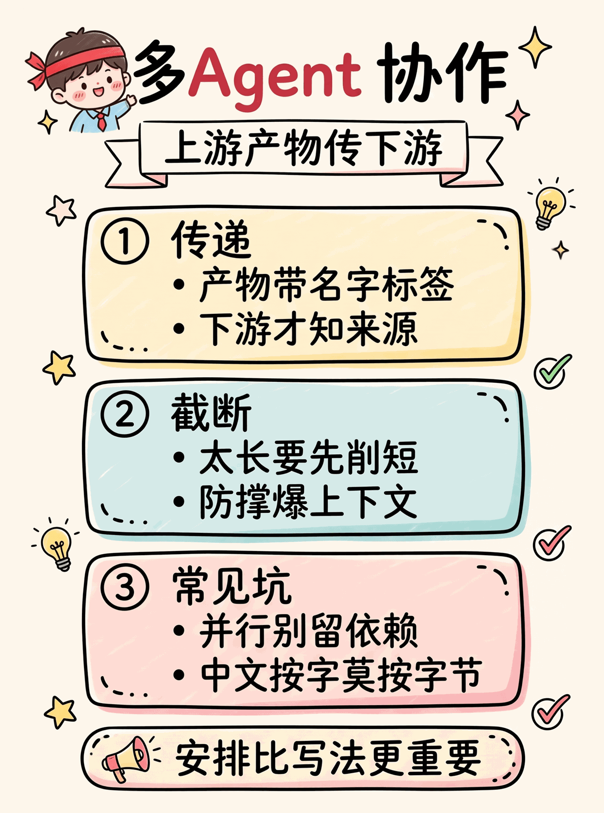
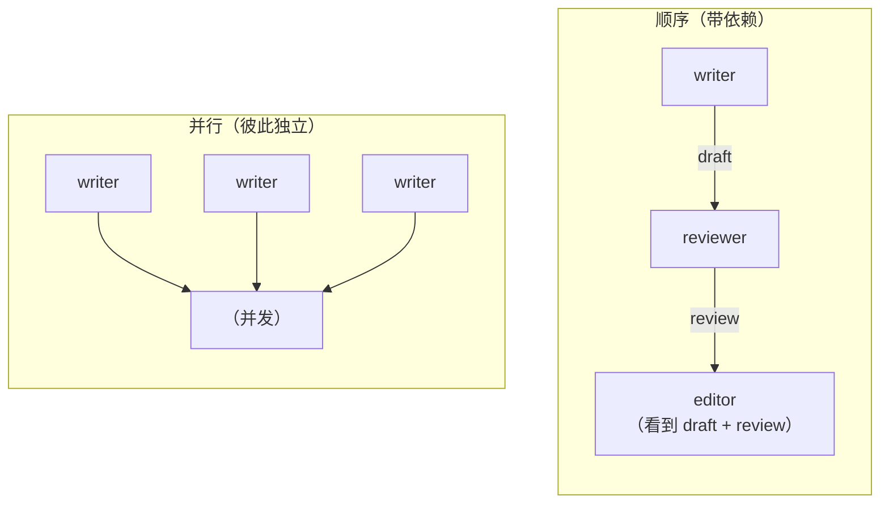
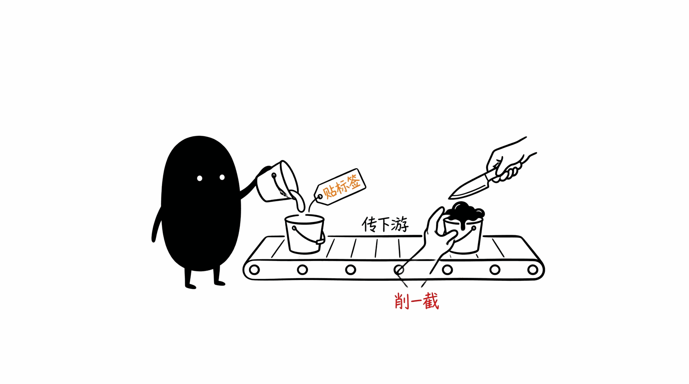

# 02 · Multi-Agent Demo

多 agent 协作。**关键不是 agent 怎么写，是 orchestrator 怎么把上游产物传给下游 + 怎么截断防爆 context。**

<p align="center"></p>

## 工作流模式



## 目录

```
.
├── python/   # Agent + Step + run_sequential/run_parallel
├── go/       # 同上，goroutine + WaitGroup 并行
└── rust/     # 同上，std::thread + Arc<Mutex<HashMap>>
```

## 跑起来

```bash
cd python && pip install -r requirements.txt && python test.py && python main.py
cd go && go mod tidy && go run .
cd rust && cargo run
```

## 三语言差异

| 维度 | Python | Go | Rust |
|---|---|---|---|
| 单 Agent | `dataclass + execute()` | `struct + Execute(ctx)` | `struct + execute()` |
| 并行 | `ThreadPoolExecutor` | `sync.WaitGroup + goroutine` | `std::thread + Arc<Mutex>` |
| 依赖拼 context | `_context(results, deps)` | `buildContext()` | `build_context()` |
| 截断 | 字符（len, 实际 bytes） | bytes (中文要注意) | `chars().take()` |

## 共通的坑

- ❌ **不截断上游产物** —— 5 个 step 累加爆 context
- ❌ **直接拼依赖** —— 不带 `[id]` 前缀，LLM 不知道哪段是哪个 step 的
- ❌ **并行 step 之间有依赖** —— 拿不到上游产物（run_parallel 不解 DAG）
- ⚠️ **Rust 按字节切中文** —— 半个字符崩 unwrap，要用 `chars().take()`


