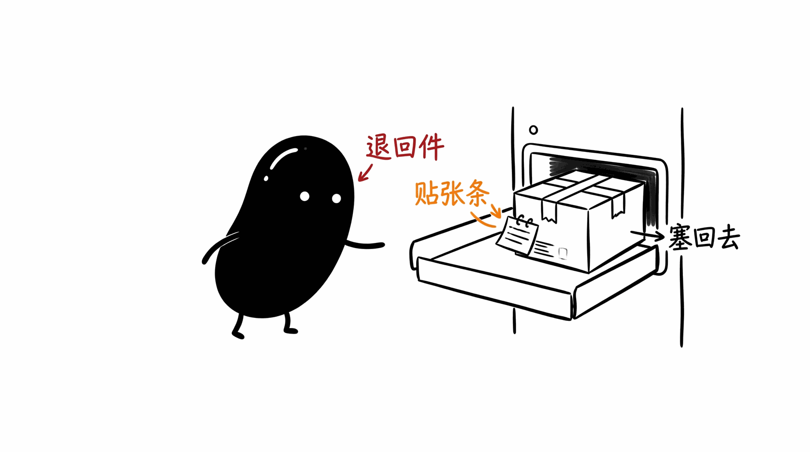
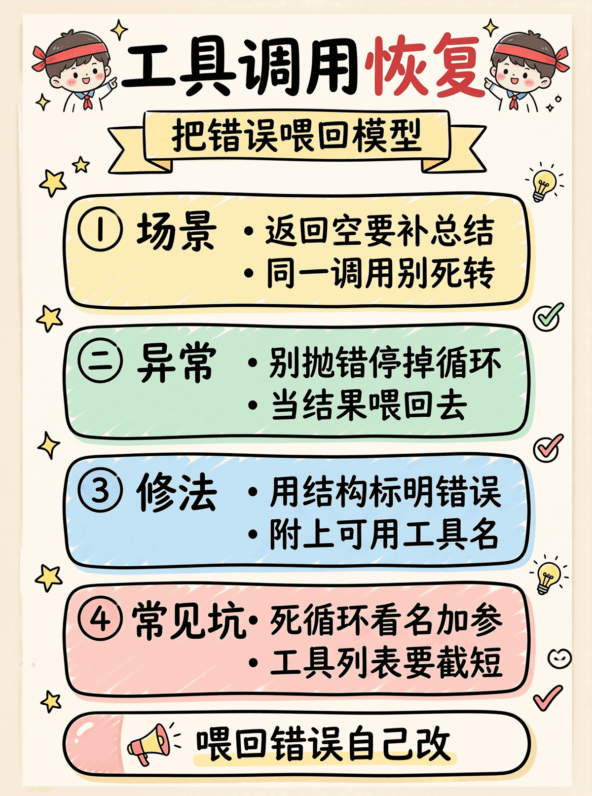

# 06 · Tool-Call 错误恢复

LLM agent 跑长了会遇到几类经典"卡死". 跟传统软件的 catch/retry 不同, LLM-era 的修法是**把错误信息喂回给 LLM, 让它自己改**.



抽自 PraisonAI `llm.py:1089` (`_generate_ollama_tool_summary`) + 实战归纳的另外 3 类.

## 四类卡死场景

### 1. Empty response loop (Ollama 风格)

```
[user]: 查 OpenAI 信息
[assistant]: <tool_call: web_search>
[tool]: {"results": [...]}
[assistant]: ""              ← Ollama 返回空, 期望用户主动 "请总结"
                              ← ReAct loop 看到无 tool_call + 短 content = 任务完成
[exit]: ""                   ← 用户看到啥都没说
```

修复: 检测 `len(content.strip()) < 10 且 tool_calls 为空 且 之前调过 tool`, 触发**强制合成 summary**.

### 2. Infinite tool-call loop

```
[assistant]: <tool_call: web_search("phone")>
[tool]: [results]
[assistant]: <tool_call: web_search("phone")>   ← 一模一样的调用
[tool]: [results]
[assistant]: <tool_call: web_search("phone")>   ← 又来
...
```

通常因为: tool 输出格式 LLM 不期望, 或者 prompt 引导不够"该停手了".

修复: 检测末尾 N 次连续完全相同 (name+args) 的 tool_call, 注入一条 `role=system` 消息: *"STOP. 已有结果, 现在给最终答案."* LLM 看到会修正.

### 3. Tool 抛异常

```python
# 传统写法
try:
    result = read_file("/missing")
except Exception as e:
    raise   # 整个 agent 死

# LLM-era 写法
try:
    result = read_file("/missing")
except Exception as e:
    result = json.dumps({"error": str(e), "tool": "read_file"})
    # 这条 error 当成 tool result 喂回 LLM, LLM 看到自己改路径
```

### 4. Unknown tool (LLM 幻觉工具名)

```
[assistant]: <tool_call: super_search_v2("...")>
              ↑ tools 注册表里只有 web_search, 不存在 super_search_v2
```

传统: KeyError 崩.
LLM-era: 返回
```json
{
  "error": "unknown tool: 'super_search_v2'",
  "available_tools": ["web_search", "read_file"],
  "hint": "Use one of available_tools, or stop calling tools."
}
```
LLM 看到 available 列表会改用对的.

## 通用原则

> **错误信息要喂回给 LLM, 不要抛异常停止 loop.**

这是 LLM 时代 error handling 跟传统的根本区别. 传统软件: error → log → retry/raise. LLM agent: error → 当 tool message 注入 → 继续 loop, LLM 自我修复.

## 跟 21 / 22 / 23 的关系

| Demo | 解决什么 | 触发场景 |
|------|---------|---------|
| 21 governance | context 结构/体积/预算 | 长跑 (20+ 轮) |
| 22 LLM 摘要 | 超长 history 总结 checkpoint | 超长跑 (50+ 轮) |
| 23 subagent | 任务并行 + context 隔离 | 多任务 |
| **24 recovery** | **LLM 自身行为异常** | **任何场景, 但小模型频发** |

24 不是"context 治理", 是"行为治理". 跟 21 是不同层次:
- 21: 给模型干净的输入
- 24: 处理模型输出的"诡异"

## 目录

```
.
├── python/
│   ├── recovery.py    # 🟢 ToolCallRecovery: 4 类检测 + 4 类修复
│   ├── main.py        # 4 个场景 (empty/loop/exception/unknown) 完整 demo
│   ├── test.py        # 11 个测试, 覆盖检测 + 修复 + 边界
│   └── requirements.txt
└── README.md
```

## 跑起来

```bash
cd python && pip install -r requirements.txt    # 含 ddgs (DuckDuckGo 真搜索, 免 API key)
cp .env.example .env  # 编辑填 API_KEY / MODEL_ID (场景 3 & 4 需要)

python test.py    # 11/11 passed (mock, 不调外网)
python main.py    # 4 场景: 1+2 mock, 3+4 真 LLM + 真联网搜索
```

工具是真的:
- `web_search` → DuckDuckGo HTML 搜索 (ddgs 库, 免 API key)
- `read_file` → 故意抛 FileNotFoundError 用于演示场景 3

所以场景 1 的 mock LLM 也"看见"了真维基百科结果, 场景 4 LLM 真的查到了 OpenAI 信息.

### Hybrid 策略 (重要)

| 场景 | 实现 | 为什么 |
|------|------|--------|
| 1 Empty response | **mock** | 现代大模型 (Qwen/GPT/Claude) 不会自然返回空, 必须人为构造 |
| 2 Infinite loop | **mock** | 现代大模型也极少自然死循环, mock 模拟连续 3 次相同 tool_call |
| 3 Tool 抛异常 | **真 LLM** | LLM 真的看到 error 后用自然语言回 sorry —— mock 写不出这种质量 |
| 4 Unknown tool | **真 LLM** | LLM 真的看到 available_tools 后切换工具 —— 真实生产场景 |

### 真 LLM 输出片段 (场景 3)

LLM 真的看到 `{"error": "FileNotFoundError: no such file: missing.yaml"}` 后自己写的回复:

> 很抱歉，我无法读取 `missing.yaml` 文件，因为**文件未找到**。
>
> 可能的原因有：
> 1. **文件路径不正确** - 文件可能不在当前工作目录下
> 2. **文件名有误** - 可能是拼写错误或扩展名不同
> 3. **文件尚未创建** - 文件可能还不存在
>
> **建议：** 请确认文件的完整路径...

这是 mock 给不出的真实质量. recovery 把 error 喂回去, LLM 自己消化成用户友好的回复.

### 真 LLM 输出片段 (场景 4 —— 真 DDG 联网)

LLM 调了不存在的 `magic_search_v2` (被 system prompt 诱导), recovery 拦下并 feed back available_tools 列表 → LLM 改用 `web_search` → DDG 返回真维基数据 → LLM 综合:

> ## OpenAI 信息摘要
>
> ### 基本信息
> - **性质**: 美国人工智能 (AI) 研究组织
> - **总部**: 旧金山
> - **成立时间**: 2015年12月11日
> - **组织形式**: 由非营利组织和营利性公共效益公司 (PBC) 组成的混合结构
>
> ### 创始人
> - Sam Altman (现任 CEO)
> - Greg Brockman
> - Elon Musk
> - Ilya Sutskever
> - Wojciech Zaremba 等

注意: 数据是**真 DDG 搜来的**, 不是 LLM 内置知识. recovery + 真搜索 + LLM 综合的完整链路.

## 常见坑

- ❌ **tool 抛异常直接 raise** → 整个 agent 死. LLM 看不到 error 没法自修
- ❌ **死循环检测只看 tool 名** → "name 一样 args 不一样" (e.g. `web_search` 不同 query) 误判
- ❌ **empty response 立即 abort** → 没合成 summary, 用户看到空, agent 死. 应触发 force_summary
- ❌ **强制 summary 在主 LLM 上调** → 主 LLM 已经"罢工"了, 调它没用. 真生产应该走规则合成 (或者另起一个 LLM)
- ❌ **infinite_loop 检测窗口太小 (N=2)** → 第 2 次重复就误判, 但 LLM 在某些任务里**确实**需要重复调 (e.g. 分页查询). N=3-5 比较稳
- ⚠️ **tool error 直接拼成纯文本 "error: ..."** → LLM 看不出是 error 还是 result; 用 JSON `{"error": "..."}` 让 LLM 明确识别
- ⚠️ **handle_unknown_tool 列出全部 100 个工具** → prompt 爆炸. 截断到 ≤ 20 个
- ⚠️ **LLM 不走 OpenAI 标准 tool_calls, 在 content 里塞 `<tool_call>` XML** → Qwen / 一些开源模型有这毛病, ReAct loop 看 `tool_calls` 字段空就当任务完成. 解法两路保险:
  1. **强 system prompt**: "Use the standard tool-calling API, do NOT output `<tool_call>` tags in your text"
  2. **Inline parser 兜底**: 正则解析 content 里的 `<tool_call>{...}</tool_call>`, JSON 合法时当 tool_call 处理 (本 demo 的 `parse_inline_tool_calls`). production client 如 litellm / LangChain 都做了这层
- ⚠️ **recovery stats 不持久化** → 跨 session 看不到趋势. 真生产把 recoveries 计数发到 metrics (prometheus)
- ⚠️ **强制 summary 写死规则拼接** → 教学版图省事; 真生产建议再调 1 次 LLM 让它综合 (但要 cooldown 防再次失败)

## 关键设计决策

### Recovery 该是 stateless 还是 stateful?

教学版用 stateful (stats 累加). 真生产**两种都要**:

- Stateless 决策 (这条消息要不要恢复): 函数化, 测试友好
- Stateful 统计 (整个 session 触发了几次): 用于 metrics + 调参

### Recovery 应该在哪个层次?

| 层次 | 优 | 劣 |
|------|---|-----|
| 包在 LLM client 里 | 对应用透明 | LLM client 见不到 messages context, 难做精准决策 |
| 包在 ReAct loop 里 | **见 messages 全貌, 决策准** ← 本 demo | 每个 agent 框架要自己实现 |
| 包在 tool registry 里 | tool 异常局部处理好 | 不能处理 empty response / infinite loop |

主流 (LangChain / PraisonAI / nanobot) 都在 **ReAct loop 这层** 做.

## 跟 PraisonAI 原版的对照

| PraisonAI `llm.py:1089` | 教学版 |
|------------------------|--------|
| `_generate_ollama_tool_summary` (Ollama-only) | `synthesize_summary_from_tools` (provider-agnostic) |
| `OLLAMA_MIN_RESPONSE_LENGTH = 10` | `min_response_length: int = 10` |
| 区分 valid_results / error_messages | 1:1 一致 |
| 单 tool 时格式化 (int / list of dict / str) | 简化: 统一 truncate 到 300 字符 |
| Search results 特化 (有 title/url/snippet) | 教学版不做特化 |
| 只对 Ollama provider 开 | 通用, 任何 provider 都启用 |

核心思路 (检测 empty + 强制合成 summary) 1:1 保留, 通用化到所有模型.

<p align="center"></p>
