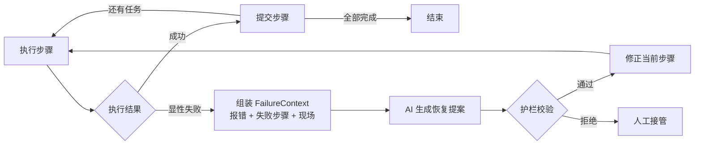

# 08 · LangGraph 多步任务错误恢复

这个案例回答一个具体问题：

> Agent 执行多步任务时，某一步明确报错，怎样把报错和现场一起交给 AI 修正，并从失败步骤继续，而不是整单重跑？

## 一句话方案

工具抛出结构化错误后，系统保存已完成进度，组装 `FailureContext` 交给 AI；AI 只返回恢复提案，提案通过护栏校验后，LangGraph 更新失败步骤并从检查点继续执行。



## 演示任务

Agent 需要依次完成：

1. 生成报告
2. 上传报告
3. 创建分享链接
4. 发送邮件

第二步故意引用不存在的 `output/report-final.pdf`，工具返回：

```text
FILE_NOT_FOUND
```

系统不会只把一条报错文本丢给模型，而是提供完整恢复上下文：

```text
FailureContext
├── goal               最终目标
├── committed_steps    已经完成且不可重复的步骤
├── failed_step        当前失败步骤
├── error              错误码、错误信息、是否可重试
├── observed_state     当前真实文件和外部状态
└── constraints        工具白名单、恢复预算
```

AI 返回结构化 `RecoveryProposal`：

```json
{
  "strategy": "patch_step",
  "reason": "原路径不存在，使用已经生成的报告文件",
  "replacement_step": {
    "id": "upload_report",
    "tool": "upload_file",
    "args": {"path": "output/report.pdf"}
  },
  "resume_from": "upload_report"
}
```

AI 只负责提出方案，不直接调用工具。护栏会检查策略类型、步骤 ID 和工具白名单，通过后才允许修改计划。

## 直接运行

环境配置已经放在当前目录的 `.env` 中，并被 Git 忽略。

```bash
cd /Users/lvyunze/project/gocronx/llm/agent/08-langgraph-error-recovery/python
python3 -m venv .venv
source .venv/bin/activate
pip install -r requirements.txt
```

先运行不依赖模型的确定性版本：

```bash
python main.py
python test.py
```

再调用 `.env` 中配置的真实 OpenAI 兼容模型：

```bash
python main.py --real-llm
```

真实模型测试得到的关键轨迹：

```text
OK generate_report
FAILED upload_report: FILE_NOT_FOUND — route to AI planner
AI PROPOSAL patch_step
GUARDRAIL approved patched step
OK upload_report
OK create_link
OK send_email
DONE all steps committed
```

## LangGraph 做了什么

| 能力 | 在本案例中的作用 |
|---|---|
| `StateGraph` | 组织执行、恢复规划、护栏校验和提交节点 |
| `Command` | 同时更新状态并决定下一个节点 |
| Checkpointer | 按 `thread_id` 保存任务进度 |
| 节点重入 | 修正计划后重新进入失败步骤 |

LangGraph 解决的是**状态与流程编排**，不会自动理解业务错误。以下内容仍需应用定义：

- 哪些错误可以重试，哪些必须修正计划
- 如何采集外部真实状态
- 工具是否幂等
- 恢复提案如何校验
- 哪些操作必须人工审批

## 与单次工具报错恢复的区别

[06-tool-call-recovery](../06-tool-call-recovery) 适合一次或少量、无副作用的工具调用：把报错写回 messages，让模型再调用一次。

本案例适合长链路任务：前面步骤已有副作用，失败后不能从头再来，需要保存进度、约束恢复范围并从断点继续。

## 目录

```text
.
├── .env                # 本地真实配置，Git 忽略
├── .env.example        # 可提交的配置模板
├── README.md
└── python/
    ├── graph.py        # LangGraph 节点、路由与检查点
    ├── models.py       # State、FailureContext、RecoveryProposal
    ├── planner.py      # mock 与 OpenAI 兼容恢复规划器
    ├── tools.py        # 模拟工具及结构化异常
    ├── main.py         # 完整演示
    ├── test.py         # 恢复成功与护栏拒绝测试
    └── requirements.txt
```
