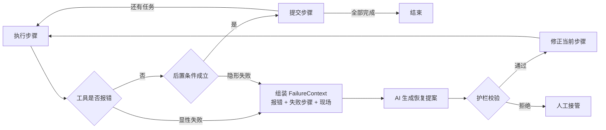
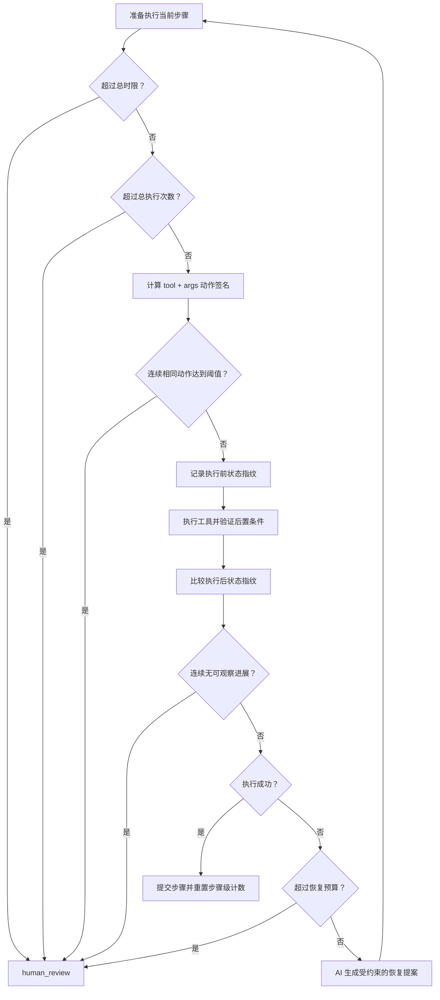

# 08 · LangGraph 多步任务错误恢复

这个案例回答一个具体问题：

> Agent 执行多步任务时，某一步明确报错或表面成功但实际无效，怎样把报错和现场一起交给 AI 修正，并从失败步骤继续，而不是整单重跑？

## 一句话方案

工具抛出结构化错误，或工具虽返回成功但后置条件不成立时，系统保存已完成进度，组装 `FailureContext` 交给 AI；AI 只返回恢复提案，提案通过护栏校验后，LangGraph 更新失败步骤并从检查点继续执行。



## 演示任务

Agent 需要依次完成：

1. 生成报告
2. 上传报告
3. 创建分享链接
4. 发送邮件

第二步故意引用不存在的 `output/report-final.pdf`，工具返回：

```text
FILE_NOT_FOUND
```

系统不会只把一条报错文本丢给模型，而是提供完整恢复上下文：

```text
FailureContext
├── goal               最终目标
├── committed_steps    已经完成且不可重复的步骤
├── failed_step        当前失败步骤
├── error              错误码、错误信息、是否可重试
├── observed_state     当前真实文件和外部状态
├── available_tools    工具用途和 JSON input_schema
└── constraints        工具白名单、恢复预算
```

`available_tools` 不是只有工具名称。每个工具都提供 `description`、必填参数、
参数类型、是否允许额外参数以及 `success_condition`。AI 据此生成调用；提案返回后，执行端再使用同一份
Schema 机械校验，避免模型猜错参数或偷偷加入未声明字段。

## 隐形失败：返回成功不等于目标完成

Demo 可以让第一次 `file.upload` 返回 `uploaded:...`，但故意不写入
`uploaded_files`。执行图不会相信返回字符串，而是调用 `verify_effect()` 检查
真实可观察状态。检查失败会产生可重试的 `POSTCONDITION_FAILED`，交给恢复规划器
决定重试；第二次上传真正落状态后才允许提交该步骤。

对应轨迹如下：

```text
OK generate_report
FAILED upload_report: POSTCONDITION_FAILED — route to AI planner
AI PROPOSAL retry
OK upload_report
OK create_link
OK send_email
DONE all steps committed
```

## 防止 Agent 死循环

防循环不能依赖模型“自己记得停”，本案例在执行框架中逐层设置机械护栏：



默认预算集中在 `LoopGuardConfig`：

| 护栏 | 默认值 | 防止的问题 |
|---|---:|---|
| `max_total_executions` | 12 | 不同动作不断切换，整体永不结束 |
| `max_identical_actions` | 3 | 同一工具和参数被连续重复调用 |
| `max_no_progress` | 3 | 工具看似在运行，但外部状态没有变化 |
| `max_runtime_seconds` | 120 秒 | 工具变慢、等待或整体任务长时间不退出 |
| `MAX_RECOVERY_ATTEMPTS` | 2 | 失败 → AI 修复 → 再失败的恢复循环 |
| LangGraph `recursion_limit` | 50 | 图节点异常跳转造成的最后一道保险 |

动作签名对参数进行稳定 JSON 序列化，因此键顺序变化不会绕过重复检测；状态指纹
来自 `observable_state()` 的 SHA-256，只有文件、上传、链接或邮件等真实外部状态变化
才算取得进展。任何护栏触发后都会明确进入 `human_review`，不会把超限伪装成
`completed`。

调用方仍应给每个真实网络、子进程和数据库工具单独设置超时；全局时间预算不能
中断一个已经阻塞且自身没有 timeout 的同步工具调用。

AI 返回结构化 `RecoveryProposal`：

```json
{
  "strategy": "patch_step",
  "reason": "原路径不存在，使用已经生成的报告文件",
  "replacement_step": {
    "id": "upload_report",
    "tool": "upload_file",
    "args": {"path": "output/report.pdf"}
  },
  "resume_from": "upload_report"
}
```

AI 只负责提出方案，不直接调用工具。护栏会检查策略类型、步骤 ID 和工具白名单，通过后才允许修改计划。

## 直接运行

环境配置已经放在当前目录的 `.env` 中，并被 Git 忽略。

```bash
cd /Users/lvyunze/project/gocronx/llm/agent/08-langgraph-error-recovery/python
python3 -m venv .venv
source .venv/bin/activate
pip install -r requirements.txt
```

先运行不依赖模型的确定性版本：

```bash
python main.py
python test.py
```

再调用 `.env` 中配置的真实 OpenAI 兼容模型：

```bash
python main.py --real-llm
```

真实模型测试得到的关键轨迹：

```text
OK generate_report
FAILED upload_report: FILE_NOT_FOUND — route to AI planner
AI PROPOSAL patch_step
GUARDRAIL approved patched step
OK upload_report
OK create_link
OK send_email
DONE all steps committed
```

## LangGraph 做了什么

| 能力 | 在本案例中的作用 |
|---|---|
| `StateGraph` | 组织执行、恢复规划、护栏校验和提交节点 |
| `Command` | 同时更新状态并决定下一个节点 |
| Checkpointer | 按 `thread_id` 保存任务进度 |
| 节点重入 | 修正计划后重新进入失败步骤 |
| Tool Schema | 同时约束 AI 规划和执行端参数校验 |
| 后置条件 | 检测工具假成功、状态未落地等隐形失败 |
| 恢复预算 | 连续失败超过 2 次后暂停并转人工处理 |

LangGraph 解决的是**状态与流程编排**，不会自动理解业务错误。以下内容仍需应用定义：

- 哪些错误可以重试，哪些必须修正计划
- 如何采集外部真实状态
- 工具是否幂等
- 恢复提案如何校验（工具、参数 Schema、步骤 ID、`resume_from`）
- 哪些操作必须人工审批

## 与单次工具报错恢复的区别

[06-tool-call-recovery](../06-tool-call-recovery) 适合一次或少量、无副作用的工具调用：把报错写回 messages，让模型再调用一次。

本案例适合长链路任务：前面步骤已有副作用，失败后不能从头再来，需要保存进度、约束恢复范围并从断点继续。

## 目录

```text
.
├── .env                # 本地真实配置，Git 忽略
├── .env.example        # 可提交的配置模板
├── README.md
└── python/
    ├── domain/
    │   ├── models.py       # State、FailureContext、RecoveryProposal
    │   └── errors.py       # 结构化工具错误
    ├── recovery/
    │   ├── graph.py        # 只声明 LangGraph 节点与边
    │   ├── nodes.py        # 执行、恢复、护栏、提交节点
    │   ├── context.py      # FailureContext 构造
    │   ├── loop_guard.py   # 次数、时间、重复动作、无进展检测
    │   └── planner.py      # mock 与 OpenAI 兼容恢复规划器
    ├── tools/
    │   ├── base.py         # Tool Protocol 扩展契约
    │   ├── registry.py     # 注册、Schema 校验与分发
    │   ├── builtin.py      # 内置工具实现
    │   ├── runtime.py      # registry + world 运行时门面
    │   ├── world.py        # 外部状态与测试故障注入
    │   └── security.py     # 参数脱敏
    ├── tests/
    │   ├── test_recovery.py
    │   ├── test_loop_guard.py
    │   └── test_tools.py
    ├── demo_plan.py        # 演示计划和初始状态
    ├── main.py             # 完整演示
    ├── test.py             # 兼容的一键测试入口
    └── requirements.txt
```

## 扩展新工具

新增工具不需要修改中央 `if/elif` 分发器。实现 `Tool` Protocol，把 Schema、执行逻辑
和后置条件放在同一个类中，再交给 `ToolRegistry.register()` 即可。注册表会自动向 AI
暴露定义、校验参数、执行工具并验证效果。简单且同领域的工具可以共用一个模块；只有
依赖、状态或验证逻辑较复杂时才单独拆文件，避免为了“小文件”而过度切分。
