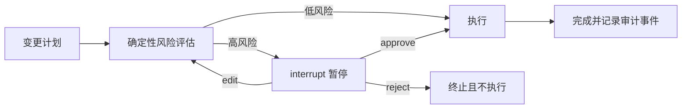

# 09 · LangGraph 人工审批与跨进程恢复

这个案例回答一个生产环境里很具体的问题：

> Agent 准备执行高风险操作时，怎样暂停数分钟甚至数小时，等人批准、修改或拒绝后，再由另一个进程从原位置继续？

## 一句话方案

确定性策略先评估风险：低风险操作直接执行；高风险操作通过 LangGraph `interrupt()` 暂停，并由 SQLite checkpointer 保存状态。审批者随后使用同一个 `thread_id` 提交 `approve`、`edit` 或 `reject`，新进程通过 `Command(resume=...)` 恢复工作流。



## 演示场景

请求把 `checkout-api` 扩容到 6 个副本：

```json
{
  "action": "scale_service",
  "service": "checkout-api",
  "environment": "production",
  "replicas": 6
}
```

风险策略完全确定，不让模型判断：

| 规则 | 结果 |
|---|---|
| 目标为 `production` | 高风险，需要审批 |
| 副本数大于等于 4 | 高风险，需要审批 |
| `staging` 且副本数不超过 3 | 低风险，自动批准 |
| 副本数不在 1–20 | 输入非法，拒绝进入工作流 |

这是刻意缩小的领域模型，便于看清暂停与恢复协议。接入真实系统时，应把风险规则替换成组织自己的策略引擎或工具围栏。

## 三种恢复路径

### 批准

审批原因写入 checkpoint，随后进入执行节点：

```json
{"action": "approve", "reason": "容量评估通过"}
```

### 修改

审批者只能修改 `environment` 和 `replicas`，不能借审批响应替换操作类型或目标服务。修改后必须重新经过风险评估；仍为高风险就再次暂停，降为低风险才自动执行。

```json
{
  "action": "edit",
  "reason": "先在预发验证",
  "edited_plan": {
    "action": "scale_service",
    "service": "checkout-api",
    "environment": "staging",
    "replicas": 2
  }
}
```

### 拒绝

工作流进入 `rejected`，执行节点不会被调用：

```json
{"action": "reject", "reason": "当前处于变更冻结期"}
```

## 直接运行

```bash
cd /Users/lvyunze/project/gocronx/llm/agent/09-langgraph-human-approval/python
python3 -m venv .venv
source .venv/bin/activate
pip install -r requirements.txt
```

第一个进程创建高风险请求并退出：

```bash
python main.py --thread-id change-001 start \
  --environment production \
  --replicas 6
```

输出包含：

```text
status: awaiting_approval
approval_request:
  risk: high
  reasons: targets production, requests four or more replicas
```

之后可以在另一个终端甚至进程重启后恢复。

批准：

```bash
python main.py --thread-id change-001 resume approve \
  --reason "容量评估通过"
```

修改为低风险方案：

```bash
python main.py --thread-id change-002 start --environment production --replicas 6
python main.py --thread-id change-002 resume edit \
  --environment staging \
  --replicas 2 \
  --reason "先在预发验证"
```

拒绝：

```bash
python main.py --thread-id change-003 start --environment production --replicas 6
python main.py --thread-id change-003 resume reject \
  --reason "当前处于变更冻结期"
```

默认 checkpoint 位于 `python/data/approval.sqlite`，已被 Git 忽略。可用 `--db` 指定其他数据库文件。

SQLite 只用于本地串行演示。多实例生产部署应使用共享的 Postgres 等 checkpointer，并为同一 `thread_id` 增加并发控制，避免两个审批请求同时恢复。

## LangGraph 做了什么

| 能力 | 在本案例中的作用 |
|---|---|
| `StateGraph` | 组织风险评估、审批、执行和拒绝节点 |
| `interrupt()` | 在审批节点产生可序列化的暂停请求 |
| `Command(resume=...)` | 将外部决策送回原审批节点 |
| SQLite checkpointer | 按 `thread_id` 跨进程保存状态和中断位置 |
| `Command(goto=...)` | 根据批准、修改或拒绝结果选择后续节点 |
| reducer | 追加审计事件，不覆盖已有轨迹 |

LangGraph 不负责以下业务判断：

- 哪些操作属于高风险
- 谁有审批权限以及怎样认证审批者
- 真实执行器是否幂等
- 审批是否过期、是否需要双人复核
- 审计记录应保存多久

这些必须由应用实现。案例中的 `audit_log` 是教学用工作流轨迹，不是不可篡改的合规审计日志。

## 安全边界

恢复载荷不会直接传给执行器，而是先做机械校验：

- 决策只能是 `approve`、`edit` 或 `reject`
- 不允许额外字段，防止夹带权限或执行参数
- `reason` 必须是非空字符串
- 修改必须提供完整且合法的计划
- `action` 和 `service` 在修改中不可变化
- 执行节点会再次校验计划，并要求状态已经批准

真实系统还应在 API 层校验审批者身份，把 `thread_id` 绑定到租户，并对批准设置有效期。

## 与 08 的区别

[08-langgraph-error-recovery](../08-langgraph-error-recovery) 解决“执行到一半失败后怎样修复并续跑”；09 解决“执行高风险步骤前怎样暂停等待外部授权”。生产流程通常先用 09 审批，再在执行失败时进入 08 的恢复策略。

## 测试

```bash
python test.py
```

10 个测试覆盖：

- 低风险自动执行
- 高风险暂停后批准
- 拒绝后永不执行
- 修改后重新评估
- 修改为低风险后直通
- 恢复载荷字段白名单
- 不允许借修改切换操作身份
- 修改必须包含完整计划
- 关闭第一个 graph 后，从同一 SQLite checkpoint 在新 graph 中恢复
- 重复使用已有 `thread_id` 创建任务时明确拒绝

## 目录

```text
.
├── .env.example
├── README.md
└── python/
    ├── approval/
    │   ├── models.py      # Plan、State 与初始化
    │   ├── policy.py      # 纯风险策略和恢复载荷校验
    │   ├── nodes.py       # interrupt、路由与执行节点
    │   ├── graph.py       # 图拓扑
    │   └── storage.py     # SQLite checkpointer 生命周期
    ├── tests/
    │   └── test_approval.py
    ├── main.py            # start / resume CLI
    ├── test.py            # 一键测试入口
    └── requirements.txt
```
