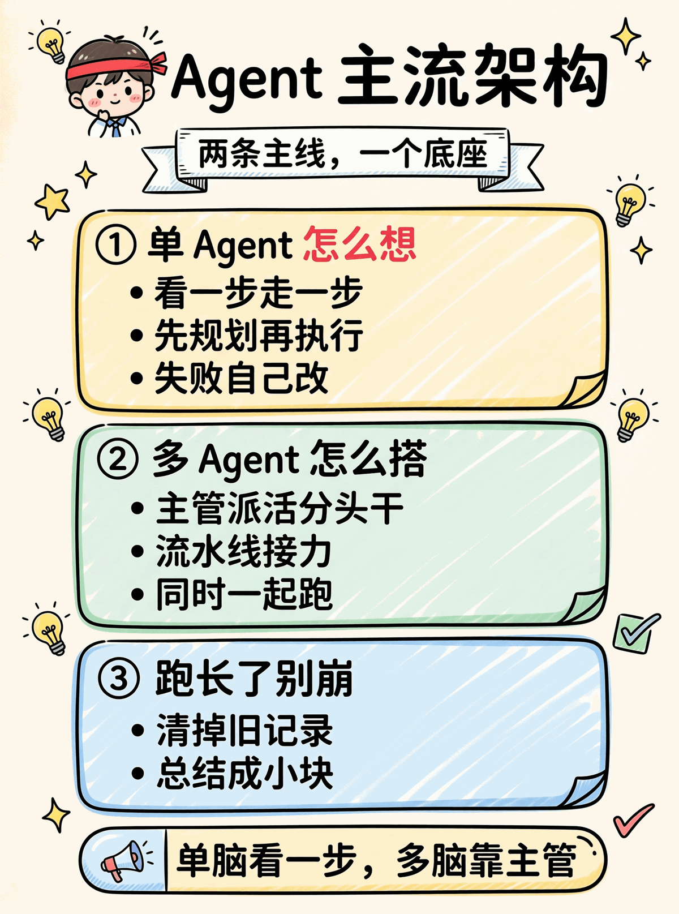
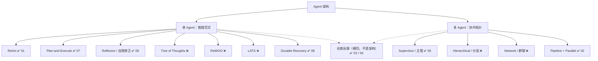
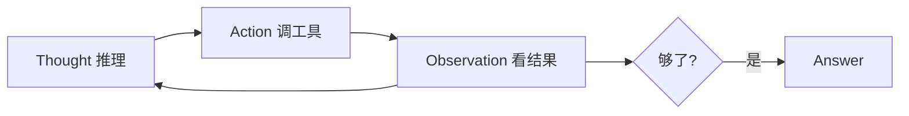
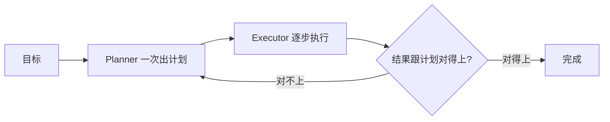
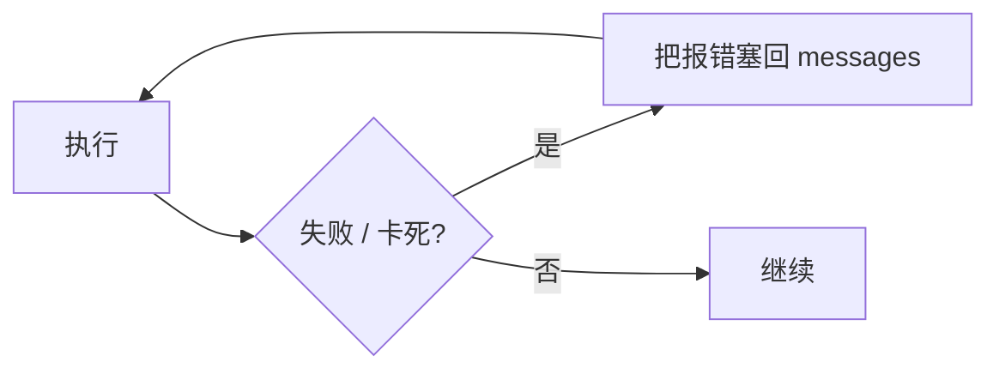
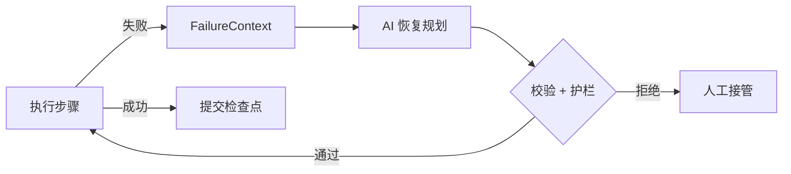
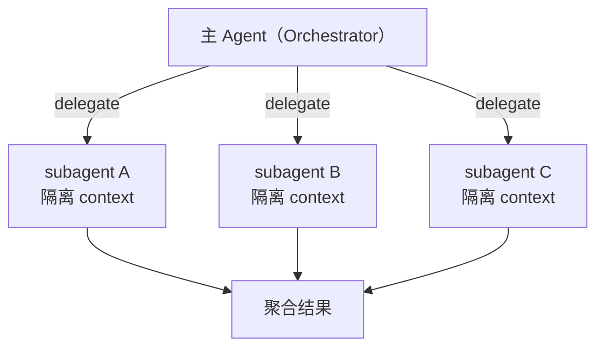
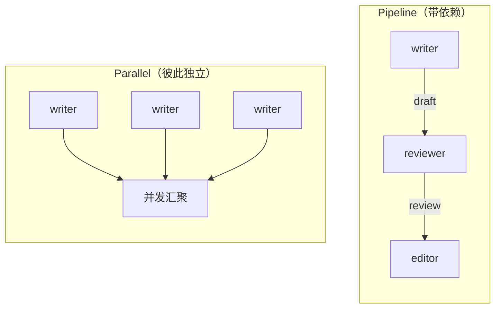
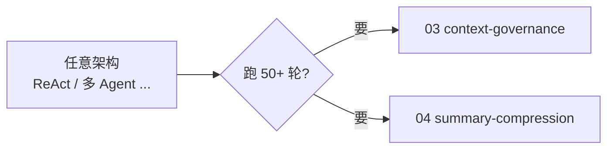
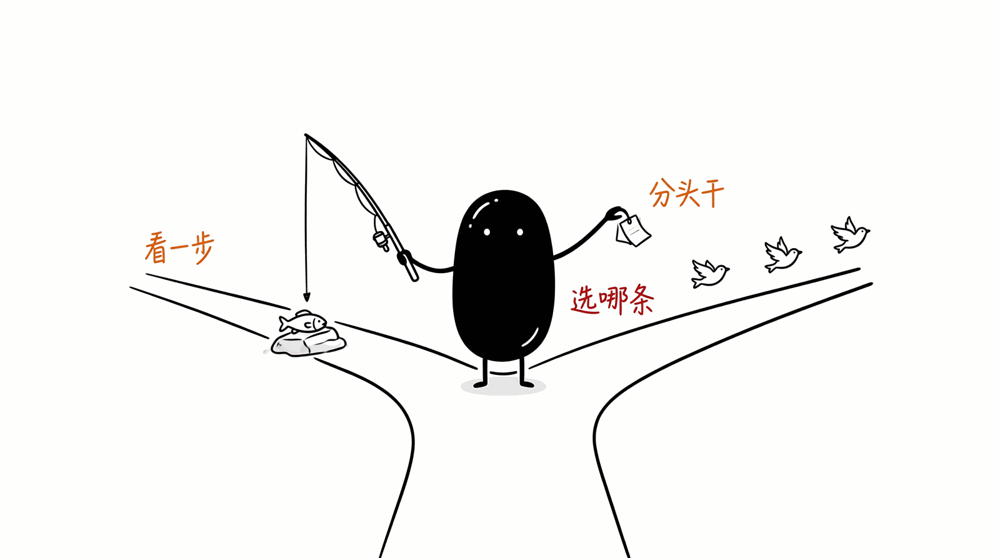

# agent · 主流架构与本目录的对应

Agent 架构没有官方分类，但讨论来讨论去基本绕不开两件事：一个 Agent 自己怎么推理，多个 Agent 之间怎么搭。下面把常见的几种架构理一遍，并标出本目录哪个 demo 实现了它（没实现的也写出来，免得你以为这就是全部）。

## 全景

真正在生产里反复用的就那么几个：单 Agent 看 ReAct 和 Plan-Execute，多 Agent 看主管式和流水线。剩下的多半是这几个的加强版，按需要再上。

## 一、单 Agent 推理范式

| 范式 | 一句话 | 什么时候用 | 本目录 |
|------|--------|-----------|--------|
| ReAct | 思考、调工具、看结果，交替着走一步看一步 | 通用工具调用，最常见 | ✅ [01-simple](01-simple) |
| Plan-and-Execute | 先把整件事拆成计划，再照着执行 | 步骤多、前后有依赖 | ✅ [07-plan-execute](07-plan-execute) |
| Reflexion / 自我修正 | 失败了把错误喂回去，让模型自己改 | 容易出错、需要试错的任务 | ✅ [06-tool-call-recovery](06-tool-call-recovery) |
| Durable Recovery | 保存多步任务状态，失败后修复并从检查点继续 | 有副作用、不能整单重跑 | ✅ [08-langgraph-error-recovery](08-langgraph-error-recovery) |
| Tree of Thoughts | 把下一步展开成多个分支，打分加回溯 | 解谜、需要探索的推理 | ❌ |
| ReWOO | 推理和取证分开，先列全所有要查的，再批量查 | 想省 token、能并行 | ❌ |
| LATS | ReAct 上面套蒙特卡洛树搜索 | 追求决策质量、不在乎慢 | ❌ |

### ReAct ✅ 01

调工具之前你并不知道工具会返回什么，所以只能看一步走一步：

最小实现在 [01-simple](01-simple)，那里还讲了论文里的 ReAct 格式怎么对应到现代的 function calling。

### Plan-and-Execute ✅ 07

ReAct 每轮都让模型重新想下一步，步数一多就费 token、还容易跑偏。Plan-Execute 把规划和执行分开：先出一份完整计划，再一条条做，做完一步看看计划要不要改。

实现和取舍在 [07-plan-execute](07-plan-execute)。要点是那个回头改计划的环（replan）——没有它就只是按顺序念一遍待办。

### Reflexion / 自我修正 ✅ 06

工具调用失败时别直接抛异常，把报错塞回对话让模型自己改。这正是 06 干的事：

[06-tool-call-recovery](06-tool-call-recovery) 实现了四类死循环的检测和错误回灌，算 Reflexion 思路落到工程上的最小版本。

### Durable Recovery ✅ 08

06 解决“这一轮工具报错后，怎样让模型换个做法”；08 解决“多步任务已经做完一半，怎样保存进度、修复失败步骤并安全续跑”。

[08-langgraph-error-recovery](08-langgraph-error-recovery) 用 LangGraph 的 `StateGraph`、`Command` 和 checkpointer 实现这个闭环。重点不是框架 API，而是 AI 只提出结构化恢复方案，确定性护栏决定能不能执行。

### ToT / ReWOO / LATS ❌

本目录没实现这三个，简单说下区别：

- **ToT** 把"下一步"摊成几个候选分支，逐个打分、走不通就回溯，适合解谜和规划。
- **ReWOO** 让规划器一次列全所有要查的证据（不依赖中间结果），交给 worker 批量并行去取，最后合成，省掉 ReAct 每轮重复推理的开销。
- **LATS** 在 ReAct 之上套蒙特卡洛树搜索，用价值函数挑路径，质量高但又慢又贵。

这几个偏研究和特定场景。工程上 ReAct 加 Plan-Execute 已经能覆盖大部分需求，列在这里是让你知道还有更重的牌。

## 二、多 Agent 协作拓扑

| 拓扑 | 结构 | 代表 | 本目录 |
|------|------|------|--------|
| Supervisor / 主管 | 一个中心 Agent 调度多个子 Agent | LangGraph Supervisor、OpenAI Swarm、Claude Code 的 Task | ✅ [05-subagent-orchestration](05-subagent-orchestration) |
| Hierarchical / 分层 | 主管下面还有子主管，多层 | 流程深的企业场景 | ❌ |
| Network / 群聊 | Agent 之间自由对话协商 | AutoGen、MetaGPT | ❌ |
| Pipeline + Parallel | 串行接力 / 并发独立 | CrewAI 流程模式 | ✅ [02-multi-agent](02-multi-agent) |

### Supervisor / 主管 ✅ 05

主 Agent 把任务拆给几个子 Agent，各自在干净的 context 里并行干，最后聚合。好处是 context 不互相污染、能并行、某个子任务崩了不拖垮全局。

见 [05-subagent-orchestration](05-subagent-orchestration)。

### Pipeline + Parallel ✅ 02

见 [02-multi-agent](02-multi-agent)（Python / Go / Rust 三版并行）。这里真正麻烦的不是单个 agent 怎么写，是 orchestrator 怎么把上游产物传给下游，以及怎么截断防止 context 爆掉。

### Hierarchical / Network ❌

Hierarchical 是 Supervisor 的多层版，主管管子主管、子主管管 worker，流程深的时候才用得上。Network 是去中心化的，Agent 之间直接对话协商（比如 AutoGen 的 GroupChat），灵活但不好控、容易跑飞、调试也难。

## 三、长跑治理（横切，不是一种架构）

跑 5 轮的 Agent 和跑 50 轮的是两回事。不管哪种架构，跑长了都会撞三堵墙：history 被截后留下孤儿 tool 消息导致 API 报 400、单次工具返回几十 KB 把 context 撑爆、总 token 超出窗口。治理这件事跟架构选型是正交的：

- [03-context-governance](03-context-governance)：orphan tool 清理、backfill、microcompact、budget、snip history 五步
- [04-summary-compression](04-summary-compression)：让 LLM 把老 history 总结成结构化 markdown，类似 Claude Code 的 `/compact`

## 怎么选

- 通用工具调用，先上 ReAct（[01](01-simple)）
- 步数多、前后有依赖，用 Plan-Execute（[07](07-plan-execute)）
- 任务容易失败、要能自愈，参考 Reflexion 思路（[06](06-tool-call-recovery)）
- 多步任务有副作用、失败后不能从头跑，用持久恢复（[08](08-langgraph-error-recovery)）
- 任务可拆、想并行又想 context 干净，用主管式 fan-out（[05](05-subagent-orchestration)）
- 固定流水线、角色接力，用 Pipeline（[02](02-multi-agent)）
- Agent 跑长了崩，先补长跑治理（[03](03-context-governance) → [04](04-summary-compression)），这跟选哪种架构没冲突

还有一种粗分法，Anthropic 常提：能用 Workflow（路径写死、LLM 只填空、可预测）解决就别上全自主 Agent（LLM 自己决定下一步和何时停，灵活但难控）。

## 本目录覆盖一览

| | 已实现 | 仅文档提到 |
|--|--------|-----------|
| 单 Agent | ReAct(01)、Plan-Execute(07)、Reflexion(06)、Durable Recovery(08) | ToT、ReWOO、LATS |
| 多 Agent | Supervisor(05)、Pipeline+Parallel(02) | Hierarchical、Network |
| 横切 | 长跑治理(03/04) | — |

