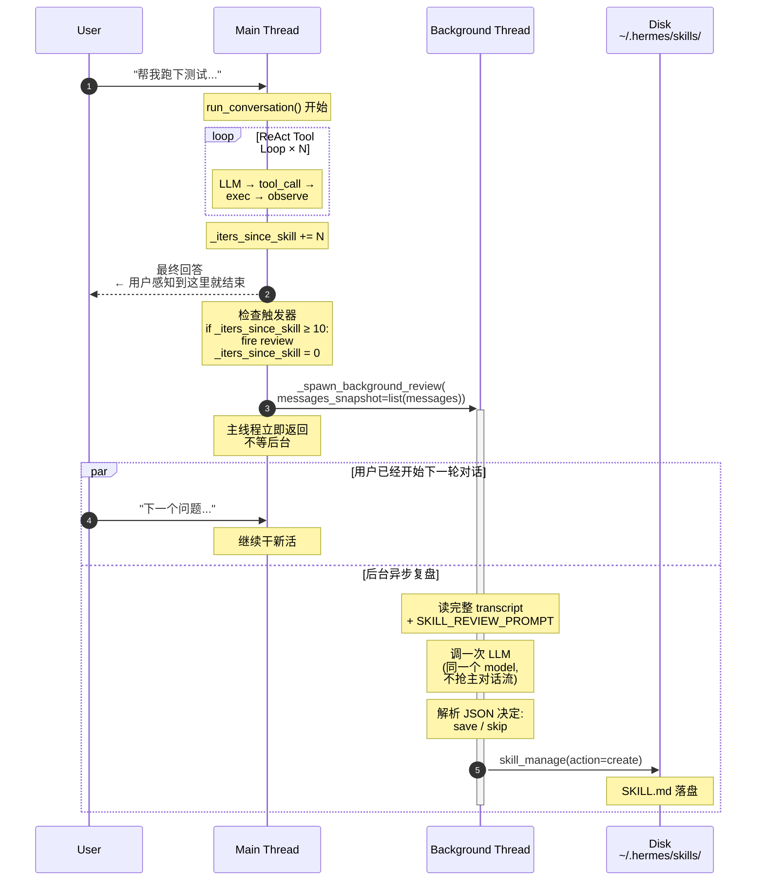
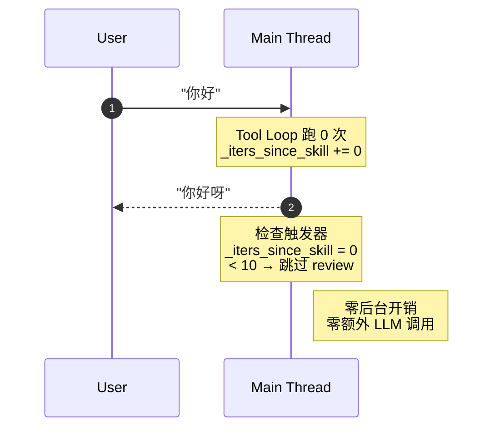
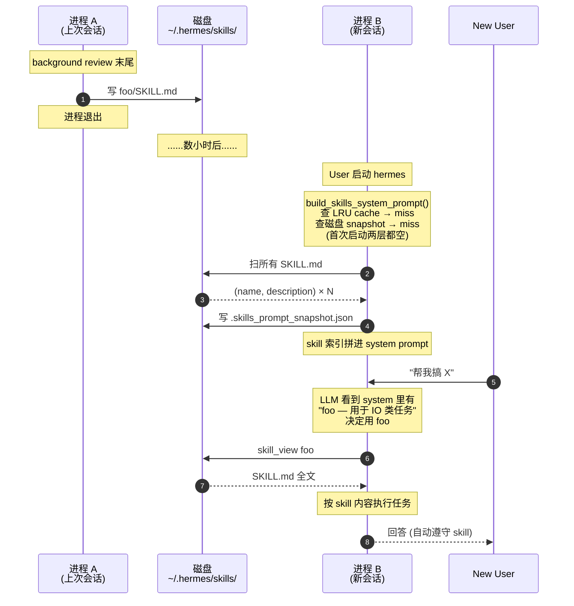
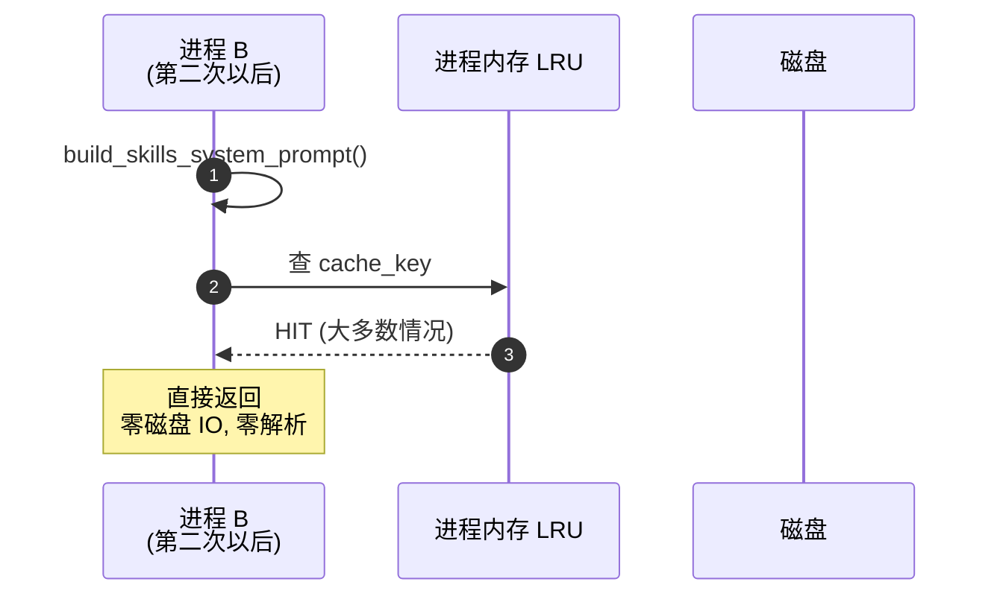
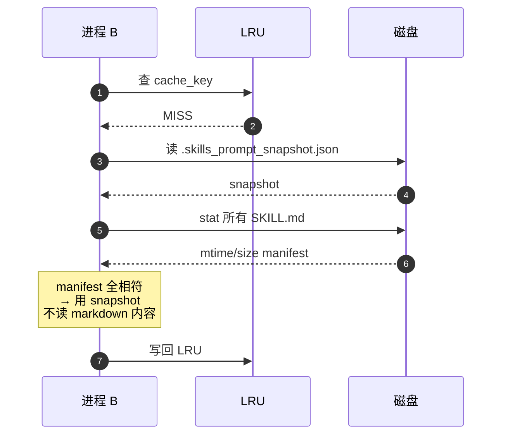
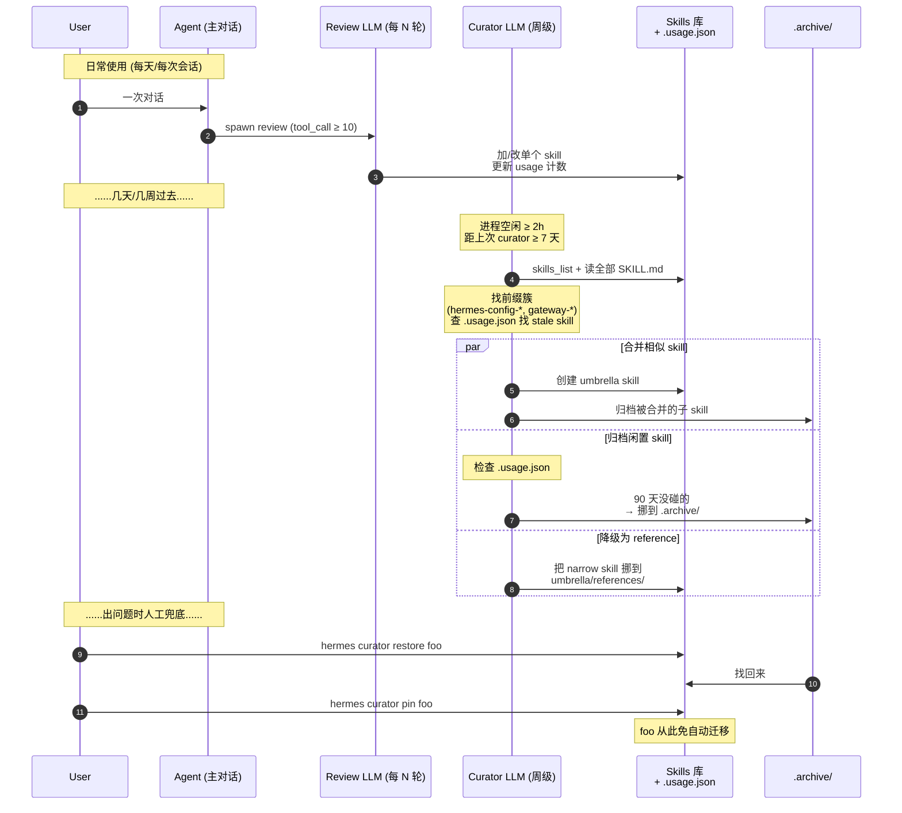

# Hermes Agent —— "越用越聪明" 拆解

**对象**：Hermes-agent
**问题**：README 说 "closed learning loop — creates skills from experience, improves them during use, searches its own past conversations"。这是 fine-tune 还是噱头？

**一句话结论**：**没有任何模型参数级学习**。所谓"越用越聪明"= 后台 LLM 看完一轮对话写一个 markdown 文件，下次启动塞进 system prompt。是**上下文工程的自动化**，不是模型权重变化。

下面把这个机制拆到代码层。

## 1. 触发：每 N 轮工具调用后开后台审查

代码：`run_agent.py:15653-15678`

```python
# 计每轮 tool_call 次数，达阈值就 fire
if (self._skill_nudge_interval > 0
        and self._iters_since_skill >= self._skill_nudge_interval
        and "skill_manage" in self.valid_tool_names):
    _should_review_skills = True
    self._iters_since_skill = 0

# 主响应已发给用户，再开后台
if final_response and not interrupted and (_should_review_memory or _should_review_skills):
    self._spawn_background_review(
        messages_snapshot=list(messages),
        review_memory=_should_review_memory,
        review_skills=_should_review_skills,
    )
```

阈值默认 10（`run_agent.py:2088`：`self._skill_nudge_interval = 10`）。
关键点：**先把答案吐给用户，再开后台**。审查不抢主对话的算力。

## 2. 后台审查就是再调一次 LLM

代码：`run_agent.py:4312` `_spawn_background_review`

`messages_snapshot` 是当前对话的完整副本。新起一个 sub-agent（无回显），prompt 用 `_SKILL_REVIEW_PROMPT`，调一次 LLM，让它输出 `skill_manage(action="create|edit|patch", ...)` 工具调用。

## 3. 审查 prompt 的"积极性"是设计出来的

代码：`run_agent.py:4077-4171`

prompt 第一句话：

> Review the conversation above and update the skill library. Be **ACTIVE** — most sessions produce at least one skill update, even if small. A pass that does nothing is a missed learning opportunity, not a neutral outcome.

这句话决定了 hermes 看起来"在不停学"——因为它**给 LLM 上了偏见**，让它倾向于产出 skill 而不是 "Nothing to save"。这是个值得借鉴的 prompt 工程招：与其问 "要不要更新？"，不如说 "你大概率应该更新，除非有强理由不更新"。

prompt 后半段还约束了**反向**：明确说哪些事**不要**捕获（环境问题、临时报错、否定性结论"X 工具坏了"——这些会变成模型的自我束缚）。这是经验沉淀。

## 4. skill 是 markdown 文件，写到磁盘

skill 文件结构（`agent/prompt_builder.py:855` 附近）：
- 顶层目录：`~/.hermes/skills/<skill-name>/`
- 必含：`SKILL.md`（带 YAML frontmatter：name, description）
- 可选：`references/`（细节）、`templates/`（模板文件）、`scripts/`（可执行脚本）

写盘工具：`tools/skill_manager_tool.py:465` 附近的 `skill_manage` 函数。
LLM 用 `action="create"` / `"edit"` / `"patch"` / `"write_file"` 走这个工具。

## 5. 下次启动：所有 SKILL.md 拼成 system prompt 的一段

代码：`agent/prompt_builder.py:988` `build_skills_system_prompt`

```python
def build_skills_system_prompt(
    available_tools: "set[str] | None" = None,
    available_toolsets: "set[str] | None" = None,
) -> str:
    """Build a compact skill index for the system prompt."""
    skills_dir = get_skills_dir()
    ...
    for skill_file in iter_skill_index_files(skills_dir, "SKILL.md"):
        # 把每个 skill 的 name + description 拼成索引
```

被谁用：`run_agent.py:6018` —— 在构造每次对话的 system prompt 时调用，把 skill 列表拼到 prompt 头部。

**注意拼的不是全文，是索引**（name + description）。需要细节时，模型自己调 `skill_view` 工具读全文。这是个**两阶段**的 prompt 经济学设计：避免几百个 skill 把 system prompt 撑爆。

## 6. 还有一个双层 cache

`build_skills_system_prompt` 用两层缓存（`prompt_builder.py:1012-1037`）：
1. 进程内 LRU dict
2. 磁盘 snapshot `.skills_prompt_snapshot.json`（用 SKILL.md 的 mtime+size 做指纹）

进程重启不需要重新扫盘。这是个工程细节但很关键 —— 没缓存的话，一个有 200 个 skill 的用户每次启动都要扫 200 个 markdown。

## 生产时序图

按真实代码路径画。四张图覆盖全部分支。

### 图 1 · 单回合（**有触发** —— 工具调用累计达阈值）



**用户感知**：完全无感。后台 LLM 调用跟主对话**完全异步**——用户已经在跟主线程聊下一个问题了，后台还在咀嚼上一段对话。失败也吃掉（`run_agent.py:15677` `except: pass`），不影响主对话。

### 图 2 · 单回合（**无触发** —— 工具调用没到阈值）



简单问候不会跑 review。这是**成本控制的关键**。

### 图 3 · 跨进程衔接（下次启动）



**两阶段读取**：
1. 启动时只读 name + description（轻，cache 友好）
2. 真要用某个 skill 才读全文（按需，模型自己决定）

skill 库 200 条时，启动只读 200 × 50 字 ≈ 10K，而不是 200 × 800 字 ≈ 160K。这是为什么用户能积累几百个 skill 而启动不变慢。

### 图 4 · 双层 cache 的快路径

第二次以后的启动几乎不读盘：



LRU miss 但磁盘 snapshot 没过期：



只有当某个 SKILL.md 真的被改过（mtime 变了）才会落到全量扫描+重解析。**所以手工编辑 `~/.hermes/skills/foo/SKILL.md` 之后下次启动就能生效** —— manifest 自动失效。

### 关键时间尺度

| 事件 | 时间尺度 | 在哪条线程 |
|------|---------|----------|
| 用户输入 → 拿到主回答 | 秒级 ~ 分钟级（取决于工具调用复杂度）| 主线程 |
| 拿到回答 → 后台 review 完 | 几秒（额外 1 次 LLM 调用） | 后台线程 |
| review 写盘 → 下次会话能看到 | 持久 | 异步 |
| 下次启动 → skill 进 prompt | LRU hit < 1ms / 全扫描随 skill 数线性 | 主线程启动期 |
| skill 数从 0 涨到 200 | 数周 ~ 数月 | 跨会话 |

### 跟我们 demo 的关键差异

| 维度 | hermes 生产 | 本目录 demo |
|------|------------|---------|
| review 触发 | tool_call ≥ 10 | 每轮必跑 |
| review 执行 | `threading.Thread` 后台 | 主线程同步 |
| 主对话感知 | 完全无感 | 阻塞等 review |
| 装载读盘 | LRU + mtime snapshot | 每次全扫 |
| 装载粒度 | 索引 + 按需 view | 索引 + 全文都塞 |

把 demo 改到生产级 = 把这 5 条逐条补齐，[`BENCHMARK.md`](BENCHMARK.md) 里按优先级排了清单。

## 长期演化：skill 库怎么不腐烂

到这里都在讲"怎么往里加"。但每轮都加、prompt 还偏置 "Be ACTIVE"，半年下来就是几百条 skill —— 凭什么不沦为屎山？

hermes 的答案分两层：**5 个硬机制（代码强制）+ 3 个软机制（prompt 引导 LLM 自觉）**。

### 硬机制 · 代码层真的在跑

#### H1. 后台 curator 是独立的"清洁工" agent

代码：`agent/curator.py:1-20, 199-249, 330-445`

curator **不是**每次对话后跑的 review，是个**完全独立的二级 agent**：
- 触发条件：进程空闲 ≥ `min_idle_hours`（默认 2h）**且**距上次 curator 运行 ≥ `interval_hours`（默认 7 天）
- 状态机持久化在 `~/.hermes/skills/.curator_state`（JSON）
- 用专门的 `CURATOR_REVIEW_PROMPT`，跟 `_SKILL_REVIEW_PROMPT` 完全不同——这个 prompt 只干一件事：**找前缀簇 + 合并 + 归档**

跟主对话 review 的分工：

| 谁 | 触发频率 | 干啥 | 看的对象 |
|---|--------|-----|---------|
| `_SKILL_REVIEW_PROMPT` | 每 N 次工具调用 | 加 / 改单条 skill | 当次 transcript |
| `CURATOR_REVIEW_PROMPT` | 空闲 + 7 天 | 合并 / 归档 / 重构 | **整个 skill 库** |

#### H2. usage tracking sidecar —— 每个 skill 都有"活跃度档案"

代码：`tools/skill_usage.py:1-23`

每次 skill 被 `view` / `use` / `patch`，都会写一笔到 `~/.hermes/skills/.usage.json`：
```json
{ "view_count": ..., "use_count": ..., "patch_count": ...,
  "last_viewed_at": ..., "last_used_at": ..., "last_patched_at": ... }
```

**这是后续所有自动判断的基础**——没有 usage 数据就无从判定"该不该清"。

#### H3. 自动状态迁移：active → stale → archive

代码：`agent/curator.py:56-59, 170-183`

```
默认 config:
  stale_after_days:   30   # 30 天没动 → 标为 stale
  archive_after_days: 90   # 90 天没动 → 归档
```

注意是**归档不是删除** —— 文件挪到 `.archive/`，随时 `hermes curator restore` 找回来。删除是不可逆的，hermes 选了保守路线。

#### H4. CLI 给用户兜底

代码：`hermes_cli/curator.py:489-582`

```bash
hermes curator run     [--dry-run]   # 手动触发一轮整理
hermes curator prune   --days 60     # 批量归档 60 天没动的
hermes curator pin     <skill>       # 钉住, 跳过自动迁移
hermes curator archive <skill>       # 手动归档
hermes curator restore <skill>       # 从 .archive/ 恢复
hermes curator status                # 看每个 skill 的活跃度
hermes curator backup / rollback     # 整库快照
```

**自动机制全部可被人工 override**。这点很重要 —— LLM 判断错了用户能救场。

#### H5. Pinned skills 豁免自动迁移

代码：`tools/skill_usage.py:287-298`

某个 skill 你死活想留，`pin` 一下，所有自动 stale / archive 逻辑都跳过它。**给"长尾但关键"的 skill 留生路** —— 比如一年用一次但用到就救命的运维 SOP。

### 软机制 · prompt 喊话，LLM 自觉

#### S1. Class-level 命名约束 —— 系统最薄弱的一环

`run_agent.py:4133-4137`：
> The name MUST be at the class level. The name MUST NOT be a specific PR number, error string, feature codename, library-alone name, or 'fix-X / debug-Y / audit-Z-today' session artifact.

**代码层 0 强制** —— `tools/skill_manager_tool.py:178-189` 的 `_validate_name` 只查正则 `^[a-z0-9][a-z0-9._-]*$`，`debug-bug-today` 这种合法但烂的名字完全允许。

只靠 prompt 拦。LLM 听话就好，不听话就生成 `debug-auth-2026-05-21` 一堆。

#### S2. Edit > Create 偏序

`run_agent.py:4104-4137` prompt 列了 4 级偏好：
1. UPDATE A CURRENTLY-LOADED SKILL（先改本轮装载的）
2. UPDATE AN EXISTING UMBRELLA（再改已有伞 skill）
3. ADD A SUPPORT FILE（再加 references/ 子文件）
4. CREATE NEW（兜底）

reviewer agent 拿得到 `skills_list` 工具，可以先查再决定。但**代码不强制必须先查**——LLM 偷懒直接 create 也通过。

#### S3. 重叠靠 reviewer "顺手报告"

`run_agent.py:4145-4146`：
> If you notice two existing skills that overlap, note it in your reply — the background curator handles consolidation at scale.

零自动检测：没 embedding 相似度，没编辑距离，没描述比对。**完全靠 curator 那个二级 LLM 用眼睛看出"哦这俩前缀都是 `hermes-config-*`，合一下吧"**。

### 完整的"清洁"时序图



### 诚实的可信度矩阵

| 机制 | 代码强度 | 信得过吗 |
|------|---------|---------|
| curator 调度 + 状态机 | ✅ 强 | 高 |
| usage 追踪 sidecar | ✅ 强 | 高 |
| stale / archive 时间阈值 | ✅ 强（config 可改） | 高 |
| **归档不删 + restore** | ✅ 强 | 高 |
| CLI 人工兜底 | ✅ 强 | 高 |
| 合并策略（找前缀簇） | ⚠️ prompt 驱动 LLM | 中 |
| **class-level 命名约束** | ❌ 零代码 | **低** —— LLM 不听就完蛋 |
| 重叠检测 | ❌ 零代码 | 低 —— curator LLM 全靠肉眼 |
| `references/` 子文件去重 | ❌ 没实现 | 低 —— 会无限累积 |

### 一句话总结

**硬限制（归档、idle 清理、状态追踪、人工兜底）是代码强制的；越用越聪明的"聪明"那部分（命名、合并、去重）还是靠 LLM 自觉。** 所以 hermes 的清洁度上限 = curator 那个 LLM 的判断力。前者保住下限，后者决定上限。

## 关键结论：到底是哪种学习

按 [`../README.md`](../README.md) 的四分类：

- (a) 纯检索 memory recall ✓（FTS5 找过去会话）
- **(b) 上下文工程**（核心）—— 后台 LLM 把经验**写成 markdown**，下次启动**塞进 system prompt**
- (c) 参数微调 ✗
- (d) 其它 —— `trajectory_compressor.py` / `rl_cli.py` 是为**下一代**模型准备训练数据的离线工具，**不影响当前 agent**

所以"越用越聪明"等价于：**你给桌上的参考手册越摞越厚**，大脑（模型权重）没动过。

## 引用对照表

| 机制 | 文件 | 函数/常量 | 行 |
|------|------|----------|-----|
| 触发阈值 | `run_agent.py` | `_skill_nudge_interval` | 2088 |
| 触发位置 | `run_agent.py` | `run_conversation` 末尾 | 15653 |
| 后台开线程 | `run_agent.py` | `_spawn_background_review` | 4312 |
| 审查 prompt | `run_agent.py` | `_SKILL_REVIEW_PROMPT` | 4077 |
| 写盘工具 | `tools/skill_manager_tool.py` | `skill_manage` | 465 |
| 装载到 prompt | `agent/prompt_builder.py` | `build_skills_system_prompt` | 988 |
| 装载触发 | `run_agent.py` | system prompt 构造 | 6018 |
| 双层 cache | `agent/prompt_builder.py` | LRU + snapshot | 1012-1037 |
| 长期 curator | `agent/curator.py` | `maybe_run_curator` + `should_run_now` | 199-249 |
| curator prompt | `agent/curator.py` | `CURATOR_REVIEW_PROMPT` | 330-445 |
| stale/archive 阈值 | `agent/curator.py` | `stale_after_days` / `archive_after_days` | 56-59, 170-183 |
| usage 追踪 | `tools/skill_usage.py` | view / use / patch 计数 sidecar | 1-23 |
| pin 豁免 | `tools/skill_usage.py` | pinned skips auto-migration | 287-298 |
| CLI 兜底 | `hermes_cli/curator.py` | run / prune / pin / restore / status | 489-582 |
| 名称校验（弱） | `tools/skill_manager_tool.py` | `_validate_name` 仅正则, 无语义检查 | 178-189 |

往下看：
- 想知道这模式怎么搬到自己项目 → [`PATTERNS.md`](PATTERNS.md)
- 想看 100 行复刻 → [`python/`](python/)
- 想比对差距 → [`BENCHMARK.md`](BENCHMARK.md)
