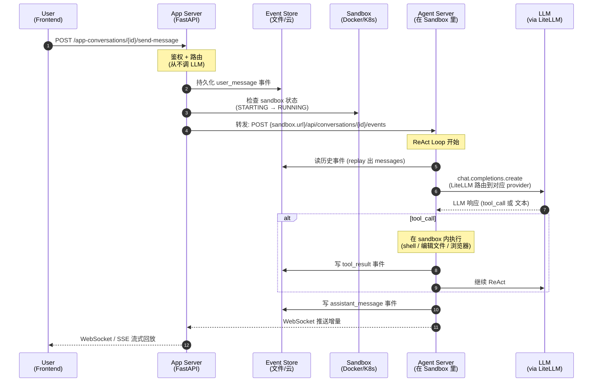
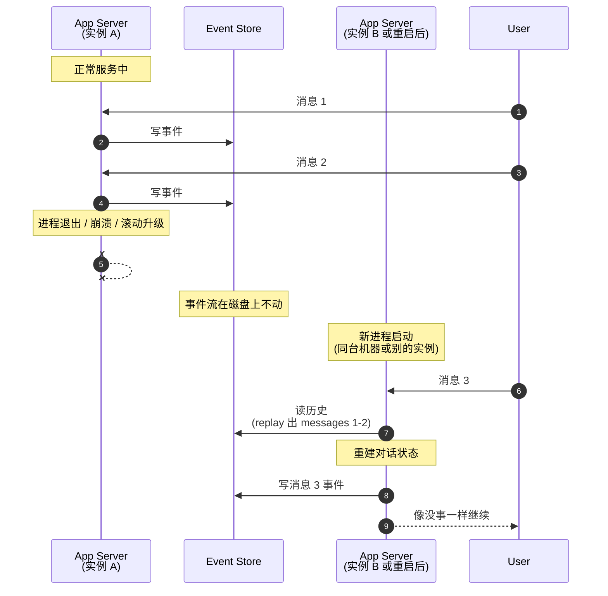
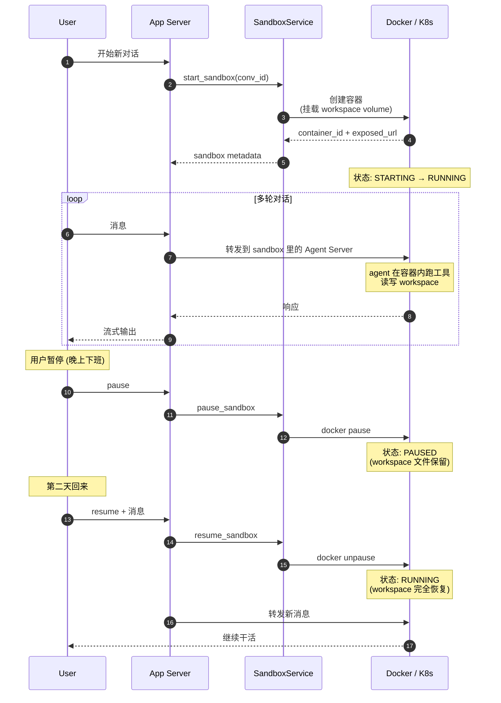

# OpenHands —— 架构分析与 LLM 特色

**对象**：OpenHands
**问题**：跟 hermes 这种单进程 CLI agent 比，OpenHands 凭什么是几百兆体量的项目？它的"LLM 特色"到底在哪？

**一句话结论**：**OpenHands 是个平台，不是 agent**。hermes 整个跑在一个进程里；OpenHands 是 **FastAPI 服务器 + 每个对话一个独立 sandbox（Docker/Process/K8s）**，是分布式架构。理解了这一点，几乎所有 LLM 特色都从"它是个服务器形态"长出来。

## 1. 形态：双层进程，App Server 从不调 LLM

最反直觉的设计：`openhands/app_server/` **从不直接调 LLM**。

流程（`openhands/app_server/app_conversation/app_conversation_router.py:436, 552`）：
```
Frontend → POST /app-conversations/{id}/send-message
        → App Server 是 thin proxy
        → 转发到 sandbox 里的 Agent Server: /api/conversations/{id}/events
        → Agent Server 才跑 ReAct loop、才调 LLM、才执行工具
```

**App Server = 编排 + 鉴权 + 持久化；Agent Server = 真干活。** 两者通过 HTTP 通信，跑在不同进程，甚至不同机器。

意义：一台 server 可以同时跑几百个用户的 agent，每个隔离在自己的 sandbox 里。这是为什么 OpenHands 能做成 SaaS 形态，而 hermes 只能单用户本地用。

## 2. LiteLLM 抽象（不是直调 SDK）

`openhands/app_server/utils/llm.py:1-308`

```python
import litellm
from litellm import LlmProviders, ProviderConfigManager, get_llm_provider
```

跟 hermes 直接用 `openai` SDK 不同，OpenHands 用 **LiteLLM** 做 provider 抽象：
- `VERIFIED_PROVIDERS` 列了 OpenAI / Anthropic / Mistral / Bedrock / Ollama
- 裸 model 名（`gpt-4`）自动 normalize 成 `provider/model`（`llm.py:62-66`）
- `openhands/*` 这种自家命名走托管代理（`llm.py:120-161`）

意义：用户在 UI 里选模型不用改代码就能切几十个 provider。代价是多一层依赖。

## 3. 每对话一个 Sandbox —— 跟 hermes 拉开最大距离的地方

`openhands/app_server/sandbox/sandbox_service.py:29-187`

三种后端实现：

| 类 | 用途 |
|---|---|
| `DockerSandboxService` | 本地 Docker，dev 标准 |
| `ProcessSandboxService` | 同进程 fork，测试用 |
| `RemoteSandboxService` | K8s pod，企业版 |

生命周期：`STARTING → RUNNING → PAUSED → RUNNING → DELETED`，sandbox **长寿**（不是 ephemeral 一次性的），跨多轮消息保留文件系统。

分组策略可配（`live_status_app_conversation_service.py:160-163`）：
- `all-in-one`（共享）
- `per-user`（一个用户一个）
- `per-conversation`（一个对话一个）

意义：LLM 可以在 sandbox 里随便跑 shell / 装包 / 编辑文件，**不会污染服务器**。hermes 的工具调用是在你本机直接跑，OpenHands 在容器里跑。

## 4. Event-Sourced 对话状态

`openhands/app_server/event/event_service.py`

会话状态是**事件流**，不是内存对象：
- 文件路径：`{prefix}/{user_id}/conversations/{conv_id}/{event_id}.json`
- 后端可选：`FilesystemEventService` / `AWSEventService` / `GoogleCloudEventService`
- 重启 server 后会话能恢复（replay 事件）

还有 `openhands/app_server/event_callback/` 模块——给会话挂 webhook，比如 `SetTitleCallbackProcessor` 在 `AGENT_MESSAGE` 触发时自动生成会话标题（`event_callback_service.py`）。

意义：审计 / 回放 / 可观测性都有了。**hermes 重启全丢，OpenHands 重启活下来。** 这是本 case demo 复刻的核心机制。

## 5. 多 Agent 注册 + 强制规划模式

`live_status_app_conversation_service.py:101-135`

```python
from openhands.sdk.subagent import get_registered_agent_definitions
```

Subagent 是**注册式**的（不是 hermes 那种临时 spawn）。每个有自己的 prompt / tool 集，可被主 agent 委派。

里面有个特别的 `PLANNING_AGENT_INSTRUCTION`：
```
<IMPORTANT_PLANNING_BOUNDARIES>
You are a Planning Agent that can ONLY create plans...
```

**规划 agent 物理上拒绝执行任务**，只产 PLAN.md。这种"硬边界"是 prompt 工程的高阶用法——把"该不该执行"从 LLM 自觉变成 prompt 强制。

## 6. MCP 双向（既消费也提供）

`openhands/app_server/mcp/mcp_router.py:43, 49-75`

```python
mcp_server = FastMCP('mcp', mask_error_details=True)
mcp_app = mcp_server.http_app(path='/mcp', stateless_http=True)
```

- **作为 MCP 服务器**：把 GitHub / GitLab / Azure / Bitbucket git 操作暴露成 MCP 工具
- **作为 MCP 客户端**：Tavily 搜索通过 MCP 代理接进来

hermes 不参与 MCP 生态，这是 OpenHands 独占特色——它**主动参与 MCP 生态**。

## 7. 技能（Skills）—— 跟 hermes 几乎正好相反

OpenHands skill = `skills/*.md`，markdown 写的**纯知识 / prompt 注入**：

```yaml
---
name: github
type: knowledge
version: 1.0.0
agent: CodeActAgent
triggers: [github, git]
---
You have access to an environment variable GITHUB_TOKEN...
```

加载逻辑（`openhands/app_server/services/skill_loader.py:1-12`）：App Server 调 Agent Server 的 `/api/skills`；触发是命中 `triggers` 关键词。

跟 hermes 的对比：

| | hermes skill | OpenHands skill |
|---|---|---|
| 内容 | markdown 程序性知识 | markdown 知识 / prompt |
| 产生方式 | **agent 自动写**（后台 review） | **工程师手写**（提交到 git） |
| 触发 | system prompt 装载索引，模型按需 view | trigger 词命中，整段塞 prompt |
| 演化 | curator agent 自动整理 | git 仓库手动维护 |

**hermes 那种"agent 自我学习写 skill"在 OpenHands 里没有**。OpenHands 的 skill 更接近"工程师手写的扩展 prompt 模板"。两者哲学完全不同。

## 生产时序图

### 图 1 · 一条消息从前端到 LLM 的全链路（双层架构核心）



**关键看点**：
- 步骤 3、6、10、13 都是写事件——**事件流是状态的唯一真相**
- 步骤 5 转发：App Server 真的只是 proxy，不解析也不理解对话内容
- 步骤 8 sandbox 隔离：任何 shell 命令都在容器里，不污染服务器

### 图 2 · 重启复活（Event Sourcing 的真价值）



hermes 走到这一步**整个对话就丢了**。这是 OpenHands 生产可用 vs hermes 个人工具的本质区别。

### 图 3 · Sandbox 生命周期



跟 hermes 对比：hermes 的 "workspace" 就是你的本机文件系统，没有暂停/恢复的概念。OpenHands 这套设计让 LLM 工作可以**像虚拟机一样冻结-唤醒**。

## 跟 hermes-agent 的对照表

| 维度 | hermes-agent | OpenHands |
|------|-------------|-----------|
| 形态 | 单进程 CLI Python | FastAPI server + 每会话 sandbox |
| LLM 调用 | 直调 openai SDK | LiteLLM 抽象 + 转发到 Agent Server |
| 状态 | 内存 + SQLite，重启丢 | Event-sourced，文件 / 云存储，可 replay |
| 工具执行 | 主机本地 | Docker / Process / K8s sandbox 隔离 |
| 技能 | agent 自学自写 markdown | 工程师手写 markdown，靠 trigger |
| 多用户 | 单用户假设 | 内建 user/secrets/auth，企业版有 org |
| MCP | 不参与 | 双向（既消费又提供） |
| 子 agent | 临时 spawn 后台 review | 注册式 subagent + 强制 planning agent |
| 学习机制 | curator 自动清理 + 自我反思 | 无（靠人维护 skill 仓库）|
| 适用场景 | 个人本地工具 | 多租户 SaaS / 团队平台 |

## 关键结论：LLM 特色的来源

OpenHands 的"LLM 特色"几乎全部不是关于 LLM **本身**，而是关于**怎么用工程化方式驯服 LLM**：

- **Sandbox 隔离** → 让 LLM 可以放心跑任意 shell（hermes 跑了就污染你本机）
- **Event sourcing** → 让 LLM 的多步操作可审计可回放（hermes 跑完就忘）
- **双层进程** → 让 LLM 这种慢 + 易崩的工作负载不拖累前端（hermes 阻塞）
- **LiteLLM** → 让 LLM 这种快速演进的接口被抽象（hermes 锁死 OpenAI 兼容协议）
- **MCP 双向** → 让 LLM 工具生态可以被外部消费（hermes 自己用自己工具）
- **Planning agent 硬边界** → 让 LLM 的"贪婪执行"被结构化约束（hermes 靠 prompt 忽悠）

**模型本身没有被改造**，被改造的是**模型周围的运行环境**。这跟 hermes 的"上下文工程"路线形成有趣对比——hermes 改的是**输入给模型的 prompt 内容**，OpenHands 改的是**模型工作的整个上下文环境**。

两条路线互补，不矛盾。

## 引用对照表

| 机制 | 文件 | 函数/常量 | 行 |
|------|------|----------|-----|
| 双层架构入口 | `openhands/app_server/app_conversation/app_conversation_router.py` | `send_message` | 436, 552 |
| LiteLLM 抽象 | `openhands/app_server/utils/llm.py` | provider 路由 | 1-308, 62-66, 120-161 |
| Sandbox 抽象基类 | `openhands/app_server/sandbox/sandbox_service.py` | `SandboxService.start_sandbox` | 29-187, 60-68 |
| Docker / Process / K8s | `openhands/app_server/sandbox/` | 三个实现类 | 各自文件 |
| Event 服务接口 | `openhands/app_server/event/event_service.py` | `EventService.get_event` | 67-73 |
| Event callback | `openhands/app_server/event_callback/event_callback_service.py` | `SetTitleCallbackProcessor` | 文件级 |
| MCP server + client | `openhands/app_server/mcp/mcp_router.py` | `mcp_server` + Tavily proxy | 43, 49-75 |
| Subagent + planning | `openhands/app_server/.../live_status_app_conversation_service.py` | `get_registered_agent_definitions` + `PLANNING_AGENT_INSTRUCTION` | 101-135 |
| Skills 加载 | `openhands/app_server/services/skill_loader.py` | proxy to agent server | 1-12 |
| User context | `openhands/app_server/user/user_context.py` | `depends_user_context` | 文件级 |
| Session API key | `openhands/app_server/sandbox/sandbox_service.py` | `SESSION_API_KEY_VARIABLE` | 24 |

往下看：
- 想知道这些模式怎么搬到自己项目 → [`PATTERNS.md`](PATTERNS.md)
- 想跑事件溯源 demo → [`python/`](python/)
- 想比对差距 → [`BENCHMARK.md`](BENCHMARK.md)
