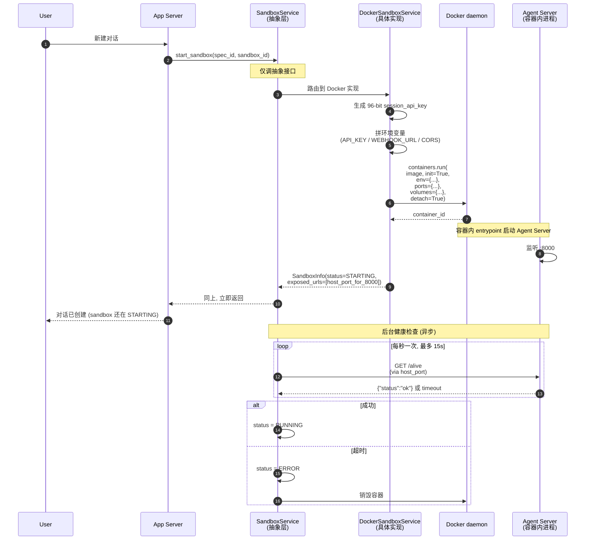
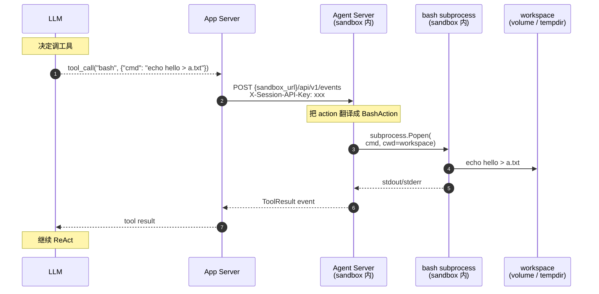
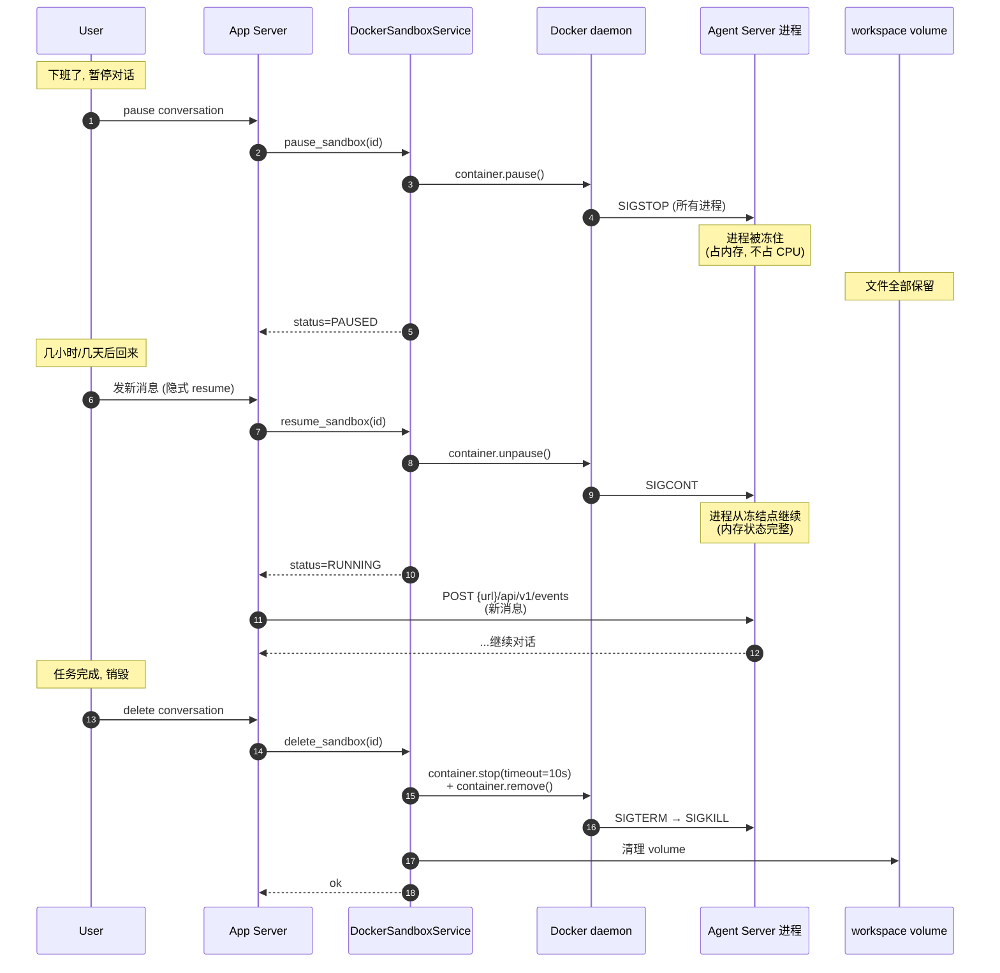

# OpenHands —— Sandbox 隔离机制

**对象**：OpenHands sandbox 子系统
**问题**：每对话一个 sandbox 到底是什么意思？怎么实现的？背后的抽象长啥样？我能搬什么过来？

**一句话结论**：**一个 `SandboxService` 抽象基类 + 三个后端实现（Docker / Process / Remote）+ 一套状态机（STARTING→RUNNING→PAUSED→STOPPED/ERROR）**。LLM 工具不直接在你机器上跑，而是隔离在 sandbox 里跑——通过 HTTP + session key 通信。

## 1. 抽象基类：`SandboxService`

代码：`openhands/app_server/sandbox/sandbox_service.py:29-233`

所有后端都实现这个异步接口：

```python
class SandboxService(ABC):
    @abstractmethod
    async def start_sandbox(self, sandbox_spec_id, sandbox_id) -> SandboxInfo: ...    # line 60-68
    @abstractmethod
    async def pause_sandbox(self, sandbox_id) -> bool: ...                            # line 174-179
    @abstractmethod
    async def resume_sandbox(self, sandbox_id) -> bool: ...                           # line 71-76
    @abstractmethod
    async def delete_sandbox(self, sandbox_id) -> bool: ...                           # line 182-186
    @abstractmethod
    async def get_sandbox(self, sandbox_id) -> SandboxInfo | None: ...                # line 41-42
    @abstractmethod
    async def get_sandbox_by_session_api_key(self, key) -> SandboxInfo | None: ...    # line 45-48
    
    # 不是抽象, 提供给所有后端用的工具方法:
    async def wait_for_sandbox_running(self, sandbox_id, timeout, httpx_client) -> SandboxInfo:
        # 轮询 /alive 健康检查
        # line 78-125
```

`SandboxInfo`（`sandbox_models.py:33-56`）就是 sandbox 的全部状态描述：

```python
@dataclass
class SandboxInfo:
    id: str
    created_by_user_id: str | None
    sandbox_spec_id: str
    status: SandboxStatus           # 状态机, 见 §3
    session_api_key: str            # 每个 sandbox 一把钥匙
    exposed_urls: list[ExposedUrl]  # Agent Server 暴露的 HTTP 端口
    created_at: datetime
```

**关键设计**：这是个**契约**，不是实现。所有调用方代码只跟 `SandboxService` 打交道，不知道底层是 Docker 还是 process 还是 K8s。这就是为什么后端可以**热插拔**。

## 2. 三个后端

### 2.1 DockerSandboxService —— 生产标准

代码：`openhands/app_server/sandbox/docker_sandbox_service.py:82-554`

用 docker-py SDK：

```python
import docker  # line 10
```

`start_sandbox` 关键步骤（`line 360-494`）：
1. 拉默认镜像（`get_default_sandbox_spec`, line 376-384）
2. 生成 sandbox id + session API key（base62 编码，96 bit 熵, line 387-392）
3. 拼环境变量（`line 394-415`）：
   - `OH_SESSION_API_KEYS_0` —— 进 sandbox 必带的鉴权 key
   - `OH_WEBHOOKS_0_BASE_URL` —— sandbox 反向通知 App Server 用的 webhook
   - `OH_ALLOW_CORS_ORIGINS_*` —— CORS 允许列表
4. 准备 volume mounts（`line 438-444`，默认 `rw` 模式）
5. 端口映射（`line 417-431`）：bridge 模式随机分配 host_port，host 模式直通
6. **`docker_client.containers.run(init=True, detach=True)`**（`line 463`）—— init=True 用 tini 处理 signal
7. 立刻返回 `STARTING` 状态，健康检查异步跑

`pause_sandbox`（`line 515-527`）= `container.pause()`（Docker 内部发 SIGSTOP 给所有进程）
`resume_sandbox`（`line 496-513`）= `container.unpause()`
`delete_sandbox`（`line 529-554`）= stop（10s 超时）→ remove container → volume 清理

### 2.2 ProcessSandboxService —— 开发用 / 没 Docker 也能跑

代码：`openhands/app_server/sandbox/process_sandbox_service.py:67-462`

**重要诚实**：这个名字叫 sandbox，但**不是真正的安全沙盒**。它只做了：
- 创建独立 working directory（`{base_working_dir}/{sandbox_id}`, line 314-315）
- 启动子进程 `python -m openhands.agent_server --port {port}`（line 125-131）
- 子进程的 `cwd` 是这个 working dir
- log redirect 到 `.openhands-agent-server.log`（line 139-143，避免管道死锁）

**没有 chroot、没有 namespace 隔离、没有 PATH 限制**。Agent 完全能 `cat /etc/passwd`、`ls ~/`。安全防护**只来自 working dir 习惯**——不是机制。

Explore agent 原话：

> "ProcessSandboxService 不是 sandbox，是 silo"

但用作"按对话隔离 workspace"足够，**生产真要安全用 Docker**。

`pause` / `resume` 用 `psutil`：
- `pause_sandbox` → `process.suspend()` = SIGSTOP（line 360-372）
- `resume_sandbox` → `process.resume()` = SIGCONT（line 346-358）
- `delete_sandbox` → `terminate()` → 超时则 `kill()` → 删除 working dir（line 374-409）

进程信息存在**全局内存字典** `_processes`（line 63）——**App Server 重启就丢**。这也是 Process backend 不适合生产的原因之一。

### 2.3 RemoteSandboxService —— 接外部 runtime 服务

代码：`openhands/app_server/sandbox/remote_sandbox_service.py:105-~550`

不是 K8s API，是**自定义的 runtime HTTP 服务**：
- `start_sandbox` → POST 给 remote runtime API
- 后端 API 契约：`GET /sessions/{id}` → `{status, session_api_key, url, runtime_id, ...}`（line 228-235）
- 批量优化：`GET /sessions/batch?ids=...`（line 237-269）
- 本地只存 metadata（`StoredRemoteSandbox` 表, line 79-101），状态实时查 remote API
- 端口映射写死（line 68-71）：
  - `AGENT_SERVER_PORT=60000`
  - `VSCODE=60001`
  - `WORKER_1=12000`, `WORKER_2=12001`

意义：这是企业版的"我们公司有套自己的 sandbox 编排服务（K8s pod / Firecracker VM / 别的），OpenHands 只要会调它的 API"。

## 3. 状态机

代码：`openhands/app_server/sandbox/sandbox_models.py:9-15`

```python
class SandboxStatus(Enum):
    STARTING   # 正在拉镜像 / 起容器 / 起进程
    RUNNING    # 健康检查过了
    PAUSED     # 进程被 SIGSTOP 冻住
    ERROR      # 启动失败 / 健康检查持续失败
    MISSING    # 容器 / 进程被外部删掉了, App Server 找不到
```

迁移：

| 从 | 到 | 触发 |
|----|----|----|
| (none) | STARTING | `start_sandbox()` 被调 |
| STARTING | RUNNING | `/alive` 健康检查通过 |
| STARTING | ERROR | 健康检查 15s 超时（`docker_sandbox_service.py:264-277`）|
| RUNNING | PAUSED | `pause_sandbox()` 被调 |
| PAUSED | RUNNING | `resume_sandbox()` 被调 |
| RUNNING | ERROR | Docker 报 dead / 进程 crash |
| any | MISSING | 容器/进程被外部删了, 服务侧查不到 |

**持久化**：
- Docker：靠容器本身的 `attrs.status` 字段
- Process：**只在内存字典里**，重启丢
- Remote：本地存 metadata，状态实时查 remote API

## 4. Agent Server 怎么进 sandbox

**Docker 版**：用预构建镜像
- 镜像 ID 由 `SandboxSpecInfo.id` 指定（`sandbox_spec_models.py:11`）
- 默认从 env var 或硬编码读（`get_agent_server_image()`, `docker_sandbox_spec_service.py:38`）
- 镜像里已经装好了 `openhands.agent_server` 包
- 容器启动后 entrypoint 就是 agent server，监听 8000 端口
- 工作目录写死 `/workspace/project`（`line 50`）

**Process 版**：直接 spawn Python 模块
- 命令 `python -m openhands.agent_server --port {port}`（`line 125-131`）
- 用 `sys.executable` 找 Python 解释器（`line 424-426`）

**Remote 版**：runtime 服务自己负责进程，OpenHands 只要 URL

## 5. App Server 怎么跟 Agent Server 通信

代码路径：`sandbox_service.py:152-171` 找到 `exposed_urls` 里 `name == AGENT_SERVER` 的那条，拿到 URL。

后续所有调用：
- HTTP 客户端：`httpx.AsyncClient`（`docker_sandbox_service.py:96`）
- 鉴权：`X-Session-API-Key: {session_api_key}` 头（`session_auth.py:37+`）
- 健康检查：`GET /alive` 返回 `{"status": "ok"}`（`sandbox_service.py:142`）
- 提交动作：`POST /api/v1/events`（`hook_loader.py:79`）
- 反向通知：sandbox → `http://host.docker.internal:{host_port}/api/v1/webhooks`（`docker_sandbox_service.py:398`）

**注意**：App Server **不是透明反向代理**。它把对话状态翻译成 action payload 发给 Agent Server。两者协议是业务级的（events / actions），不是 HTTP 转发级的。

## 6. 安全边界：实际有保护的 vs 没保护的

| 维度 | 保护到位 | 没保护 |
|------|---------|--------|
| **鉴权** | ✅ session API key 96 bit 熵，每 sandbox 一把 | |
| **进程隔离** | Docker ✅ namespace 全到位<br>Process ❌ 只是 cwd 不同 | |
| **文件系统** | Docker 主要靠 volume mount 限制 | Process 完全没限制，能读全机 |
| **网络出站** | | ❌ 不过滤，能 curl 全网 |
| **CPU/内存** | | ❌ `docker.containers.run()` 完全没设 limit (line 463 附近) |
| **secrets** | ✅ session key 动态注入 env，不入镜像 | |
| **session key 过期** | ✅ 只有 RUNNING 状态有效 | |

**最大的安全坑**：Docker 后端虽然有 namespace，但**资源限制完全没设**。一个跑疯的 LLM 可以让一个容器吃满 CPU 把整台机器拖垮。要往生产推**必须**加 `mem_limit` / `cpu_quota` / `pids_limit`。

## 7. 分组策略：sandbox 怎么按用户/对话分

代码：`live_status_app_conversation_service.py:160-163`

`sandbox_grouping_strategy` 可选值（在 `User` / `Org` 表里）：
- `per-conversation` —— 每对话一个，最隔离
- `per-user` —— 一个用户共享一个
- `all-in-one` —— 全平台一个，**高危**

切换逻辑没在 OSS 代码里完整看到，主要在 enterprise/。

## 生产时序图

### 图 1 · sandbox 从无到有



### 图 2 · 执行一条 shell 命令（端到端）



**关键看点**：
- 步骤 2、4 都有 session API key 鉴权
- 步骤 5 子进程的 cwd 是 workspace 目录，不会跑到 host
- App Server 全程不知道命令长啥样，它只是个事件转发器

### 图 3 · 暂停 / 恢复 / 销毁



**Pause / Resume 跨多长时间能撑？** Docker 官方没承诺。短时（小时级）稳，长时（几天）可能被 docker daemon GC。Production OpenHands 有更智能的"超时自动 stop + 状态保存"，但 OSS 代码里没看到完整实现。

## 跟 hermes 的对照

| 维度 | hermes | OpenHands |
|------|--------|-----------|
| 工具在哪跑 | **你的本机** | sandbox 容器/进程 |
| LLM 写的代码污染范围 | 你的工作目录 | sandbox workspace（host 不动） |
| 多对话并发 | 互相污染（共享 fs） | 各自 sandbox，互不影响 |
| 暂停一个对话 | 不存在的概念 | 一等公民（pause/resume） |
| 后端可换 | 直接调 OS API | 三个后端可热插拔 |

hermes 的工具系统在**信任 LLM** 这件事上是裸奔的——LLM 跑 `rm -rf` 就真的删你文件。OpenHands 用 sandbox 这层把信任问题**从协议层解决**了。这是平台级 vs 个人级 agent 的核心差异之一。

## 关键结论

OpenHands 的 sandbox 抽象做了三件事：

1. **执行隔离** —— LLM 工具不污染 host
2. **生命周期** —— start/pause/resume/stop 让一个对话像虚拟机一样可冻结可唤醒
3. **多后端可换** —— 同一接口下，dev 用 Process，生产用 Docker，弹性用 Remote/K8s

但同时也要诚实：
- **Process backend 不是真 sandbox**，只是 silo
- **Docker backend 没设资源限制**，跑疯了能拖垮整机
- **网络出站完全不过滤**，LLM 能 curl 外网拖数据

要往生产推必须在这些缝隙上补丁。详见 [`BENCHMARK.md`](BENCHMARK.md)。

## 引用对照表

| 机制 | 文件 | 函数/常量 | 行 |
|------|------|----------|-----|
| 抽象基类 | `openhands/app_server/sandbox/sandbox_service.py` | `SandboxService` ABC | 29-233 |
| 健康检查轮询 | `openhands/app_server/sandbox/sandbox_service.py` | `wait_for_sandbox_running` | 78-125 |
| 数据模型 | `openhands/app_server/sandbox/sandbox_models.py` | `SandboxInfo` / `SandboxStatus` / `ExposedUrl` | 9-56 |
| Docker 后端 | `openhands/app_server/sandbox/docker_sandbox_service.py` | `DockerSandboxService.start_sandbox` | 360-494 |
| Docker pause/resume | `openhands/app_server/sandbox/docker_sandbox_service.py` | `pause_sandbox` / `resume_sandbox` | 496-527 |
| Docker delete | `openhands/app_server/sandbox/docker_sandbox_service.py` | `delete_sandbox` | 529-554 |
| Process 后端 | `openhands/app_server/sandbox/process_sandbox_service.py` | `ProcessSandboxService.start_sandbox` | 290-344 |
| Process spawn | `openhands/app_server/sandbox/process_sandbox_service.py` | `python -m openhands.agent_server` | 125-131 |
| Process pause/resume | `openhands/app_server/sandbox/process_sandbox_service.py` | psutil suspend / resume | 346-372 |
| Remote 后端 | `openhands/app_server/sandbox/remote_sandbox_service.py` | `RemoteSandboxService` | 105+ |
| Remote 端口写死 | `openhands/app_server/sandbox/remote_sandbox_service.py` | `AGENT_SERVER_PORT=60000` 等 | 68-71 |
| session key 鉴权 | `openhands/app_server/sandbox/session_auth.py` | header `X-Session-API-Key` | 37+ |
| 分组策略 | `openhands/.../live_status_app_conversation_service.py` | `sandbox_grouping_strategy` | 160-163 |

往下看：
- 想知道这模式怎么搬到自己项目 → [`PATTERNS.md`](PATTERNS.md)
- 想跑最小 ProcessSandbox 复刻 → [`python/`](python/)
- 想比对差距 → [`BENCHMARK.md`](BENCHMARK.md)
