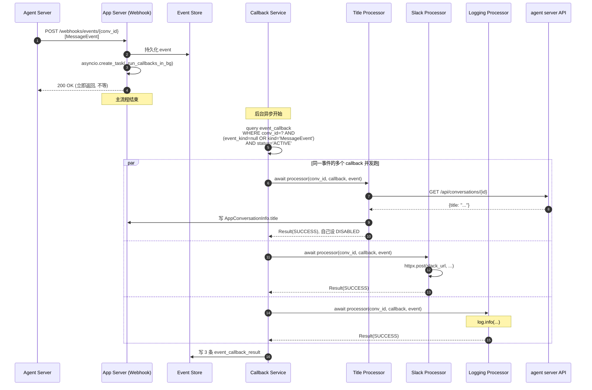
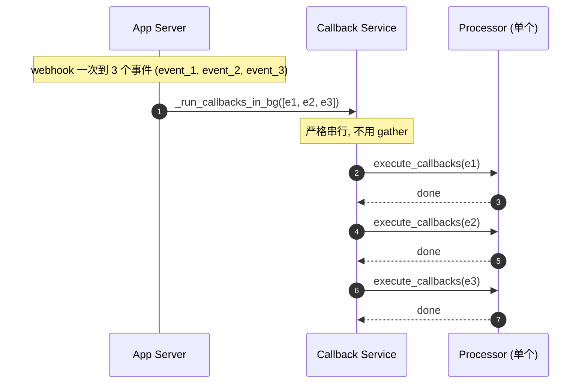
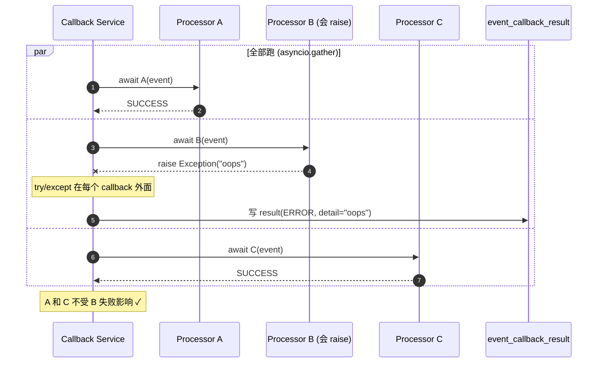

# OpenHands —— Event Callback 子系统

**对象**：OpenHands `event_callback/` 子系统
**问题**：事件来了之后，怎么挂"副作用"？挂的不该跟事件流耦合，得是个独立可插拔的处理器机制——OpenHands 怎么做的？

**一句话结论**：**一个 `EventCallbackProcessor` 抽象基类 + 注册表 + 后台 asyncio 派发器**。事件持久化后，匹配该事件的所有 callback 在后台并发执行，主流程不等。callback 持久化在 SQL，跨重启留存；至多一次语义（at-most-once）；callback 可以禁用自己。这是 [case 02](../02-openhands-architecture) 提的"event sourcing"的副作用层，但比 02 介绍的更工程化。

## 1. 抽象基类：`EventCallbackProcessor`

代码：`openhands/app_server/event_callback/event_callback_models.py:40-48`

```python
class EventCallbackProcessor(DiscriminatedUnionMixin, ABC):
    @abstractmethod
    async def __call__(
        self,
        conversation_id: UUID,
        callback: EventCallback,
        event: Event,
    ) -> EventCallbackResult | None:
        """Process an event."""
```

四点关键设计：

1. **异步**。`async def __call__(...)`，整个派发器跑在 asyncio 上。
2. **可调用对象**而不是普通方法（用 `__call__`）—— processor 实例本身可以被 `await` 当成函数。
3. **返回类型 `Result | None`**：
   - 返回 `Result(status=SUCCESS)` —— callback 这次跑完了
   - 返回 `Result(status=ERROR, detail=...)` —— 出错了但记录在案
   - 返回 `None` —— 这次什么都没做，callback 保持 ACTIVE 状态等下次匹配的事件
4. **Pydantic 鉴别联合**（`DiscriminatedUnionMixin`）—— processor 用 `type` 字段区分，能序列化到 JSON，**存数据库里跨重启复活**。

## 2. 注册表：双维度过滤

代码：`event_callback_models.py:73-93`

```python
class CreateEventCallbackRequest(OpenHandsModel):
    conversation_id: OpenHandsUUID | None = Field(default=None)  # None = 全局
    processor: EventCallbackProcessor
    event_kind: EventKind | None = Field(default=None)            # None = 所有事件
```

每个 callback 注册时有两个独立过滤器：

| 维度 | None | 具体值 |
|------|------|-------|
| `conversation_id` | 全局（所有对话都触发） | 只在这个对话触发 |
| `event_kind` | 所有事件 | 只这一类事件触发 |

四种组合：

| conv_id | event_kind | 用途 |
|--------|-----------|------|
| None | None | 全局统计：每条事件都记一笔 |
| None | `MessageEvent` | 全局：每条消息触发某个动作（比如计费）|
| `abc-123` | None | 本对话所有事件挂个钩子 |
| `abc-123` | `MessageEvent` | 本对话每条消息触发（最常见，比如自动起标题）|

## 3. 派发器：后台异步 + 顺序-并发混合

派发入口：`openhands/app_server/event_callback/webhook_router.py:406-452`

```python
asyncio.create_task(
    _run_callbacks_in_bg_and_close(conversation_id, user_id, events)
)
return Success()   # webhook 立即返回, 不等 callback 跑完
```

**关键设计：fire-and-forget**。webhook 接到事件 → 立即返回成功 → 后台 task 慢慢跑 callback。这意味着主流程感知不到 callback 的延迟，代价是 callback 失败用户不知道（只在日志里）。

派发内部：`webhook_router.py:491-503`

```python
async def _run_callbacks_in_bg_and_close(conv_id, user_id, events):
    # 注释里写得明明白白:
    # "We don't use asyncio.gather here because callbacks must be run in sequence."
    for event in events:
        await event_callback_service.execute_callbacks(conv_id, event)
```

对**单个事件**内部的多个 callback，是并发的（`sql_event_callback_service.py:223-228`）：

```python
await asyncio.gather(*[
    self.execute_callback(conv_id, callback, event)
    for callback in callbacks
])
```

**两层混合并发**：
- 事件之间：**串行**（保证用户消息 A 的 callback 全跑完才跑 B 的 callback）
- 同一事件的多个 callback：**并行**（asyncio.gather）

为什么这样设计？事件代表用户的逻辑顺序（先说了 A 再说 B），副作用要按这个顺序处理；但同一事件的不同副作用（起标题、发 Slack、写日志）互相独立，并行更快。

## 4. 内置 callback 处理器

### 4.1 `LoggingCallbackProcessor`（示例 / 教学用）

代码：`event_callback_models.py:51-70`

最简单的处理器：把事件 log 一行，返回 SUCCESS。教初学者用的样板。

### 4.2 `SetTitleCallbackProcessor`（真业务）

代码：`event_callback/set_title_callback_processor.py:80-155`

干一件事：**新对话第一条消息后，自动生成对话标题**。流程：

```
1. 触发条件: event 是 MessageEvent (line 89 类型筛选)
2. 轮询 agent server: GET /api/conversations/{id}
   - 最多 4 次, 每次间隔 3 秒 (line 30-32 的常量)
   - 期望响应里有 .title 字段 (agent server 内部异步生成)
3. 成功拿到 title:
   - 写到 AppConversationInfo 表 (line 144)
   - 把自己设为 DISABLED 状态 (line 147) —— 不再触发
4. 没拿到 title:
   - 返回 None —— callback 保持 ACTIVE, 下次 MessageEvent 再试
   - HTTP 错误 log warning 但不算 ERROR
```

**关键设计点**：
- **callback 能禁用自己**：跑成功后状态变 DISABLED，下次扫描跳过它（一次性 callback）
- **未完成时返回 None**：保持 ACTIVE 等下次重试，不需要外部重试机制
- **轮询而非长连接**：app server 不能假设 agent server 多快出 title，所以重复轮询

### 4.3 企业版处理器（在 enterprise/ 子目录）

不开源，但能在 enterprise import 里看到名字：
- `GithubV1CallbackProcessor` —— 对话结束时往 GitHub PR 评论里贴总结
- `SlackV1CallbackProcessor` —— 往 Slack thread 推
- `JiraV1CallbackProcessor` / `GitLabV1CallbackProcessor` / `BitbucketV1CallbackProcessor` —— 同样模式

触发条件都是同一种事件：`ConversationStateUpdateEvent` 里 `key='execution_status'` `value='finished'` 或 `'error'`。

## 5. 持久化：SQL 表

callback 注册不是 in-memory 的，是 SQL 表：

```
event_callback        — 注册的 callback (id, conv_id, event_kind, processor JSON, status)
event_callback_result — 每次执行的结果 (callback_id, event_id, status, detail, timestamp)
```

意义：
- 重启服务器，callback 还在
- 每次执行有 audit log（哪个 callback 在哪条事件上跑成啥结果）
- processor 字段是 JSON（Pydantic 鉴别联合的功劳），反序列化能精准复活

代价：跨进程同步用数据库，写有事务开销。OpenHands 这点是为多用户平台准备的，单机工具不用做这么重。

## 6. 容错：隔离 + 日志 only

代码：`sql_event_callback_service.py:235-252`

```python
async def execute_callback(self, conv_id, callback, event):
    try:
        result = await callback.processor(conv_id, callback, event)
        ...
    except Exception as exc:
        _logger.exception(f'Exception in callback {callback.id}', stack_info=True)
        stored_result = StoredEventCallbackResult(
            status=EventCallbackResultStatus.ERROR,
            detail=str(exc),
            ...
        )
    self.db_session.add(stored_result)
```

诚实矩阵：

| 失败情形 | 保护 | 不保护 |
|---------|-----|-------|
| 一个 callback raise 异常 | ✅ 捕获 + 写 ERROR result + 其他 callback 不受影响 | |
| 一个 callback hang | | ❌ 没 timeout, 整个 gather 卡住 |
| 进程崩溃 / 服务器重启 | | ❌ 在跑的 callback 丢, 没重试队列 |
| Callback 副作用产生重复 | | ❌ 至多一次但**没幂等性保证** —— 重试可能两次发 Slack |

**幂等性是用户的事**：要发 Slack 消息又怕重复，应该在 callback 里查"这条 event id 之前发过没"。OpenHands 不替你做这件事。

## 7. Webhook 反向澄清：别跟 callback 混了

case 03 提过 `OH_WEBHOOKS_0_BASE_URL` 这个环境变量。**这不是 event callback 系统**。

方向相反：
- **OH_WEBHOOKS_0_BASE_URL**：sandbox 里的 agent server 用这个把事件 POST 给 app server
- **event_callback**：app server 收到事件后，运行注册的 processor 做后处理

类比：webhook 是邮箱，callback 是邮箱里的过滤规则。

## 生产时序图

### 图 1 · 一条事件触发 N 个 callback（fan-out）



### 图 2 · 顺序处理多个事件（事件间串行）



**为什么 e1 → e2 → e3 不并行**？因为副作用要按用户操作顺序生效。如果 e1 是"创建文件"、e2 是"删除文件"，并行跑可能 e2 先于 e1 完成，得到错的结果。

### 图 3 · Callback 失败隔离



## 跟 hermes 的对照

| 维度 | hermes | OpenHands |
|------|--------|-----------|
| 抽象层级 | 没抽象, 直接 `_spawn_background_review` 调 LLM | `EventCallbackProcessor` 抽象基类, 多实例可插拔 |
| 注册方式 | 硬编码在 run_agent.py 里 | DB 持久化 + Pydantic discriminator JSON |
| 触发条件 | tool_call 计数到阈值 | event_kind + conversation_id 双维度过滤 |
| 副作用类型 | 只一种: 写 skill | 任意（log/title/slack/github/jira/...）|
| 失败处理 | `except: pass` (best effort) | 捕获 + 持久化 ERROR result |
| 跨重启 | 内存的就丢 | DB 持久化的 callback 重启复活 |
| 并发 | 后台线程一个 | asyncio.gather 同事件多 callback 并发 |

**核心差异**：hermes 把"事件后做事"绑死成"调 LLM 写 skill"这一个用途；OpenHands 把这事抽成**通用副作用机制**——后面接什么处理器都行，处理器之间不知道彼此存在。

这是单机工具 vs 平台产品的典型分野。

## 关键结论

OpenHands 的 event_callback 做了三件事：

1. **解耦事件与副作用** —— 事件流就是事件流，副作用是订阅者，互不知道
2. **可插拔处理器** —— 加一个 SlackProcessor 只需要写一个类，不动派发器
3. **持久 + 可观测** —— callback 状态在 SQL，每次执行有 result 行，能审计

但同时也要诚实：
- **没系统级 retry**，崩了在跑的 callback 丢
- **没幂等性保证**，幂等是处理器自己的事
- **没 timeout**，hang 的 callback 拖死整个 gather
- **at-most-once 而非 exactly-once**

要生产用必须在这些缝隙上补。详见 [`BENCHMARK.md`](BENCHMARK.md)。

## 引用对照表

| 机制 | 文件 | 函数/常量 | 行 |
|------|------|----------|-----|
| 抽象基类 | `event_callback/event_callback_models.py` | `EventCallbackProcessor` ABC | 40-48 |
| 注册请求模型 | `event_callback/event_callback_models.py` | `CreateEventCallbackRequest` | 73-93 |
| EventKind 动态生成 | `event_callback/event_callback_models.py` | `EventKind = Literal[tuple(...)]` | 28-30 |
| Logging 处理器 | `event_callback/event_callback_models.py` | `LoggingCallbackProcessor` | 51-70 |
| Title 处理器 | `event_callback/set_title_callback_processor.py` | `SetTitleCallbackProcessor.__call__` | 80-155 |
| 后台派发入口 | `event_callback/webhook_router.py` | `asyncio.create_task(_run_callbacks_in_bg...)` | 406-452 |
| 事件间串行 | `event_callback/webhook_router.py` | `_run_callbacks_in_bg_and_close` | 491-503 |
| 同事件并发 | `event_callback/sql_event_callback_service.py` | `asyncio.gather([...])` | 223-228 |
| 容错隔离 | `event_callback/sql_event_callback_service.py` | `execute_callback` try/except | 235-252 |
| 自动注册 title | `event_callback/webhook_router.py` | `save_event_callback(SetTitleCallback...)` | 372-388 |
| Pydantic 类型注册 | `app_server/config.py` | `import event_callback` | 12-13 |

往下看：
- 想知道这模式怎么搬到自己项目 → [`PATTERNS.md`](PATTERNS.md)
- 想跑可插拔 callback 复刻 → [`python/`](python/)
- 想比对差距 → [`BENCHMARK.md`](BENCHMARK.md)
