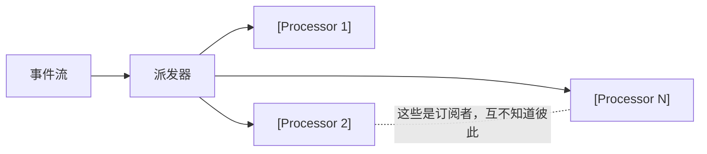
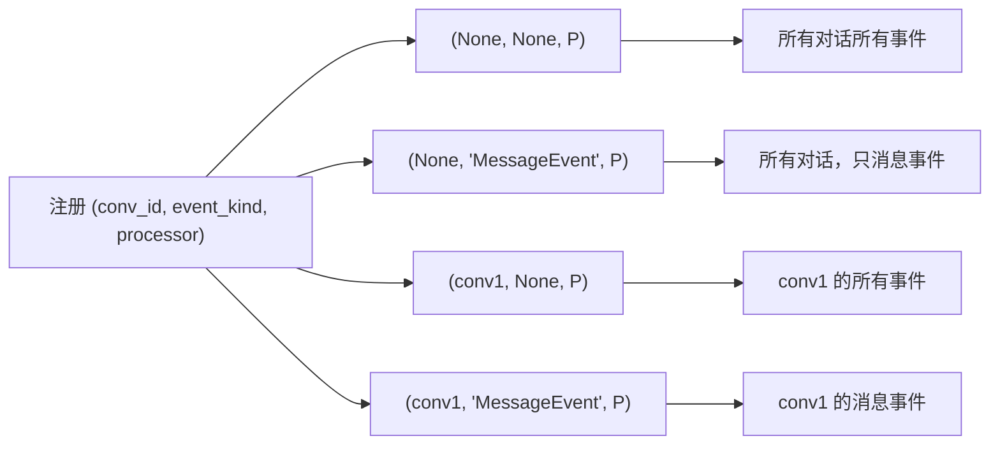
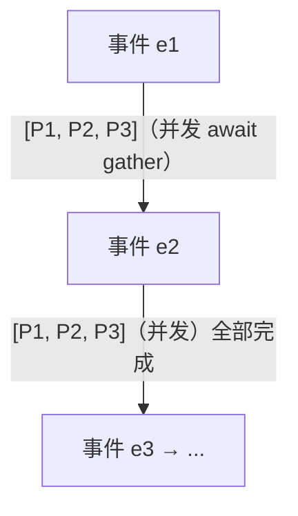
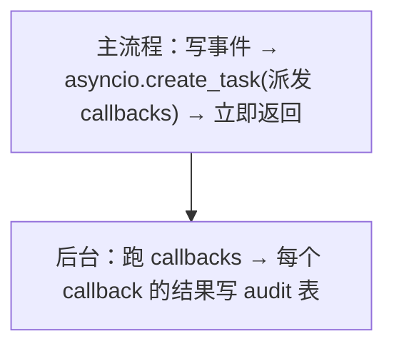

# 抽出来的设计模式

OpenHands 的 event_callback 把"事件后做事"做成了**通用副作用机制**。4 个独立模式各自可以单独抄。

## 模式 A · Plugin Processor 模式



**核心做法**：
- 定义一个**单方法 ABC**（`async __call__(ctx, event) -> Result | None`）
- 任何新的副作用 = 新写一个类实现 ABC
- 派发器只跟 ABC 打交道，不知道具体是谁

**好处**：加一个 SlackProcessor / EmailProcessor / BillingProcessor 不动派发器，不动其他 processor。每个 processor 独立测试。

**适用**：任何 **"事件 + N 种独立后续动作"** 场景：
- ✅ 用户消息后：写日志、起标题、推 Slack、扣额度
- ✅ Order 创建后：发邮件、扣库存、调风控
- ✅ Build 成功后：通知 Slack、更新 status badge、归档产物

**不适用**：
- ❌ 只有一种副作用 —— 直接函数调用，不用 ABC
- ❌ 副作用之间有严格依赖（A 必须等 B 完成）—— 用 workflow 引擎而不是 fan-out

### 怎么抄

最小 ABC：

```python
class EventCallbackProcessor(ABC):
    @abstractmethod
    async def __call__(self, conv_id, event) -> Result | None: ...
```

每个 processor 一个文件，类名见名知意（`SetTitleCallbackProcessor` / `SlackCallbackProcessor`），符合"Single Responsibility"。

**关键设计点**（OpenHands 做对的）：
- 返回类型用 `Result | None`：`None` 表示"这次没干活，下次再来"。这让 callback **能自然处理"尚未就绪"的情况**（参考 `SetTitleCallbackProcessor` 轮询 title 没好时返回 None）。
- 没 None 这一档，你要么 SUCCESS 要么 ERROR，"等待"状态无处安放。

## 模式 B · 双维度过滤注册表



**核心做法**：注册表里每条记录带两个独立的过滤维度，None 表示通配。

**好处**：用同一套机制覆盖"全局监听 + 单对话定制"，注册和派发逻辑都简单。

**适用**：任何"事件流要分维度订阅"的场景。Pub/sub 系统、监控告警、access log filter，全是这个模式。

**陷阱**：维度多了会 N×M 爆。OpenHands 只有 2 维（conv_id × event_kind）刚好。

### 怎么抄

派发时一句 SQL：
```sql
SELECT * FROM event_callback
WHERE (conv_id IS NULL OR conv_id = :event_conv_id)
  AND (event_kind IS NULL OR event_kind = :event_kind)
  AND status = 'ACTIVE'
```

`IS NULL OR =` 是处理通配的标准写法。

## 模式 C · 顺序事件 + 并发 Callback 的混合并发



**核心做法**：
- 同一批事件之间 **严格串行**（保证副作用按事件顺序生效）
- 单事件内的多个 callback **并发**（节省时间）

**为什么这两个反着**？因为：
- 事件顺序代表用户的因果逻辑（先创建后删除）—— 不能乱
- 同事件的多个 callback 是平行的副作用（起标题 + 推 Slack）—— 互不依赖

**适用**：所有"事件流 + 副作用"产品。

**反例**：
- ❌ 全并行（`gather([all events × all callbacks])`）—— 因果错位
- ❌ 全串行（每个 callback 都 await 完才下一个）—— 慢且无必要

### 怎么抄

伪代码：
```python
for event in events:                              # 事件串行
    matching = filter_callbacks(event)
    await asyncio.gather(*[                      # callback 并发
        cb.processor(conv_id, cb, event)
        for cb in matching
    ])
```

一行 `for` + 一行 `gather`，就这两层。

## 模式 D · Fire-and-forget + 持久化 audit log



**核心做法**：
- 主流程**不等** callback 完成（用户响应快）
- 后台跑的结果**持久化**到 audit 表（出问题能查）

**好处 / 代价**：

| | 好处 | 代价 |
|---|------|------|
| 用户感知 | 响应快 | callback 出错用户看不到 |
| 调试 | audit 表可查每次执行 | callback 失败要看日志/audit，不是用户报告 |
| 可靠性 | 副作用慢不拖累主流程 | 进程崩了在跑的 callback 丢 |

**适用**：
- ✅ 副作用**对用户响应不关键**（推 Slack、写日志、起标题）
- ✅ 用户对 callback 完成时间**无明确预期**

**不适用**：
- ❌ 副作用决定用户结果（扣款 → 必须同步等成功）
- ❌ 必须 exactly-once（fire-and-forget 是 at-most-once 的）

### 怎么抄

```python
@router.post("/webhooks/events")
async def receive_event(event):
    await event_store.save(event)
    asyncio.create_task(run_callbacks(event))   # 不 await!
    return {"status": "ok"}
```

注意：**不 await create_task** 是这模式的灵魂。漏了 await 是 bug，故意不 await 是设计。

## 何时全套抄 OpenHands event_callback 模式

✅ **强烈推荐抄**：
- 平台产品，事件多种类、副作用多类（log + Slack + GitHub + 计费 + ...）
- 多用户，不同用户可能挂不同 callback
- 需要审计（每次副作用执行的结果要存）
- 副作用相对独立，没硬依赖

⚠️ **抄一部分就够**：
- 只有一两种副作用 → 抄模式 A（ABC + 实现），跳模式 B/C/D
- 单进程内存够 → 抄模式 A + C，跳 SQL 持久化

❌ **别抄**：
- 副作用必须同步保证成功（支付、转账）—— 用工作流引擎，不是 fan-out
- 副作用必须按依赖顺序 —— DAG 调度而非平铺 callback
- 嵌入式 / 资源极紧 —— asyncio 都嫌重

## 实践要点

### 处理器返回 `None` 的妙用

OpenHands 的 `SetTitleCallbackProcessor` 是经典示范：当 title 还没生成好时，**返回 None 而不是 SUCCESS 或 ERROR**。这样 callback 保持 ACTIVE 状态，下次 MessageEvent 到时再试。

效果：**轮询逻辑被压进 callback 自己**——不需要外部 retry 机制，事件流自然给你"再来一次"的机会。

### 自禁用（self-DISABLE）

跑完一次性任务的 callback（自动起标题、首次欢迎邮件）应该跑成功后**自己把状态设为 DISABLED**。这比"派发器维护一个 once 列表"干净得多 —— 状态归属在 callback 自己。

### 处理器之间不通信，但通过事件流通信

```
P1 跑完, 写一个新事件 → P2 监听这个新事件 → ...
```

这就是事件溯源的力量：**callback 之间不直接调用，而是通过事件流间接联动**。你想让 SlackProcessor 跑完后再起 EmailProcessor，让 SlackProcessor 写一个 `SlackPosted` 事件，让 EmailProcessor 监听 `SlackPosted` 事件。看起来绕，但每个 processor 独立，可测、可禁用、可换。

### 幂等性是 callback 自己的事

OpenHands 不替你做。SlackProcessor 要避免重复发，自己得加去重逻辑——典型做法：以 `event_id` 为幂等键，记录"已处理 event_id 集合"。

如果你的 callback 必须严格 exactly-once，用消息队列 + 幂等键，不要用 fire-and-forget。

### 处理器要有 timeout

OpenHands **没**给单个 callback 设 timeout，一个 hang 的 callback 会卡死整个 `gather`。生产请加：

```python
result = await asyncio.wait_for(
    processor(conv_id, cb, event),
    timeout=30.0,
)
```

这是 1 行修复，但 OpenHands 没做。

## 反例：哪些不要抄

- ❌ **callback 之间用全局变量通信**。它们的设计就是"互不知道"，全局状态打破隔离。要协作走事件流。
- ❌ **派发器同步等所有 callback 完成才返回**。这退化成普通函数调用，failed-forget 的所有意义没了。
- ❌ **把 callback 注册逻辑写在 processor 类里**。注册是用户/管理员关心的事，processor 只负责实现 "what" 不该负责 "where"。
- ❌ **依赖 callback 的执行顺序**（"A 必须先于 B 完成"）。同事件多 callback 是 gather 的，并发执行，顺序不保证。
- ❌ **callback 里启动新的 LLM 工具调用**。处理器是后台无人值守的环境，应该是**短平快的副作用**，不该跑 ReAct loop。要跑就走 task queue，别赖 callback 系统。

## 跟我这个项目里其它 demo 的关系

- [`02-openhands-architecture`](../02-openhands-architecture)：本案例是 02 提到的"event_callback 钩子"那一块的专题深挖。02 拿整体定位，04 拿这一条线的深度。
- [`01-hermes-skill-evolution`](../01-hermes-skill-evolution)：hermes 的 `_spawn_background_review` 是这个模式的特殊化版本——只支持一种 processor（review LLM 写 skill）。把它泛化掉就是 OpenHands 这套。
- [`agent/03-context-governance`](../../agent/03-context-governance)：5 步治理可以重做成 5 个事件 callback（每步是一个 processor），这样治理动作可独立配置 / 开关 / 测试。
- [`production/06-batch-runner`](../../production/06-batch-runner)：批量任务的"每条结果跑一个钩子"也是这个模式。

把 event sourcing（02）+ event_callback（04）拼起来 = 状态层 + 副作用层完整解耦的事件驱动架构。
