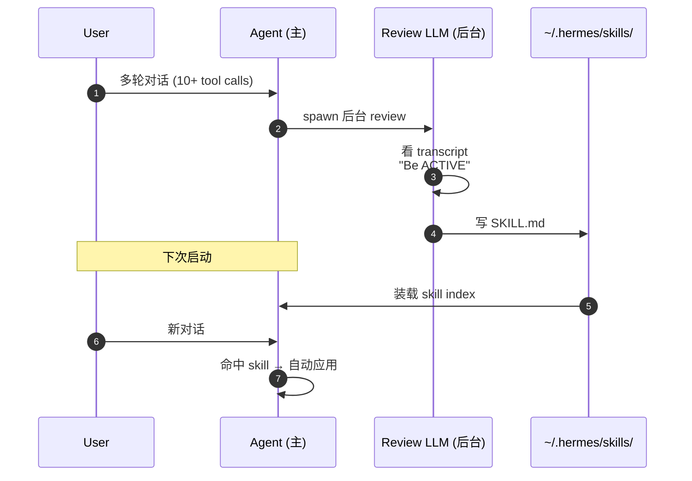
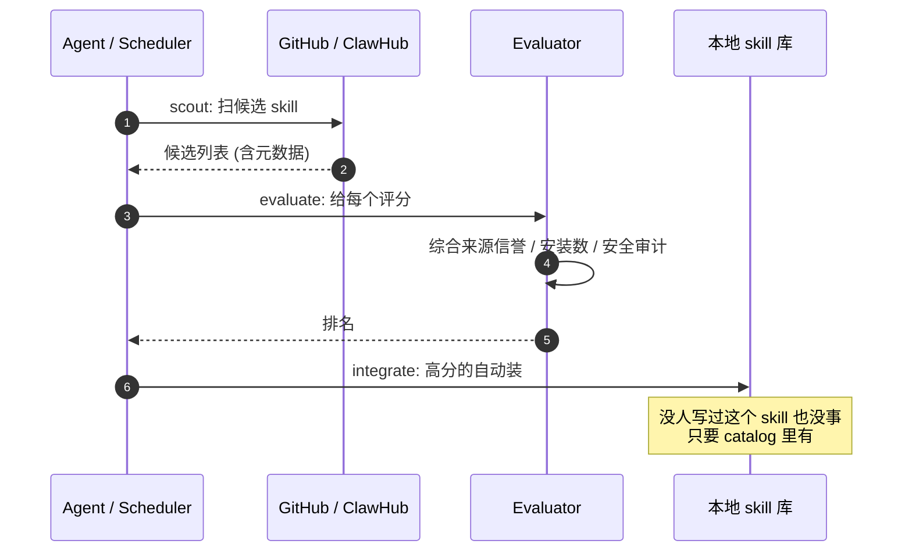
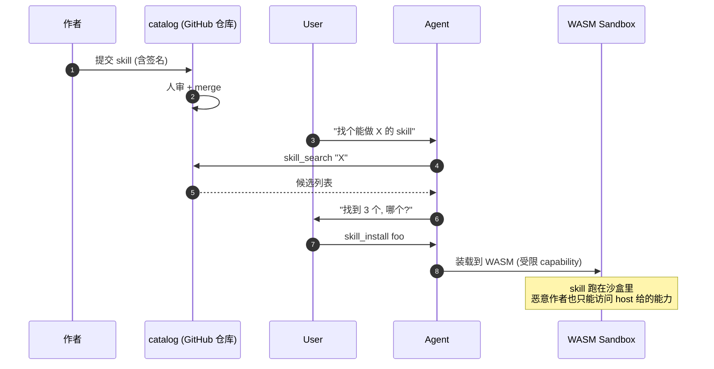

# 三种 Skill 哲学 —— hermes vs zeroclaw vs ironclaw

**对象**：三个真实 Rust/Python agent 项目对 "skill 怎么来" 这个问题的三种回答
**问题**：让 agent "越用越聪明" 需要 skill 持续累积。**谁来产 skill**？

**一句话结论**：**三种哲学，没有绝对优劣，是对不同未来生态的押注**。
- **hermes 自产**：agent 自己写
- **zeroclaw 采集**：agent 满世界扒
- **ironclaw 策展**：人写 + 用户装

跟前面的 case 不同——这个 case 不拆**一个项目的一种机制**，拆的是**三个项目对同一个问题的三种解法**，目的是给你建立选型框架。

## 自产派：hermes-agent

代码：`run_agent.py:4077-4171` `_SKILL_REVIEW_PROMPT` + `run_agent.py:4312` `_spawn_background_review` + `tools/skill_manager_tool.py:465` `skill_manage`

详细拆解在 [`../01-hermes-skill-evolution/ANALYSIS.md`](../01-hermes-skill-evolution/ANALYSIS.md)。核心循环：

```
每 10 个 tool_call → 后台 LLM 复盘 transcript → 用 skill_manage(action="create|patch") 写 SKILL.md
                                                ↓
下次启动 → build_skills_system_prompt() 装载 → 模型自动应用
```

skill 内容 = **markdown 程序性知识**，由 LLM 自己根据这次会话产生。

## 采集派：zeroclaw

代码：`crates/zeroclaw-runtime/src/skillforge/`（scout / evaluate / integrate 三个子模块）

不存在的版本（活的）+ 存在但没接的版本（死代码），两层叠加：

**活的：SkillForge（外部采集）**
- `scout` —— 扫 GitHub / ClawHub 候选 skill
- `evaluate` —— 评分（来源信誉 / 用户安装数 / 安全审计）
- `integrate` —— 达标的自动装上

skill 内容 = **别人写好的**（GitHub 仓库 / 中心化 catalog），agent 来挑。

**死代码：SkillImprover（内部自产）**
- 代码：`crates/zeroclaw-runtime/src/skills/improver.rs:1-467`
- `improve_skill()` 原子改写 SKILL.md + 加 `improvement_reason` 元数据
- 完整单元测试通过
- **但是**：从 `skills/mod.rs:21` 导出后，**没有任何一处代码调用它**
- 在 `crates/zeroclaw-channels/src/orchestrator/mod.rs:4135` 的 post-turn 流程里，只 spawn 了 `consolidate_turn`（写 memory），**没 spawn SkillImprover**

意味着 zeroclaw 作者**把自产工具锻造好了但没焊到流水线上**。这是个值得 watch 的状态——什么时候这一行加上，zeroclaw 就同时拥有自产 + 采集两种能力。

## 策展派：ironclaw

代码：`src/tools/builtin/skill_tools.rs:540, 635, 769, 1928`

agent 能调的 skill 工具是这四个：

| 工具 | 干啥 |
|------|------|
| `skill_list` | 列已装 skill |
| `skill_search` | 在 catalog 里搜 |
| `skill_install` | 从 URL / catalog / 原文安装 |
| `skill_remove` | 卸载 |

**没有 skill_create / skill_patch**。skill 的来源是：
1. `skills/` 仓库自带（33 个手写的）
2. `~/.ironclaw/skills/` 用户自己放
3. `~/.ironclaw/installed_skills/` 从外部 catalog 装的
4. bundled（编译时打包的）

agent 自己**没有任何自演化 / 自产 / 自采**的能力。每个 skill 都是某个**人类作者**写好的，提交到某处。

ironclaw 把 WASM 沙盒投入到这条路上，是因为这条路**需要防恶意 skill 作者**——而前两条路没有这个威胁面（hermes 是 agent 自己写自己的，zeroclaw 自己挑自己装）。

## 三种哲学的属性对比

| 维度 | hermes 自产 | zeroclaw 采集 | ironclaw 策展 |
|------|-----------|-------------|-------------|
| skill 谁产 | agent 自己（后台 LLM） | 外部作者 → agent 挑 | 外部作者 → 人审 |
| skill 谁审 | curator agent（周级） | 评分器（来源 / 数据）| 提交者 + 用户安装时 |
| 触发产 skill | 工具调用 ≥ N | 定期扫 catalog | 手动 `skill_install` |
| 质量保证 | 弱（LLM 自评易飘）| 中（外部数据可信）| 强（人审 + 签名）|
| 覆盖广度 | 受本会话限制 | 受 catalog 限制 | 受作者社区限制 |
| 防恶意 skill 难度 | 不存在（自己人）| 中（要查作者）| 高（需要沙盒）|
| 用户成本 | 0（自动）| 0-低（agent 自动）| 中（要人决策装啥）|
| skill 多样性 | 受当前会话限制 | 受 catalog 限制 | 受社区贡献限制 |
| 隐私 | ✅ 不出本机 | ⚠️ 访问外网 catalog | ⚠️ 装的 skill 可能含外网调用 |

## 类比

| | 类比 |
|---|------|
| **hermes 自产** | 你写日记，写得多了自己变聪明 |
| **zeroclaw 采集** | 你订阅 RSS / `npm install`，自动拉别人的代码用 |
| **ironclaw 策展** | 应用商店：人审 → 你点装 → 装 |

## 时序图对比

### hermes 自产



### zeroclaw 采集



### ironclaw 策展



## 决策框架：选哪种？

按你**项目的现实约束**回答这 5 题，每题打 1-5 分（越靠 hermes 越低，越靠 ironclaw 越高）：

| 题 | 1 分 (hermes 派) | 5 分 (ironclaw 派) |
|---|-----------------|------------------|
| 用户量 | 单人或团队几个 | 几千到几万 |
| skill 质量要求 | 个人用，凑合就行 | 生产场景，必须可审计 |
| skill 多样性需求 | 主要场景就那几种 | 长尾覆盖，要支持很多奇怪需求 |
| 信任模型 | agent 跟自己说话 | 第三方贡献，需要防恶 |
| 演进速度需求 | 越快越好（自动）| 慢点没事（人审）|

**总分 5-10 → 选 hermes 路线**（自产为主，curator 做清理）
**总分 11-19 → 选 zeroclaw 路线**（采集为主，加点自产补长尾，加点策展卡门槛）
**总分 20-25 → 选 ironclaw 路线**（策展为主，WASM 防御）

## 关键结论

三个项目分别押注**三种不同的未来 agent 生态**：

| 项目 | 押注的未来 |
|------|----------|
| hermes | 单用户工具会持续个性化，skill 来自每个用户自己的使用历史 |
| zeroclaw | skill 会像 npm 包一样有公开 catalog，agent 自动发现安装 |
| ironclaw | skill 会形成商业生态（VS Code 插件市场风），需要严格安全边界 |

**三者不互斥**。理论上一个 agent 可以同时支持：
- 当前会话自动写新 skill（hermes 模式）
- 不会的事自动去 catalog 找别人写的（zeroclaw 模式）
- 装第三方 skill 时走 WASM 沙盒（ironclaw 模式）

事实上 zeroclaw 已经走在这条 "混合路线" 上（SkillForge 是采集，consolidation 是自产入门版，SkillImprover 死代码是完整自产）—— 它只是还没把这三件事都接好。

## 引用对照表

| 机制 | 项目 | 文件 | 函数/常量 | 行 |
|------|------|------|----------|-----|
| 自产: 后台 review | hermes | `run_agent.py` | `_spawn_background_review` + `_SKILL_REVIEW_PROMPT` | 4077-4312 |
| 自产: 写盘工具 | hermes | `tools/skill_manager_tool.py` | `skill_manage(action="create")` | 465 |
| 自产: 装载 | hermes | `agent/prompt_builder.py` | `build_skills_system_prompt` | 988 |
| 采集: scout 扫候选 | zeroclaw | `crates/zeroclaw-runtime/src/skillforge/` | SkillForge 三步 | 子模块 |
| 自产: 死代码 | zeroclaw | `crates/zeroclaw-runtime/src/skills/improver.rs` | `SkillImprover::improve_skill` | 1-467 |
| Post-turn 钩子 | zeroclaw | `crates/zeroclaw-channels/src/orchestrator/mod.rs` | `consolidate_turn` spawn | 4135 |
| 策展: skill 工具集 | ironclaw | `src/tools/builtin/skill_tools.rs` | `skill_list` / `_search` / `_install` / `_remove` | 540 / 635 / 769 / 1928 |
| 策展: 装载源 | ironclaw | `crates/ironclaw_skills/src/registry.rs` | 4 个 source | 文件级 |
| 策展: WASM 沙盒接口 | ironclaw | `wit/tool.wit` | host capability 列表 | 18-106 |

往下看：
- 抽象出的设计模式 → [`PATTERNS.md`](PATTERNS.md)
- 三种哲学的可跑 demo（同一抽象 + 三种后端） → [`python/`](python/)
- 各自局限 + 怎么混合 → [`BENCHMARK.md`](BENCHMARK.md)
