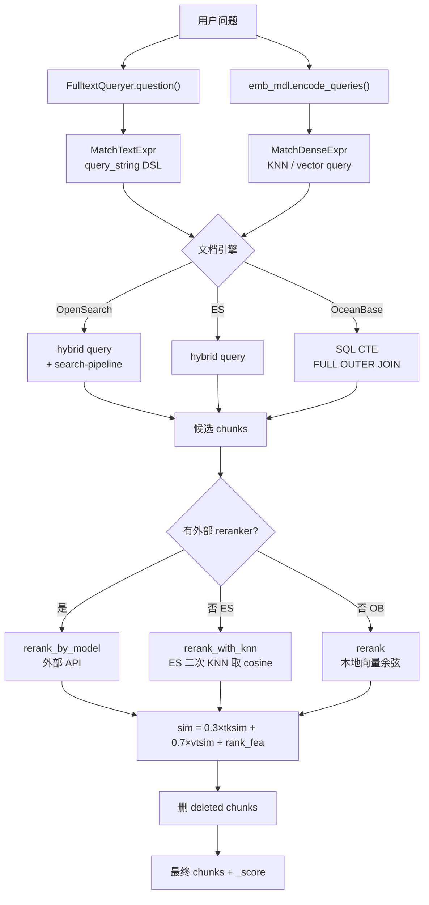

# RAGFlow 混合检索 —— BM25（关键词）+ 向量 双路召回 + 加权重排

**对象**：[infiniflow/ragflow](https://github.com/infiniflow/ragflow) 的文档检索层
**问题**：RAG 检索为什么不能只靠向量？RAGFlow 怎么把 BM25（关键词匹配）和向量相似度融合在一起？
**一句话结论**：**双路召回 + 加权重排两层叠加，不是简单加权求和一次搞定**。

## 为什么 BM25 + 向量都要

| 查询类型 | 只有 BM25（关键词） | 只有向量 |
|---------|-------------------|---------|
| "def login" | ✅ 精确命中 | ❌ embedding 把 "login" 泛化，定位不准 |
| "how to authenticate" | ❌ 字面 token 不匹配 | ✅ 语义理解 |
| "database connection timeout" | ⚠️ 部分匹配 | ⚠️ 语义接近但不精确 |

RAGFlow 的做法不是**选一个**，而是**两个都用，然后融合**。

## 源文件总览

RAGFlow 把"文档引擎"抽象成 `DocStoreConnection`，用三种 typed expression 描述检索意图：

```python
# common/doc_store/doc_store_base.py
MatchTextExpr   # 关键词/BM25 路
MatchDenseExpr  # 向量路
FusionExpr      # 怎么融合
```

三个后端各自翻译这三种 expression 为自己的 DSL：

| 后端 | 文件 | 怎么翻译 |
|------|------|---------|
| **OpenSearch** | `rag/utils/opensearch_conn.py` | `hybrid` query + `_search/pipeline` normalization-processor |
| **Elasticsearch** | `rag/utils/es_conn.py` | `hybrid` query (ES 8.x 原生) |
| **OceanBase** | `rag/utils/ob_conn.py` | SQL CTE：FULL OUTER JOIN 合并两路结果，加权求和 |
| **Infinity** | `rag/utils/infinity_conn.py` | 原生 `weighted_sum` 融合 |

## 双阶段架构

RAGFlow 的检索分成两个阶段：

### 阶段 1：文档引擎层 Hybrid Recall

入口：`rag/nlp/search.py:203-213` `Dealer.search()`

```python
# rag/nlp/search.py:197-213
matchText, keywords = self.qryr.question(qst, min_match=(0.3 if min_match else 0))
#     ↑ MatchTextExpr —— 关键词路，底层是 ES/OS 的 query_string（内部 BM25 打分）

matchDense = await self.get_vector(qst, emb_mdl, topk, req.get("similarity", 0.1))
#     ↑ MatchDenseExpr —— 向量路，embedding 编码后用 KNN

fusionExpr = FusionExpr("weighted_sum", topk, {"weights": "0.001,1"})
#     ↑ 关键：weights 几乎全给向量！0.001 BM25, 1 向量
#       这说明第一层 hybrid 主要是为了"召回"——让两路都出候选人，
#       而不是靠加权得到最终排名
```

**BM25 路怎么实现的**：`rag/nlp/search.py:198` 调 `query.FulltextQueryer.question()` 生成 `query_string` DSL，由 ES/OS 的倒排索引 + BM25 算法打分。

**RAGFlow 不在这一层用纯 Python 实现 BM25**，而是**把 BM25 委托给文档引擎**——倒排索引的 BM25 远比自实现快。

#### 各后端在文档引擎层怎么融合

**OpenSearch**（`rag/utils/opensearch_conn.py:447-462`）：

```python
# 两路都开时，发 hybrid query
q["query"] = {"hybrid": {"queries": [keyword_query, {"knn": knn_query}]}}
# 用 search-pipeline 做 min-max 归一 + arithmetic_mean 融合
# pipeline 在初始化时创建 (opensearch_conn.py:106-152)
```

**Elasticsearch**（`rag/utils/es_conn.py`）：

ES 8.x 原生支持 `hybrid` query DSL，OpenSearch 没有 `hybrid` query 但有 `_search/pipeline`，所以实现略有不同。

**OceanBase**（`rag/utils/ob_conn.py:812-839`）：

```python
# SQL 级融合：FULL OUTER JOIN 合并两路，加权求和
score_expr = (
    f"(f.relevance * {1 - vector_similarity_weight}"
    f" + v.similarity * {vector_similarity_weight}"
    f" + {pagerank_score_expr})"
)
```

### 阶段 2：应用层 Weighted Rerank

入口：`rag/nlp/search.py:549-660` `Dealer.retrieval()`

第一阶段 hybrid recall 拿到候选 chunk 后，**真正决定最终排名的加权融合在这一层**：

```python
# rag/nlp/search.py:598-619
# 三路分数
tksim = token_similarity(keywords, chunks)   # BM25 式词级别相似度
vtsim = knn_scores[chunk_id]                # 向量 cosine（从引擎取回或重算）
rank_fea = rank_feature_scores(...)          # pagerank + tag 加权

sim = tkweight * tksim + vtweight * vtsim + rank_fea
#     ↑ 默认 tkweight=0.3, vtweight=0.7
```

Rerank 有三种模式（`rag/nlp/search.py:600-630`）：

| 模式 | 条件 | 怎么算 |
|------|------|--------|
| `rerank_by_model` | 配了外部 reranker（Jina / Cohere / Bedrock） | 外部模型打分代替 vtsim |
| `rerank_with_knn` | ES 后端，无外部 reranker | ES 二次 KNN 调用来取干净 cosine 分 |
| `rerank` | OceanBase 后端 | 本地向量余弦 |

#### 词级别相似度（BM25 式的 term similarity）

`rerank_with_knn`（`rag/nlp/search.py:434-460`）和 `rerank`（`rag/nlp/search.py:461-493`）里：

```python
# 加权拼接 chunk 的 token（content + 2×title + 5×important_kwd + 6×question）
tks = content_ltks + title_tks * 2 + important_kwd * 5 + question_tks * 6

# 词级别 Jaccard 式相似度（query 关键词 vs chunk token）
tksim = token_similarity(keywords, ins_tw)
```

这不是严格意义的 BM25（用的是 `token_similarity`，不是 BM25 公式），但**功能等价**——解决"字面 token 精确匹配"这一半的需求。真正的 BM25 打分在文档引擎层的 `query_string` 里。

## 完整数据流



## 引用对照表

| 机制 | 文件 | 函数/类 | 行 |
|------|------|--------|-----|
| 表达式抽象 | `common/doc_store/doc_store_base.py` | `MatchTextExpr` / `MatchDenseExpr` / `FusionExpr` | 58 / 72 / 122 |
| 搜索入口 | `rag/nlp/search.py` | `Dealer.search()` | 190-250 |
| FusionExpr 构建 | `rag/nlp/search.py` | 第一层 fusion | 210 |
| 重排入口 | `rag/nlp/search.py` | `Dealer.retrieval()` | 549-660 |
| ES KNN 重排 | `rag/nlp/search.py` | `rerank_with_knn()` | 434-460 |
| OB 本地重排 | `rag/nlp/search.py` | `rerank()` | 461-493 |
| 外部 reranker | `rag/nlp/search.py` | `rerank_by_model()` | 494-523 |
| Reranker 连接层 | `rag/llm/rerank_model.py` | 7 个 provider | 全文件 |
| OpenSearch hybrid | `rag/utils/opensearch_conn.py` | `search()` + `_init_hybrid_search()` | 106-152 / 314-485 |
| ES hybrid | `rag/utils/es_conn.py` | `search()` | ~450 |
| OceanBase hybrid | `rag/utils/ob_conn.py` | `search()`（SQL fusion） | 530-910 |
| 对话服务调用 | `api/db/services/dialog_service.py` | `retrieval()` | 764-776 |

## 关键发现

1. **BM25 不在 Python 里**——RAGFlow 把 BM25 委托给文档引擎（ES/OS 的倒排索引），自己只实现向量 + rerank
2. **两层融合，权重不同**——第一层 hybrid recall 几乎全给向量（0.001/1），第二层 rerank 才真正加权（0.3/0.7）
3. **后端差异靠抽象层屏蔽**——`MatchExpr` 是统一契约，三个后端各翻译一次
4. **Reranker 可插拔**——本地 cosine 或外部 API（Jina/Cohere/Bedrock）同一接口
5. **Pagerank + tag feature 是第三路分数**——不是只有 BM25+向量

往下看：
- 抽出来的设计模式 → [`PATTERNS.md`](PATTERNS.md)
- 最小可跑复刻 → [`python/`](python/)
- 复刻差距 → [`BENCHMARK.md`](BENCHMARK.md)
