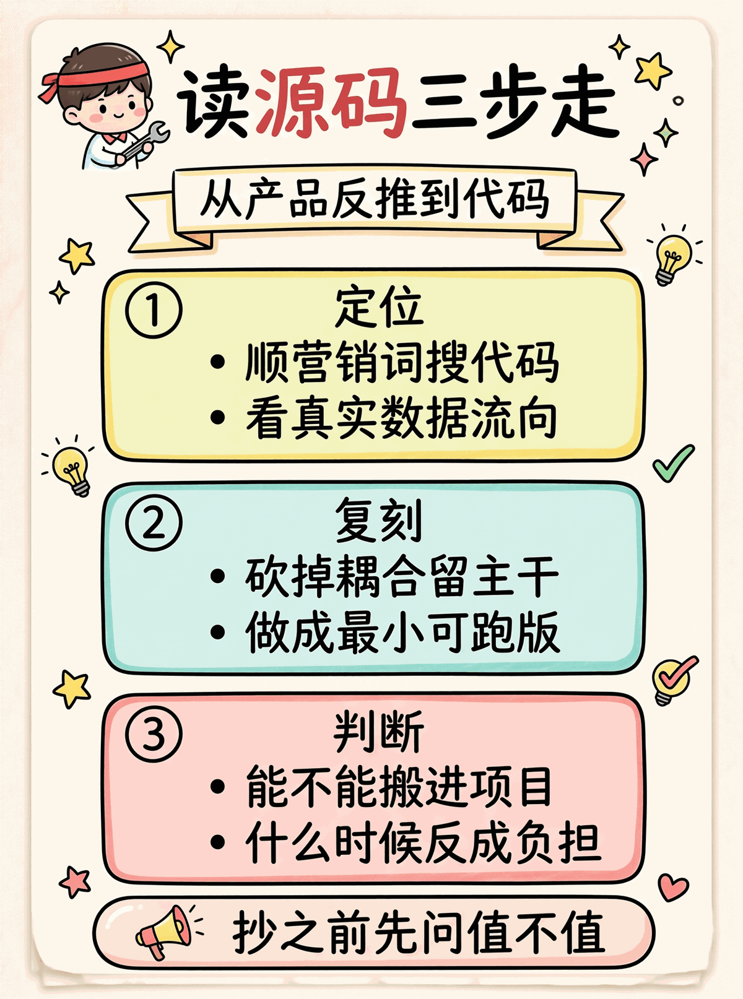
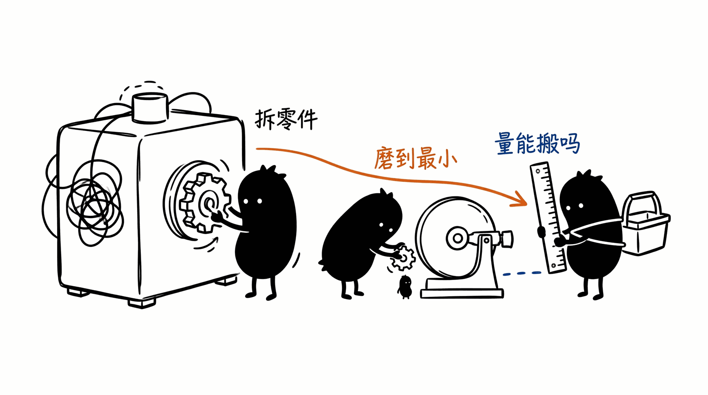

# case-studies · 真实项目源码拆解

不是教程，是**拆解**。挑一个开源 AI 项目里看起来"神秘"的能力（比如"越用越聪明"、"自动找出该用哪个工具"、"上下文怎么不爆"），定位到具体代码、复刻最小可跑版本、抽出可以搬到自己项目里的模式。

<p align="center"></p>

## 跟 core/agent/production/niche 有什么不一样

| 系列 | 出发点 | 看完得到什么 |
|------|--------|------------|
| core / agent / production | 我要做 X 能力 | 知道怎么实现 X |
| **case-studies** | **某个项目凭什么这么好用** | **能力背后的代码、能不能抄、抄过来怎么用** |

前者从需求出发，后者从既有产品反推。两者互补。

## 每个 case 的目录结构

```
NN-<project>-<mechanism>/
├── ANALYSIS.md      # 源码定位 + 原理拆解（带 file_path:line 引用）
├── PATTERNS.md      # 抽出来的设计模式 + 适用/不适用场景
├── BENCHMARK.md     # 原版 vs 复刻 demo 的差距与可改进点
├── .env.example
└── python/
    ├── README.md
    ├── requirements.txt
    └── *.py         # 100-300 行的最小复刻
```

四个文件分工：
- **ANALYSIS.md** —— 是什么、在哪、怎么跑通的。引用必须落到 `path/to/file.py:NNN`。
- **PATTERNS.md** —— 把机制抽象成可复用的设计模式。能不能搬，搬到什么场景下值得，什么场景下别用。
- **BENCHMARK.md** —— demo 是简化版，差在哪、为什么差、想做得更接近原版要加什么。
- **python/** —— 真能跑。沿用项目根 `API_BASE_URL` / `API_KEY` / `MODEL_ID` 约定。

## 拆解方法论

拆一个项目的步骤：

1. **找营销话术** —— 看 README 自己怎么吹的（"自适应"、"持续学习"、"自动规划"等），把这些当成假设而不是事实。
2. **顺词搜代码** —— 关键词反查源码，找到声称对应的函数/类。grep 比通读快得多。
3. **看真实数据流** —— 这个函数被谁调用、写到哪、下次怎么读出来。任何"学习"机制都对应可观察的 IO。
4. **判定层次**：
   - (a) 纯检索（memory recall）
   - (b) 上下文工程（把过去经验拼进 prompt）
   - (c) 模型参数级微调
   - (d) 其它（如外部分类器、嵌入索引）
5. **复刻最小可跑版本** —— 砍掉所有耦合，留下让你看清原理的那一条主干。
6. **总结搬不搬** —— 同样的机制放到你自己的 agent 上能加分吗？什么时候反而是负担？

## 当前 case 列表

| # | case | 拆的是 | 主要回答 |
|---|------|-------|---------|
| 01 | [hermes-skill-evolution](01-hermes-skill-evolution) | hermes-agent | "越用越聪明" 到底是什么？模型变了还是上下文变了？ |
| 02 | [openhands-architecture](02-openhands-architecture) | OpenHands | 351MB 平台级 AI 工程师跟单进程 CLI agent 差什么？LLM 特色在哪？|
| 03 | [openhands-sandbox-isolation](03-openhands-sandbox-isolation) | OpenHands | sandbox 子系统怎么实现？抽象 + 状态机 + 多后端，能不能搬？ |
| 04 | [openhands-event-callbacks](04-openhands-event-callbacks) | OpenHands | 事件后挂副作用怎么不耦合？可插拔 processor + 双维度过滤 + fire-and-forget |
| 05 | [three-skill-philosophies](05-three-skill-philosophies) | hermes / zeroclaw / ironclaw | "AI 写 skill = 越用越聪明" 是对的吗？三种哲学（自产 / 采集 / 策展）选哪个 |

## 用法建议

- 拆完一个项目可以再开新 case 继续拆同项目的别的机制（命名时把项目名放前面便于聚拢，如 `02-hermes-fts5-memory`）。
- 拆出来的 PATTERNS.md 是真正能复用的资产。建议有几个 case 之后回头读一遍 PATTERNS.md，看有没有重叠的模式可以再抽一层。
- BENCHMARK.md 别只比"是不是一样"，更要写**为什么差**。差距常常就是工程化的真正难点。

## License

MIT


