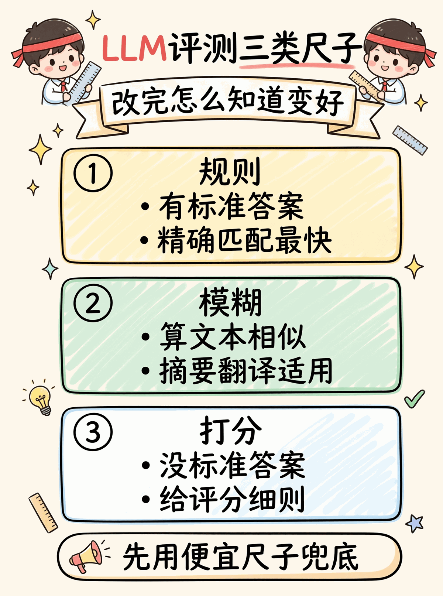
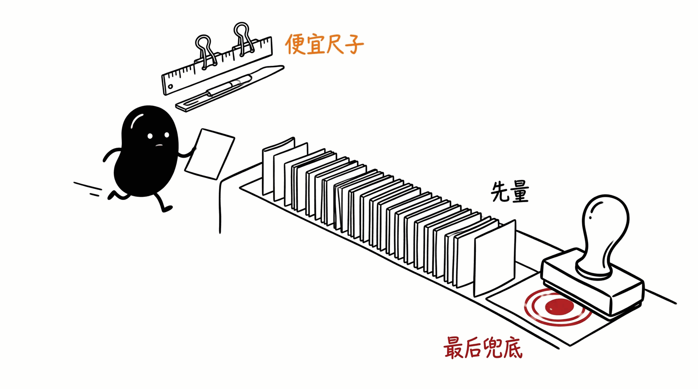

# 08 · Evaluation Demo

LLM 应用的"回归测试"。改 prompt / 换模型后怎么知道是变好还是变差 —— 需要一套可重复的评测。

<p align="center"></p>

## 七种 metric + LLM 裁判

| 类型 | metric | 用在 |
|---|---|---|
| 规则 | `exact / contains / regex / keywords / json_equal` | 有标准答案的题 |
| 模糊 | `rouge_l / levenshtein` | 摘要、翻译、容错 |
| 主观 | `llm_judge` + rubric | 没标准答案的题 |

**优先用便宜的 metric**。LLM 裁判贵且会漂移，最后兜底。

## 跑起来

```bash
cd python
pip install -r requirements.txt
python test.py    # 10/10 passed
python main.py    # 跑 datasets/qa_testset.jsonl，按 category 分类
```

## 共通的坑

- ❌ `exact` 用在自由文本 → 全是 false negative
- ❌ LLM 裁判没 rubric → 每次跑结果不同
- ❌ 裁判用同一个 model 评自己 → 自评有偏
- ❌ 单 LLM 1-5 分打分 → 用 pairwise 比相对


