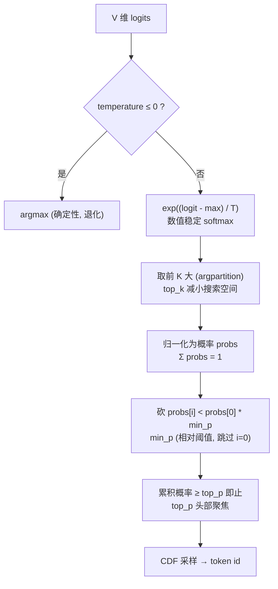

# 01 · Top-K + Top-P + Min-P + Temperature 采样

LLM 推理的最后一步: 模型输出 V 维 logits (V 是词表大小, 通常 32k-256k), 怎么把它变成一个 token id?

这是 llama.cpp / vLLM / SGLang / Ollama 都在用的"现代"采样组合, 抽自 [ds4.c](https://github.com/antirez/ds4) 
的 `sample_top_p_min_p` (`ds4.c:15023`).


## 采样管道



## 三个旋钮的"温度计"直觉

| 旋钮 | 极端值 → 行为 |
|------|-------------|
| `temperature` | 0 → 贪心; 1 → 原分布; >>1 → 接近均匀 |
| `top_k` | 1 → 贪心; ∞ → 不截 |
| `top_p` | 极小 → 贪心; 1 → 不截 |
| `min_p` | 0 → 不砍; 1 → 几乎贪心 (只留概率等于 max 的) |

实战常用配置 (跟 llama.cpp 默认接近):
```
temperature=0.7, top_k=40, top_p=0.95, min_p=0.05
```

## 关键工程细节 (别忽略)

1. **数值稳定 softmax**: `exp((logit - max) / T)`, 不减 max 会 overflow (vocab=128k, logit 可能上百)
2. **min_p 是相对阈值**, 不是绝对: `threshold = probs[0] * min_p`, 跳过第 0 个 (最高那个无论如何保留)
3. **top_k 用 argpartition** O(V), 不是 sort O(V·logV) —— V=128k 时差 10×
4. **non-finite logits 必须跳过**: GPU 数值精度问题会出 NaN/Inf, 跑进 softmax 会让 sum=NaN, 整批输出崩
5. **CDF 采样的 r ∈ [0, sum)**: 用未归一化的 probs 也行 (我们这版就是), 等价 `searchsorted(cumsum, r * sum)`

## 目录

```
.
├── python/
│   ├── sampling.py     # 🟢 sample() + softmax() + sample_argmax()
│   ├── main.py         # 8 个场景演示分布变化
│   ├── test.py         # 8 个测试: 退化关系 + 分布逼近 + 边界
│   └── requirements.txt
└── README.md
```

## 跑起来

```bash
cd python
pip install -r requirements.txt
python test.py    # 8/8 passed, 包括分布 L1 距离 < 0.03 的统计验证
python main.py    # 看 8 种参数组合下 10k 次采样的实际分布
```

## 常见坑

- ❌ **不减 max 就 exp** → `exp(5000)=inf`, 整个分布崩 NaN
- ❌ **min_p 当绝对阈值用** → vocab 大时 max prob 很小 (~1e-3), 绝对阈值会把全部砍光
- ❌ **min_p 把第 0 个也砍** → 概率极尖时 (一个 token 占 99%), 第二名 prob/max < min_p 是常态, 但不该砍第 0 个本身
- ❌ **top_p 累积没含本位** → 用 `>` 而非 `>=`, 边界条件下少了 1 个候选, 偶发"突然只剩 1 个"
- ❌ **rng 全局状态** → 多线程 batched 推理时, 两个 stream 用同一个 rng 会有竞争, 应该每个 sequence 一个独立 rng
- ⚠️ **top_k 太大** (e.g. =V): argpartition + argsort 退化为全排序, 慢 10×; 真不想截就传 0 走 full_vocab 路径
- ⚠️ **temperature 极低 (e.g. 0.01)**: `exp((logit-max)/0.01)` 接近 one-hot, 数值上跟 argmax 等价, 直接走 `sample_argmax` 更稳

## 跟 ds4.c 原版的对照

| ds4.c | 这里 (numpy) |
|-------|-------------|
| 插入排序找 top_k (O(V·logK)) | `argpartition` + `argsort` (O(V) + O(K·logK)) |
| `qsort` 候选数组 | numpy 向量化 |
| 数组 stack-alloc `int ids[1024]; float vals[1024]` | numpy ndarray |
| 手写 `for (i) if (!isfinite)` 过滤 | `np.isfinite(logits)` |
| CDF 用 `for i: r -= probs[i]` 找 | `np.searchsorted(cumsum, r)` |

算法逻辑 1:1 等价, numpy 版可读性 ×3, 性能差不多 (V≤256k 时主要在 sort/partition, 都是 BLAS 加速).
