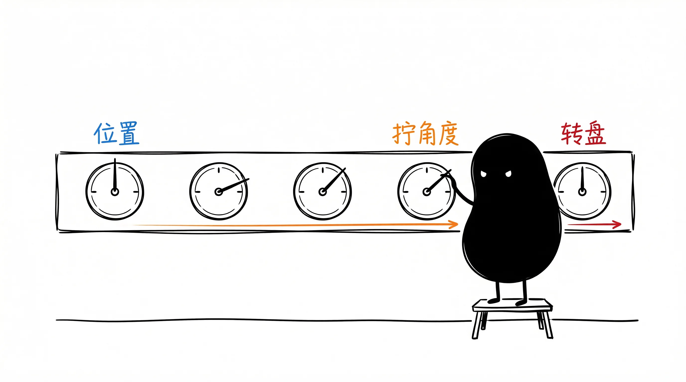
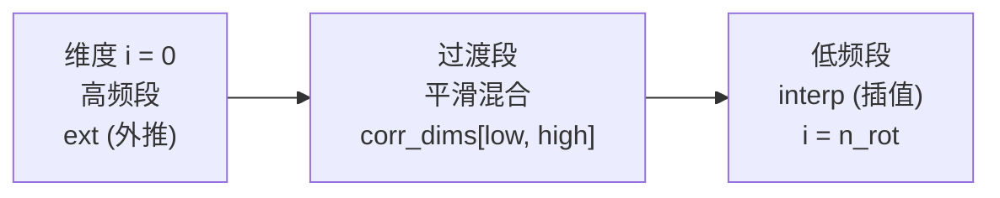

# 02 · RoPE 位置编码 + YaRN 长 context 外推

Transformer 的位置信息怎么塞进去? 早期方案 (Sinusoidal/Learned) 是**加**到 token embedding 上.
LLaMA 之后所有主流模型 (Qwen / DeepSeek / Mistral) 都用 **RoPE (Rotary Position Embedding)** —— **旋转**而不是相加.

抽自 [ds4.c:4675-4742](https://github.com/antirez/ds4) (`rope_tail_ext_inplace`). 论文: [Su et al. 2021, RoFormer](https://arxiv.org/abs/2104.09864) + [Peng et al. 2023, YaRN](https://arxiv.org/abs/2309.00071).



## 几何直觉

把 head_dim 维向量按 `(x0,x1), (x2,x3), ...` 两两配对, 每对看成**复数** `x0 + i*x1`. 位置 pos 的 token 在第 (i, i+1) 维上**乘旋转因子** `exp(i*θ_i)`:

```
x0' = x0 * cos(θ) - x1 * sin(θ)    ← 复数乘法的实部
x1' = x0 * sin(θ) + x1 * cos(θ)    ← 复数乘法的虚部
```

其中 `θ_i = pos / freq_base^(2i/n_rot)`, 不同维度对用不同频率.

## 核心性质 (这是 RoPE 香的原因)

### 相对位置编码

`<RoPE(q, m), RoPE(k, n)>` **只依赖** (m-n), 不依赖 m, n 各自的绝对值. 即:

```
attention_score(q_at_pos5, k_at_pos3) == attention_score(q_at_pos105, k_at_pos103)
```

因为复数旋转 `R_m · R_n^T = R_{m-n}`. 实测 (本 demo 的 `test_relative_position_dot_product`):

```
distance=5, 绝对位置 = 5/0, 105/100, 1005/1000:
  内积 = 0.6234, 0.6234, 0.6234   ← spread < 1e-3 ✓
```

### 频率分层

低 i 对应高频 (转得快) → 编码近距离信息; 高 i 对应低频 (转得慢) → 编码远距离信息.

```
freqs[0]  (最高频)  → 转 1 周期需要 6.28 个 token (近距离)
freqs[16] (中频)    → 转 1 周期需要 628 个 token  (中距离)
freqs[31] (最低频)  → 转 1 周期需要 62k 个 token  (远距离)
```

freq_base=10000 时频率覆盖 `[1, 10000]` 三个数量级. DeepSeek 用 freq_base=500000 拉得更开 (长 context 友好).

## YaRN —— 长 context 外推

**问题**: 训练用 ctx=4k, 推理想用 ctx=32k. 怎么办?

| 方案 | 做法 | 问题 |
|------|------|------|
| 朴素外推 | θ 不变, pos 直接到 32k | OOD, 模型崩 (训练分布外) |
| 位置插值 (PI) | θ = (pos/scale) · freq | 长 context OK, 但近距离精度损失 |
| **NTK / YaRN** | 高频外推 + 低频插值 + 平滑过渡 | 实战最佳 |

YaRN 关键: 用两个阈值 `beta_fast` / `beta_slow` 切出三段:



`ramp(i)` 在过渡段平滑从 1 (纯外推) 滑到 0 (纯插值). 配合 `mscale` 给 attention logit 做缩放修正 (防 softmax 太尖).

### 实测 YaRN @ pos=20000 (训练 ctx=4096)

```
ext_factor=0.0 (纯插值 PI):       out norm = 8.16, finite ✓
ext_factor=0.5 (YaRN 中等混合):    out norm = 8.16, finite ✓
ext_factor=1.0 (YaRN 完整):        out norm = 8.16, finite ✓
```

norm 全相等是因为旋转保 L2 范数; 关键是分布形态, 不是数值是否溢出.

## 关键工程细节

1. **每两维一组**, 不是 head_dim 整个矩阵转 —— 旋转矩阵在 2D 平面定义
2. **freq_base 选 10000 / 500000**: 大 base → 频率范围拉得更开
3. **inverse mode**: sin_sign=-1, 用于 attention output 旋转回去 (DS4 特性, 教学版可忽略)
4. **NoPE 部分**: 某些模型 (DS4) head_dim 前 n_nope 维不旋转, 只对 tail 应用. 教学版对全部维度做.
5. **精度**: 训练用 float32 算 cos/sin, 否则 bfloat16 在大 pos 下精度不够 (周期 > 65k 时)

## 目录

```
.
├── python/
│   ├── rope.py             # 🟢 apply_rope() + apply_rope_yarn() + precompute_freqs()
│   ├── main.py             # 距离-相关性曲线 + 频率分层可视化
│   ├── test.py             # 7 个测试: identity / 范数保持 / 相对位置 / 远距离衰减 / YaRN
│   └── requirements.txt
└── README.md
```

## 跑起来

```bash
cd python && pip install -r requirements.txt
python test.py    # 7/7 passed
python main.py    # 看距离-相关性曲线
```

`main.py` 输出会显示:
```
dist | correlation | bar
   0 |      1.0000 | ++++++++++++++++++++++++++++++++++++++++
   1 |      0.9821 | +++++++++++++++++++++++++++++++++++++++
   5 |      0.6234 | +++++++++++++++++++++++++
  10 |      0.0512 | ++
  20 |     -0.1832 | -------
 100 |      0.0241 | +
1000 |     -0.0089 | 
```

观察:
- d=0: correlation=1 (自己跟自己)
- d=1-5: 高相关 (近距离)
- d=10+: 震荡, 整体衰减
- d=1000: 接近 0 (远距离低相关)

## 常见坑

- ❌ **head_dim 是奇数** → 没法两两配对, RoPE 直接错
- ❌ **freqs 用 float16 算** → freq_base=10000 时, 最低频 freqs[-1] ≈ 1e-4, fp16 表示不了, 精度全丢
- ❌ **pos 整数溢出** → pos > 2^31 时 int32 溢出, theta 变负
- ❌ **YaRN 没配合 mscale 调 attention logit** → 长 context 下 softmax 太尖, 模型走神
- ⚠️ **bfloat16 在 pos > 10k 时 cos/sin 精度不够** → 训推用 float32 算位置编码, attention 算完再降精度
- ⚠️ **YaRN 的 corr_dims 公式跟 beta_fast/beta_slow 强耦合** → 不同模型默认值不同 (LLaMA 32/1, DeepSeek 自定义), 别用 LLaMA 默认直接套别的模型
- ⚠️ **inverse RoPE 跟 forward 不严格互逆 (浮点误差)** → 多次往返会累积误差, 别在 forward pass 里反复套

## 跟 ds4.c 原版的对照

| ds4.c | 这里 (numpy) |
|-------|-------------|
| 嵌套 `for (h)` `for (i)` 手写循环 | 大部分操作矢量化, YaRN 因 ramp 跟 i 强耦合保留循环 |
| `cosf / sinf / powf` 单精度 | numpy float32 (精度等价) |
| inplace 写回 `tail[i]` | 返回新数组 (教学版优先可读, production inplace) |
| NoPE 头部 (`x + n_nope`) | 跳过 NoPE, 对全 head_dim 做 |
| `rope_yarn_corr_dim` 公式 | 1:1 移植, 仅类型从 float→np.float |
| `theta_extrap *= theta_scale` (累积更新) | `pos * freqs[i]` 直接算 (内存换可读) |

算法逻辑等价, 数值结果对 atol=1e-5 一致.
