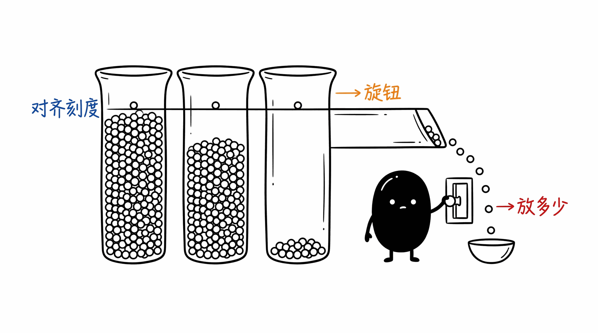

# 03 · RMSNorm + SwiGLU

现代 LLM (LLaMA / Mistral / Qwen / DeepSeek) 的 normalization + activation 标配. 抽自 [ds4.c:2700, 5012](https://github.com/antirez/ds4).



| | 经典 (Pre-2020) | 现代 (Post-LLaMA) |
|--|----------------|------------------|
| Norm | LayerNorm | **RMSNorm** |
| FFN activation | ReLU / GELU | **SwiGLU** (silu+gating) |

---

## RMSNorm —— 砍掉减均值的 LayerNorm

经典 LayerNorm:
```
y = (x - mean(x)) / sqrt(var(x) + eps) * γ + β
```
- 2 个统计量 (mean + variance)
- 2 个学习参数 (γ, β)

RMSNorm:
```
y = x / sqrt(mean(x²) + eps) * γ
```
- **1 个**统计量 (只算 RMS)
- **1 个**学习参数 (γ)

### 为什么砍掉减均值

[Zhang & Sennrich, NeurIPS 2019](https://arxiv.org/abs/1910.07467) 证明了: LayerNorm 的精度来自 **re-scaling**, 不是 **re-centering**. 实测在 transformer 上换 RMSNorm 精度不掉, 但**速度快 10-50%** (省一遍遍历求均值).

现代 LLM 几乎清一色 RMSNorm. 经典 LayerNorm 还在 vision transformer 和老一代 BERT 系列里见.

### 缩放不变性

RMSNorm 把任意尺度的输入都拉到 RMS=1:
```
x      RMS=0.95  →  rms_norm(x)      RMS=1.0
100·x  RMS=95    →  rms_norm(100·x)  RMS=1.0
```
这让网络对输入幅度不敏感 (梯度训练友好).

---

## SiLU + SwiGLU

### SiLU (Swish)

```
silu(x) = x * sigmoid(x)
```

跟其他激活的关系:
- ReLU: 直角折线, 0 点不可导
- GELU: `x * Φ(x)` (用正态 CDF), 比 ReLU 平滑
- **SiLU**: `x * σ(x)` (用 sigmoid), 跟 GELU 形状几乎一样但计算便宜

在 x=0 附近近似 `x/2`, 在 x ≫ 0 近似 `x`, x ≪ 0 时近似 0.

### SwiGLU —— Gated Linear Unit with SiLU

把 FFN 从:
```
FFN(x) = W_out · ReLU(W_in · x)              ← 经典 (BERT/GPT-2)
```
换成:
```
FFN(x) = W_down · (silu(W_gate · x) ⊙ (W_up · x))   ← SwiGLU (LLaMA/Mistral/Qwen)
```

- 多 1 个投影矩阵 (`W_up`), 参数量加 ~50%
- **但效果显著提升** ([Shazeer 2020](https://arxiv.org/abs/2002.05202))
- "gate" 通过 silu 学到"哪些维度该激活", "up" 提供输入信号; element-wise 相乘 = 门控

为了保持总参数量, 一般会把 `intermediate_size` 缩小 (LLaMA 是 8/3 × hidden, 不是 4 × hidden).

### Gating 行为示例

```
gate=0     → silu(0)=0    → out = 0 · up = 0    (门关上)
gate=10    → silu(10)≈10  → out ≈ 10 · up      (门完全开)
gate=-10   → silu(-10)≈0  → out ≈ 0            (门关上)
gate=1     → silu(1)≈0.73 → out ≈ 0.73 · up    (门半开)
```

跟 ReLU 的区别: ReLU 是"硬门" (0 或 1), SwiGLU 是"软门" (连续, 可导).

---

## 数值稳定 sigmoid

朴素实现:
```python
def sigmoid(x):
    return 1 / (1 + exp(-x))
```

x = -100 时:
- `exp(100) ≈ 2.7e43` → **fp32 溢出 inf**
- 整个网络梯度变 nan

数值稳定版:
```python
def sigmoid_stable(x):
    if x >= 0:
        return 1 / (1 + exp(-x))    # exp(-x) ∈ (0, 1], 安全
    else:
        return exp(x) / (1 + exp(x)) # exp(x) ∈ (0, 1], 安全
```

`ds4.c:4885` 就是这么写的. fp16 训练不做这个判断会直接崩 (fp16 表示范围 [-65504, 65504]).

---

## 目录

```
.
├── python/
│   ├── layers.py       # 🟢 rms_norm, sigmoid_stable, silu, swiglu, layer_norm (对照)
│   ├── main.py         # SiLU/SwiGLU ASCII 曲线 + 缩放不变性演示
│   ├── test.py         # 8 个测试: 数学性质 + 边界 + 速度对照
│   └── requirements.txt
└── README.md
```

## 跑起来

```bash
cd python && pip install -r requirements.txt
python test.py    # 8/8 passed
python main.py    # 看激活函数 ASCII 曲线 + 缩放不变性
```

`main.py` 会画出:
```
>>> silu(x) = x * sigmoid(x)
  +5.00 |                                                    ****
  +4.21 |                                                ****
  +3.41 |                                            ****
  +2.62 |                                        ****
  +1.83 |                                     ***
  +1.03 |                                  ***
  +0.24 |                              ****
  -0.55 |                **************
   ...
```

## 常见坑

- ❌ **fp16 训练直接用朴素 sigmoid** → x ≈ -65 就溢出, 必须数值稳定版
- ❌ **RMSNorm 的 `ss` 累加用 fp16** → vocab=128k 这种大向量累加丢精度, fp64 累加再降回 fp32
- ❌ **RMSNorm 公式忘了开根号** → 直接拿 `mean(x²)` 当 scale, 整个网络坏
- ❌ **SwiGLU 用 silu(up) * gate** (顺序反了) → 数学上**不等价** (silu 不对称); 一定是 `silu(gate) * up`
- ❌ **GELU 跟 SiLU 互换** → 数值差几个百分点, 在大模型上累积成显著精度差
- ⚠️ **eps 太小** → 极端输入 (全零向量) 时 1/sqrt(0+eps) = inf, 常用 1e-6 (LLaMA) 或 1e-5 (BERT)
- ⚠️ **layernorm/rmsnorm 的 weight 跟 bias 写反** → bias 是经典 LN 才有, RMSNorm 没有 bias
- ⚠️ **head-wise RMSNorm vs 全 hidden-dim RMSNorm 混用** → DS4 在 Q 投影后做 per-head, 普通模型在 residual 上做全 hidden; 别混

## 跟 ds4.c 原版的对照

| ds4.c | 这里 (numpy) |
|-------|-------------|
| `for (i) ss += (double)x[i]*x[i]` | `(x.astype(float64)**2).mean()` |
| `1.0f / sqrtf(ss/n + eps)` | `1 / sqrt(ss + eps)` |
| `out[i] = x[i] * scale * weight[i]` | `x * scale * weight` (向量化) |
| `sigmoid_stable(x)` 手写分支 | numpy 用 mask 数组分两路 |
| `silu(x) = x * sigmoid_stable(x)` | 1:1 |
| `swiglu` 单输出循环 | element-wise 向量化 |

算法等价, 数值结果对 atol=1e-5 一致.

<p align="center"></p>
