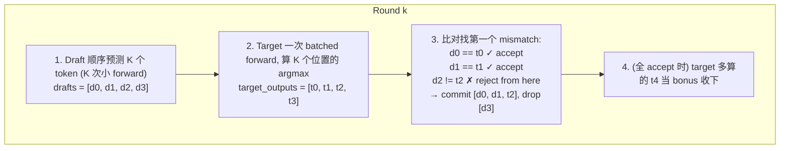

# 05 · 投机解码 (Speculative Decoding)

LLM 自回归生成的核心瓶颈: **每生成 1 个 token 跑 1 次 full forward**, 70B 模型 ~30 token/s 已是 H100 上限. 投机解码把这个上限**翻 2-4 倍**, 是 vLLM / TensorRT-LLM / DeepSeek V4 的标配优化.

<p align="center"></p>

抽自 ds4.c:17575 (`ds4_session_eval_speculative_argmax`), 简化 GPU 强耦合部分, 保留核心算法和 DS4 的 margin 改进.

论文: [Leviathan et al. 2022, Fast Inference from Transformers via Speculative Decoding](https://arxiv.org/abs/2211.17192).

## 核心思想

引入两个模型:

| | Target (大) | Draft (小) |
|--|-------------|-----------|
| 速度 | 慢 (~10× draft) | 快 |
| 精度 | 高 (最终权威) | 偶尔出错 (~70-90% 一致) |
| 例子 | LLaMA-70B / DeepSeek V4 | LLaMA-7B / V4 MTP head |

每轮算法:



### 关键: 为什么这是 **lossless**

输出跟朴素逐 token 解码**一字不差**. 因为:
- accept 的 draft 都通过了 target argmax 验证 (跟 target 自己产的一样)
- reject 的位置用 target argmax 替换 (= 朴素 decode 在该位置会产的 token)
- 后续 draft 全弃 (从 reject 位置重新开始, 跟朴素一致)

不是"用 draft 代替 target", 而是"用 draft 押注 target 会输出什么, 押对了省一次 forward".

## 加速比来自哪

朴素 decode 生成 N 个 token: **N 次 target forward**.

投机 decode: 每轮平均 accept α·K (α = accept rate) + 1 bonus. 即每轮 (α·K + 1) token / 1 次 target forward.

理论加速 ≈ **α·K + 1**. 实测 (本 demo, K=4):

| draft accuracy | target_calls (生成 50) | accept_rate | 模拟 wall-clock | 加速 |
|---------------|----------------------|-------------|---------------|------|
| 0.5 | ~35 | 0.50 | 380 ms | 1.32× |
| 0.7 | ~22 | 0.70 | 250 ms | 2.00× |
| 0.9 | ~13 | 0.90 | 150 ms | 3.33× |

(假设 target_ms=10, draft_ms=1; 朴素 = 500 ms)

## DeepSeek V4 的 margin 改进

朴素投机: draft 模型的 argmax 直接当 draft. 问题: draft 模型不确定时 (top1-top2 logit 差很小), 强行 draft 大概率 reject, 浪费 target verify.

DS4 (ds4.c:17629) 加了 **margin filter**:
```
if margin (= top1 - top2) < threshold:
    停止本轮 drafting, 提前 verify 已有的
```

效果 (本 demo, draft acc=0.5, K=8):

| | draft_calls | margin_filtered | target_calls |
|--|-----------|-----------------|--------------|
| no filter | 92 | 0 | 41 |
| margin=1.5 | 64 | 12 | 35 |

filter 早停减少了 draft 浪费, target_calls 也微降.

## 关键工程细节

### 1. KV cache 回滚 (教学版没实现)

真实 GPU 实现: target verify 时**已经写了 K 个位置的 KV cache**. 如果 reject 在位置 i, 必须**回滚** KV cache 到 i, 否则下一轮基于错的 state 算. ds4.c:17665 处的 `DS4_MTP_KEEP_ACCEPTED` 宏就是干这事的.

教学版用 list append, 没 KV 概念, 自然没回滚问题. 真生产里这步极其关键且 bug-prone.

### 2. Batched verify (教学版串行)

真实 GPU: target 的 verify 是**一次 forward 算 K 个位置的 logits** (用 attention mask 让每个位置只看自己及之前的). 教学版我们串行调 K 次 target, 计数等价但实际时间不等价.

```
真实 GPU verify 时间 ≈ 1 次 forward (≈ 单 token 的 1.1×)
教学版串行 = K 次 forward (慢 K×, 抵消加速收益)
```

### 3. Draft 模型选择

| 方案 | 优点 | 缺点 |
|------|------|------|
| 独立小模型 (e.g. 70B + 7B) | accuracy 高 (70-90%) | 多管理一个模型 |
| 同模型的"早期 layer 退出" | 0 额外模型 | accuracy 中等 (50-70%) |
| **MTP head** (DS4 自带, 1-2 层小 transformer) | 0 额外模型 + 跟主模型联合训练 | DS4 特有 |
| n-gram 检索 (Medusa, Prompt Lookup) | 极快 | 仅特定场景准 (代码补全等) |

DS4 用 MTP, 文中提到 accept rate ~80-85%.

## 目录

```
.
├── python/
│   ├── speculative.py    # 🟢 speculative_decode() + naive_decode() + mock target/draft
│   ├── main.py           # 加速比矩阵 (accuracy × lookahead × margin)
│   ├── test.py           # 6 个测试: lossless 保证 + 加速比 + margin filter + bonus
│   └── requirements.txt
└── README.md
```

## 跑起来

```bash
cd python && pip install -r requirements.txt
python test.py    # 6/6 passed, 包括 lossless 保证 (输出与朴素一字不差)
python main.py    # 加速比矩阵 (3 个 accuracy × 3 个 lookahead)
```

`main.py` 输出大致:
```
draft acc  lookahead  target_calls   draft_calls   accept_rate  wall_ms    speedup
0.5        4          35             ...           0.50         ...        1.32×
0.7        4          22             ...           0.70         ...        2.00×
0.9        4          13             ...           0.90         ...        3.33×
```

## 常见坑

- ❌ **忘记 KV cache 回滚** → 下一轮基于错的 state, 输出胡言乱语 (静默 bug, 不报错)
- ❌ **lookahead 太大** (e.g. K=16) → accept rate 指数级跌, draft 浪费大于收益; 实测 K=4-8 最佳
- ❌ **margin filter 阈值太严** (e.g. > 3) → 几乎不让 draft, 退化为朴素
- ❌ **draft 模型用了不同 tokenizer** → token id 不对齐, 验证全 reject; 必须 draft 和 target 同 tokenizer
- ❌ **temperature > 0 时直接用 argmax 验证** → 投机解码要么改用 importance sampling (论文方案), 要么 target 也强制 argmax (DS4 走这条路, 不支持 sampling)
- ⚠️ **跟 batch inference 不兼容** → batch 里每个 sequence 的 accept 长度不同, kernel 实现复杂; vLLM 2024 才解决
- ⚠️ **draft 和 target accuracy 强相关** → 同源 (e.g. 蒸馏出的小模型) 比独立训练的更准
- ⚠️ **margin filter 需要 draft 模型暴露 top2 logit** → 不是所有 inference API 支持 (Anthropic/OpenAI 都没暴露)

## 跟 ds4.c 原版的对照

| ds4.c | 这里 |
|-------|------|
| GPU graph eval (`metal_graph_eval_mtp_draft_from_hc`) | mock target/draft 函数 |
| KV cache + raw window 管理 (`mtp_n_raw`) | 简单 list append |
| margin 检测 `logits_top2` | (token, margin) 直接由 draft 返回 |
| `strict_mtp` 模式 (失败回退) | 不实现 (教学版 lossless 默认) |
| 环境变量调参 (`DS4_MTP_MIN_MARGIN`) | 函数参数 |
| EOS 早停 | 不实现 (mock 模型无 EOS 概念) |

核心算法 1:1 等价, 状态机骨架完整保留.


