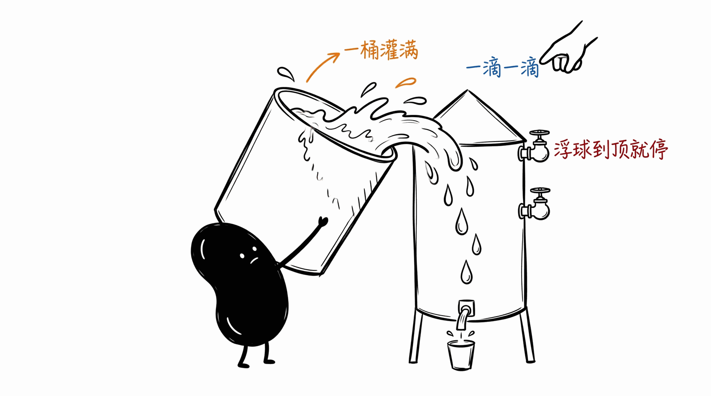
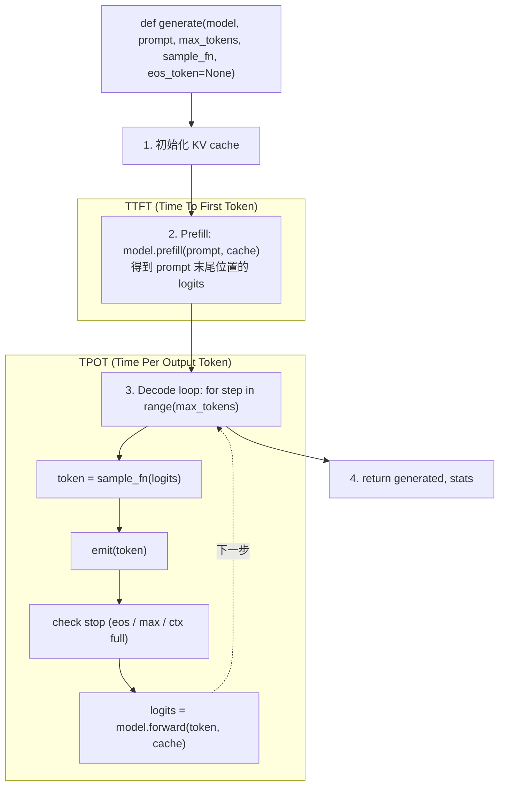

# 06 · Generation 主循环

LLM 推理引擎的"骨架": 把 model forward + sampling + stop condition 串成一个 token-at-a-time 循环. 抽自 ds4.c:15119 (`generate_raw_swa_cpu`).



这个 demo 把前 5 个 (G01-G05) 都能联动起来:
- G01 sampling 提供 sample_fn
- G02 RoPE / G03 RMSNorm / G04 量化都是 forward 内部用的算子
- G05 投机解码是 generation loop 的 "高级模式"

## 主循环结构



## Prefill vs Decode 的区别

```
   prompt = [t0, t1, t2, ..., t_{P-1}]    (P 个 prompt token)

   Prefill (一次性, 大批量):
     喂全部 P 个 token, 写 P 行 KV cache, 拿到位置 P-1 的 logits
     GPU 满载 (大矩阵乘), 时间 O(P) 但单 token cost 低
     例如 P=2000 prompt: 100 ms 总计, 0.05 ms/token

   Decode (逐 token, 小批量):
     喂 1 个新 token, 写 1 行 KV cache, 拿到下一位置的 logits
     GPU 利用率低 (单 token 矩阵乘是瘦小矩阵), 时间 O(1)
     例如 70B 模型 decode: 30 ms/token (~33 token/s)
```

| | Prefill | Decode |
|--|--------|--------|
| 喂入 | 整个 prompt | 1 个 token |
| KV 写入 | P 行 | 1 行 |
| GPU 利用率 | 高 | 低 (memory-bound) |
| 时间 | TTFT (一次性) | TPOT (累积) |
| 用户感知 | "等多久才开始" | "流多快" |
| 优化目标 | 不大 (大 batch + 高吞吐) | 大 (token/s 上限) |
| 主要瓶颈 | 算力 (FLOPs) | HBM 带宽 (load weights) |

## KV Cache —— 推理性能的核心

Attention 算 `softmax(Q · K^T) · V` 时, 第 t 个 token 的 K, V 需要所有 t' ≤ t 的历史. 每次 forward 都重算所有 K, V 是 O(N²) 浪费; 缓存住后 decode 只算第 t 行, 是 O(N) (随上下文长度线性).

KV cache 大小 ≈ **2 · n_layer · n_head · head_dim · ctx_len · bytes_per_value**.

LLaMA-70B, ctx=8k, fp16:
```
2 · 80 · 64 · 128 · 8192 · 2 = 21.5 GB
```

KV cache 跟序列长度成正比, 长 context 直接吃显存. 这是为什么:
- **GQA (Grouped-Query Attention)** 减少 n_head (Llama2-70B → 8 个 KV head)
- **MLA (Multi-head Latent Attention, DeepSeek)** 把 KV 压缩到低维 latent
- **PagedAttention (vLLM)** 像虚拟内存一样按页管理 KV
- **KV cache 量化** (FP8/INT8) 减少 bytes_per_value (见 G04)

教学版的 `KVCache` 只是个 placeholder, 真实实现复杂得多.

## 停止条件 (3 个, 任一触发即停)

| 条件 | 谁决定 | 含义 |
|------|--------|------|
| EOS token | 模型 | 模型说"我说完了" |
| max_tokens | 用户 | 别让模型瞎扯太多 |
| ctx_size | 物理 | KV cache 满了 |

ds4.c:15172 把这三条都查了, 教学版同样.

## 跟 G05 (投机解码) 的关系

G06 是"基线 generation", G05 是它的加速版:

```
G06 (基线): for step in range(max_tokens):
                token = sample(logits)
                logits = model.forward(token, ...)

G05 (投机): for round in range(...):
                drafts = draft_model_predict_K(history)
                target_logits = target.batched_forward(drafts)
                accepted = verify(drafts, target_logits)
                history.extend(accepted)
                if not full_accept: history.append(replacement)
```

G05 把 "forward → sample → forward → sample" 的串行链替成 "batched forward → verify".

## 目录

```
.
├── python/
│   ├── generation.py    # 🟢 generate() 主循环 + KVCache + MockModel
│   ├── main.py          # 流式输出 demo + 3 种停止条件演示
│   ├── test.py          # 8 个测试: 基本生成 / EOS / ctx_full / 流式 / KV 长度 / 输入校验
│   └── requirements.txt
└── README.md
```

## 跑起来

```bash
cd python && pip install -r requirements.txt
python test.py    # 8/8 passed
python main.py    # 看流式输出 (sleep 0.05s/token 模拟 20 token/s)
```

`main.py` 流式输出大致:
```
>>> 推理开始, prompt=[1, 2, 3, 4, 5]
   (词表 200, ctx 512)
   生成中 (流式):
   t82 t14 t199 t42 t7 t156 ...      ← 一个一个蹦出来

>>> 完成. 输出 20 token, 停止原因: max_tokens
   Prefill: 0.12 ms (5 prompt tokens)
   Decode:  1000.50 ms (20 generated)
```

## 常见坑

- ❌ **prefill 跟 decode 混在一起算 token/s** → prefill 是一次性大批量, 跟 decode 不可比. 报性能数据分两个: TTFT (prefill 总时间) + TPOT (decode 平均 ms/token)
- ❌ **EOS 检测在 forward 之后** → 应该 sample → 立刻检查 EOS → 不命中才 forward. 否则多 forward 1 次浪费
- ❌ **ctx_full 检测在 append 之后** → 应在 forward 之前检查; 否则真的 append 越界, KV cache 越界访问 crash
- ❌ **emit 在 sample 之前** → 流式 UI 看到的 token 跟实际生成对不上 (off-by-one)
- ❌ **prompt 超 ctx_size 没校验** → 直接进 prefill 会越界写 KV
- ⚠️ **decode 时 cache.len 跟 pos 不一致** → 教学版自动同步; 真实实现 pos 可能因 GQA / sliding window 跟 cache.len 解耦, 仔细对齐
- ⚠️ **emit_fn 抛异常没捕获** → UI callback 崩了不该影响生成本身, 真生产 wrap 在 try/except 里
- ⚠️ **max_tokens=0** → 不该 prefill (浪费), 直接返回 []. 教学版没做此优化

## 跟 ds4.c 原版的对照

| ds4.c | 这里 (Python) |
|-------|-------------|
| `kv_cache_init` + `cpu_decode_scratch_init` | `KVCache()` 占位 |
| `prefill_layer_major_cpu(logits, ...)` | `model.prefill(tokens, cache)` |
| `sample_argmax(logits, DS4_N_VOCAB)` | 外部 `sample_fn(logits)` |
| `forward_token_raw_swa_cpu_decode_scratch` | `model.forward(token, pos, cache)` |
| `emit(emit_ud, token)` | `emit_fn(token)` |
| `pos >= ctx_size` / `token == eos_id` | 三态 stop_reason |
| `n_predict` 上限 | `max_tokens` |
| `DS4_TRACE_TOP` 环境变量 (top-k logit 调试) | 留作扩展点 |
| `directional_steering_dirs` (DS4 特性) | 不实现 |

骨架 1:1 对齐, 教学版砍掉的是 model forward 的"内部细节" (那些是 G02/G03/G04 demo 的范畴).

## 下一步可以做什么

- **替换 MockModel 为真 transformer**: 集成 G02 RoPE + G03 RMSNorm + G04 量化 + attention, 凑出一个最小可跑的 transformer
- **替换 sample_fn 为 G01 sample()**: top_k/top_p/temperature 都接进来
- **替换 generate 为 G05 speculative_decode**: 加速 2-3×
- **加 batch 维度**: 让 generate 接受多 prompt 并行, 跟 vLLM 的 continuous batching 看齐

<p align="center"></p>
