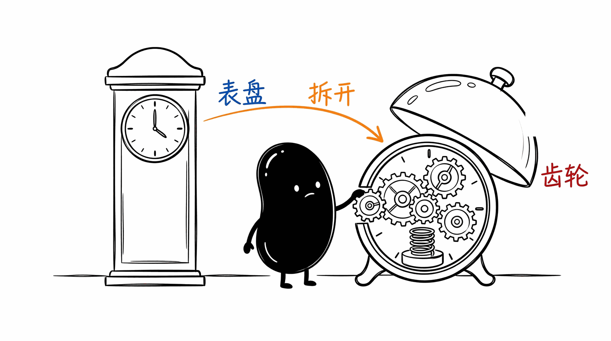
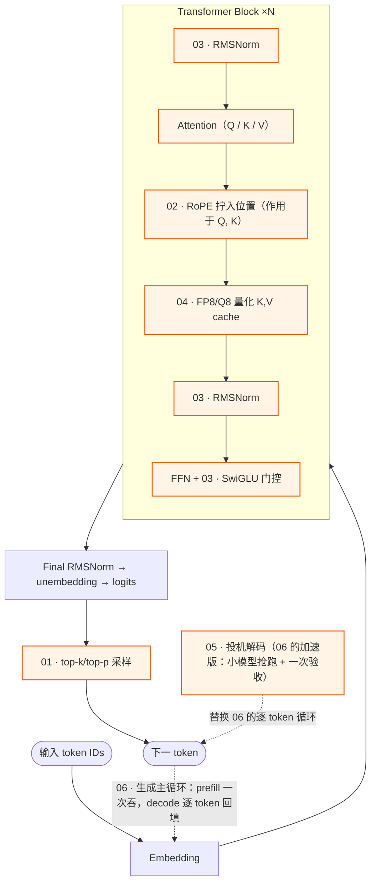
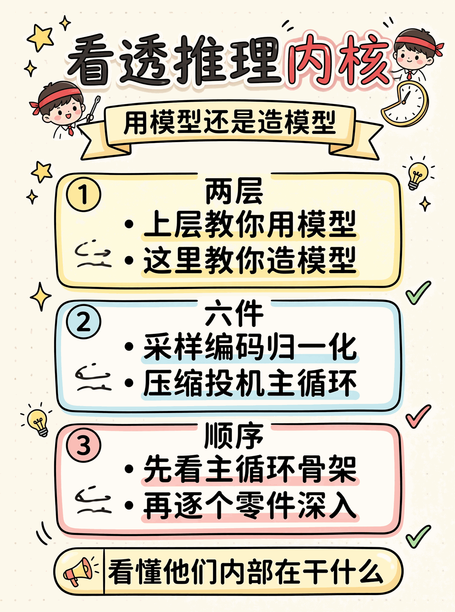

# LLM Internals —— 推理引擎内核的"算法" cookbook

跟仓库其他目录的关系:

| 目录 | 教 | 例子 |
|------|---|------|
| [仓库根目录](../README.md)的 core / agent / production / niche / case-studies | **用 LLM** | function call, streaming, agent, memory, MCP, multi-agent, context governance |
| `internals/`（这里） | **实现 LLM** | 采样, RoPE, RMSNorm, 量化反量化, 投机解码, generation 主循环 |

为什么单开一个目录: LLM 内部的"数学算法"跟"应用层 demo"是两个层次, 混着写谁都看不清.
这里所有 demo 都用 **numpy + 纯 Python**, 不需要 GPU / 不引推理框架, 让你能在笔记本上单步跑.

## 源材料

主要来自 [ds4.c](https://github.com/antirez/ds4) (antirez 风格的 C LLM 推理引擎, 800KB 单文件), 部分参考 llama.cpp / vLLM / Mistral / DeepSeek 的现代做法.

## 完整目录

| # | demo | 来源 | 价值 | 测试 |
|---|------|------|------|------|
| 01 | [top-k-top-p-sampling](01-top-k-top-p-sampling) | `ds4.c:15023` | ⭐⭐⭐⭐⭐ 采样管道 (温度+top_k+top_p+min_p+CDF) | 8/8 ✓ |
| 02 | [rope-positional-encoding](02-rope-positional-encoding) | `ds4.c:4675` | ⭐⭐⭐⭐⭐ RoPE + YaRN 长上下文外推 | 7/7 ✓ |
| 03 | [rmsnorm-swiglu](03-rmsnorm-swiglu) | `ds4.c:2700, 5012` | ⭐⭐⭐⭐ 现代 LayerNorm + 门控激活 | 8/8 ✓ |
| 04 | [fp8-quantize-dequantize](04-fp8-quantize-dequantize) | `ds4.c:1605, 1657` | ⭐⭐⭐⭐ FP8 / Q8_K 量化 (含 power-of-2 scale) | 9/9 ✓ |
| 05 | [speculative-decoding](05-speculative-decoding) | `ds4.c:17575` | ⭐⭐⭐⭐⭐ 投机解码 + DS4 margin filter | 6/6 ✓ |
| 06 | [generation-main-loop](06-generation-main-loop) | `ds4.c:15119` | ⭐⭐⭐⭐ Prefill→Decode 主循环 (含 KVCache placeholder) | 8/8 ✓ |

## 学习路径

建议顺序: **06 (整体骨架)** → 01 (采样, 最末一步) → 03 (Norm + 激活, 最常见) → 02 (RoPE, 编码位置) → 04 (量化) → 05 (投机).

## 风格约定

- **numpy 优先**: 算法用 numpy 矢量化, 别手写 for; 跟 C 版逐行对照写在每个 README
- **每个 demo self-contained**: `cd python && pip install -r requirements.txt && python test.py` 一气呵成, 不调外网, 不引大模型
- **README 必有"关键工程细节"+"常见坑"+"跟 C 版的对照"**: 算法本身在论文里都能查到, 这里讲"工程上为啥这么写"
- **测试 ≥ 6 个**: 覆盖正确性 + 边界 + 退化关系 (e.g. temperature=0 = argmax)

## 怎么把这些拼成一个最小可跑的 transformer

如果有兴趣组合, 大致流程:
1. 用 06 的 `Model` 接口骨架替代 MockModel
2. 实现 `forward(token, pos, cache)`: 嵌入 → 多层 (RMSNorm → Q/K/V proj → RoPE → attention → RMSNorm → SwiGLU) → unembed
3. 用 04 量化 K/V cache
4. 用 01 的 `sample()` 替 `argmax_sampler`
5. 用 05 的 `speculative_decode` 替 `generate` (加速 2-3×)

工作量大约 800-1500 行 Python (NumPy 向量化), 但每个组件这里都有了, 是可行的项目.

## Disclaimer

教学版**不是**生产用. 在 70B 模型上 numpy 实现会慢 10000× (没 GPU + 没 fused kernel). 真要 inference 用 [llama.cpp](https://github.com/ggerganov/llama.cpp) / [vLLM](https://github.com/vllm-project/vllm) / [SGLang](https://github.com/sgl-project/sglang). 这里的目的是**让你看懂他们内部在干什么**.

