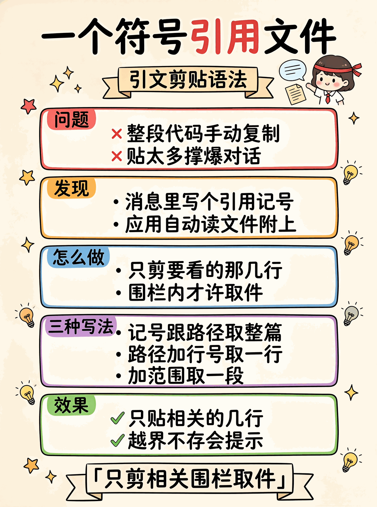

# 07 · Context References Demo

Cursor / Claude Code 风格的 `@file.py:5-10` 引用：用户消息里写 `@path`，应用自动读文件附加到 prompt。

<p align="center"></p>

## 引用语法

```
@path          整个文件
@path:5        第 5 行
@path:5-10     第 5-10 行
```

沙箱在 WORKSPACE 内；越界、不存在、二进制都渲染成 `[error: ...]` 让 LLM 知道。

## 跑起来

```bash
cd python
pip install -r requirements.txt
python test.py    # 8/8 passed
python main.py    # 5 个场景
```

## 共通的坑

- ❌ 沙箱用字符串前缀 → `..` 绕过；必须 `resolve()` + `relative_to()`
- ❌ 错误 silent 丢 → LLM 看不到用户引用了啥
- ❌ 不 dedupe → 同文件嵌两遍
- ❌ 没 MAX_BYTES → 大文件爆 context


